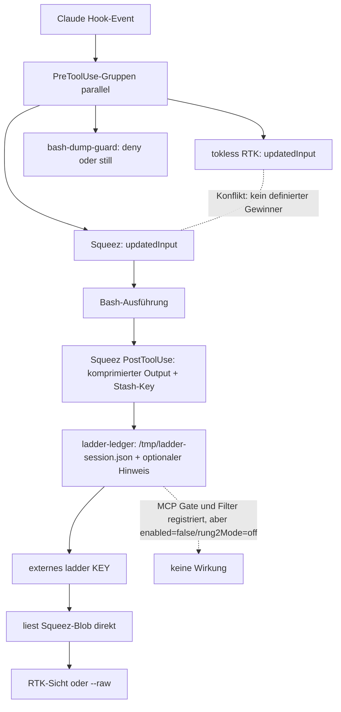

# Audit: Squeez-RTK-Ladder und aktueller Claude-Code-Stand

## 1. Ergebnis

`Squeez-RTK-Ladder` ist starke Forschungs- und Planungsreferenz: mehrere verworfene Messreihen bleiben sichtbar, Messfehler werden benannt, Architekturentscheidungen werden revidiert und v5 isoliert einen echten, eng begrenzten Gewinn. Als reproduzierbares Produktionspaket reicht der Stand nicht. Aktive Runtime hängt an einem nicht versionierten `ladder`-Binary, zwei konkurrierende Bash-Rewriter sind parallel registriert, Hook-Rungs sind zwar verdrahtet, aber deaktiviert, und mehrere State-/Portabilitäts-/Testfehler bleiben.

## 2. Ist-Fluss



Claude Code führt passende Hooks parallel aus. Daher ist die in Kommentaren implizierte Reihenfolge `protect → RTK → guard → Squeez` kein Vertrag. Die [offizielle Hook-Referenz](https://code.claude.com/docs/en/hooks) rät entsprechend davon ab, mehrere Hooks denselben Input verändern zu lassen.

## 3. Entwicklung der Ladder

| stage_id | Implementierung | vorhandenes Ergebnis | gültige Schlussfolgerung | Status |
|---|---|---|---|---|
| `L0` | Squeez gegen bestehende Context-/RTK-Pfade | einzelner Diff: 379 versus 409 Tokens | 30 Tokens Slice-Vorsprung rechtfertigen keinen neuen Server | verworfen |
| `L1_GATE` | `PreToolUse` blockt `squeez_retrieve` und verlangt erneuten RTK-Befehl | gepaarter Median `+9,6 %` fresh input; Qualität gleich; Streuung 36 % | Neuausführung/Extraround frisst Slicegewinn; kein Nutzen belegt | deaktiviert |
| `L2_FILTER` | geholten Blob im `PostToolUse` mit RTK filtern | Unitpfad funktioniert; kein produktiver E2E-Nachweis | konstruktiv besser als Neuausführung, aber Outputshape/State noch unsicher | deaktiviert |
| `L3_COMMAND_V4` | `ladder <key>` liest Blob direkt, RTK oder `--raw` | `−0,3 %` fresh input bei 27–33 % Streuung | Nullbefund; Messsignal kleiner als Rauschen | überholt |
| `L3_COMMAND_V5` | gleiche Kommandoidee, drei gebündelte Source-Strukturfragen | `−27,2 %` fresh input, `−32.097` Tokens; 3 %/7 % Streuung; Output stieg | positiver Befund nur für Source-Strukturfragen, bei denen R2 genügt und native Spillgrenze nicht greift | bedingter Pilot |

v5 misst nicht „Ladder spart generell 27,2 %“. Es misst sechs Läufe auf drei Quelltext-Strukturfragen. Arm B erhielt `5.369` statt `13.268` Tokens über die drei Eskalationsflächen (`−60 %` auf diesem Slice); die gesamte fresh-input-Differenz war `−27,2 %`. Output-Tokens waren im Median höher. Git-/Verzeichnisoutput, Codekörper-Änderungen, Failure-Diagnostik und breite Aufgaben sind nicht abgedeckt.

## 4. Datenqualität der Messreihen

| series | verdict | Grund |
|---|---|---|
| `ab-log.json` | invalid | zwei Transkripte in einzelnen Läufen; keine saubere Armzuordnung |
| `ab-log-v1-invalid.json` | invalid | nur ein Stash, null Redirects; bewegliches Korpus; circa `+39 %` ist Drift |
| `ab-log-v2-gate.json` | usable_with_low_power | eingefrorenes Korpus und feuerndes Gate; Delta kleiner als Armstreuung |
| `ab-log-v3-src.json` | incomplete | nur Arm A |
| `ab-log-v4.json` | valid_null_result | eingefroren/gepaart; Effekt `−0,3 %` gegen sehr hohe Streuung |
| `v5` reports | strongest_available | SHA-geprüft, je Lauf eigenes Verzeichnis, drei Replikate je Arm; Rohtranskripte fehlen im Repo |

Stärkste methodische Lehren:

1. Endpunkt vorab definieren: fresh input = uncached input plus cache creation.
2. Korpus und Antwortschlüssel isolieren.
3. Ein Transkript je Laufverzeichnis erzwingen.
4. Native Spill-/Truncationgrenzen im Design berücksichtigen.
5. Tool-Slice, modellsichtbare Tokens und E2E-Aufgabenkosten getrennt führen.
6. Engen Befund nicht auf andere Workloads extrapolieren.

## 5. Dateienabgleich

| Datei | Referenz versus `hooks/` | Bewertung |
|---|---|---|
| `ladder-ledger.mjs` | byteidentisch | eine Quelle sollte generiert/verlinkt statt dupliziert werden |
| `ladder-retrieve-gate.mjs` | byteidentisch | deaktivierte Forschungsvariante; nicht produktiv registrieren |
| `ladder-retrieve-filter.mjs` | byteidentisch | deaktivierte Forschungsvariante; erst nach Contract-/State-Fix pilotieren |
| `ladder-config.json` | genau eine operative Zeile anders: Referenz `enabled:true`, aktuelle Hooks `enabled:false` | Referenzkommentar behauptet dennoch „OFF“; Config und Provenienz widersprechen sich |
| `test-ladder.mjs` | aktuelle Hooks entfernen 60 Zeilen Nudge-Tests | deployed Suite deckt Ledger-Hinweise schwächer ab |
| externes `ladder` | live unter `/Users/rob/.local/bin/ladder`, nicht getrackt | produktiver Kern nicht reproduzierbar |
| Squeez-Hooks/-Config | nur absolute Verweise in `settings.json`, nicht im Paket | Version, Hash und lokale Anpassungen nicht reproduzierbar |

Token-/Dateifläche, mit `tiktoken/o200k_base` als Vergleichsproxy, nicht als exakter Claude-Tokenizer:

| Fläche | Dateien | Bytes | Zeilen | o200k-Proxy-Tokens | modellsichtbar? |
|---|---:|---:|---:|---:|---|
| `Squeez-RTK-Ladder/` | 32 | 220.750 | 4.692 | 66.793 | nein, Referenz-/Testmaterial |
| Root + `hooks/` + `settings.json` | 15 | 107.364 | 2.586 | 29.131 | größtenteils nein |
| Root `CLAUDE.md` | 1 | 8.416 | 173 | 1.975 | ja, Always-on-Kandidat |

Hookcode und `settings.json` werden nicht als Rohtext in den Modellkontext injiziert. Direkte Dateitoken dürfen deshalb nicht als Sessionkosten addiert werden. Modellsichtbar sind Root-Instruktionen, dynamische Plugin-/Skill-/MCP-Metadaten und bedingte `additionalContext`-Ausgaben.

## 6. Aktueller `settings.json`-Stand

| metric | value |
|---|---:|
| konfigurierte Plugins | 35 |
| aktiviert | 25 |
| deaktiviert | 10 |
| Hook-Events | 7 |
| Hook-Gruppen/-Commands | 18 / 18 |
| passende `PreToolUse:Bash`-Gruppen | 5 |
| passende `PostToolUse:Bash`-Gruppen | 3 |

Kritische Flächen:

- `tokless rtk-hook claude` und Squeez können parallel `updatedInput` liefern. Das verletzt den Single-Owner-Grundsatz direkt.
- `bash-dump-guard` ist Deny-Guard, kein Outputreplacer; der Name suggeriert mehr als der Code tut.
- `bash-size-feedback` und `ladder-ledger` können Kontext injizieren. Diese Hinweise müssen in ein gemeinsames Nudge-Budget.
- MCP-Gate und MCP-Filter sind registriert, obwohl Squeez-MCP bewusst nicht registriert und beide Rungs deaktiviert sind. Toter Runtime-Ballast.
- `context-mode-cache-heal.mjs` wird als direkt ausführbare Datei registriert; alle getrackten Hooks sind Git-Mode `100644`. Ohne explizites `node` ist der SessionStart-Pfad nicht portabel und kann mit Exit 126 enden.
- Absolute `/Users/rob/...`-Pfade machen die Datei zu einem Maschinen-Snapshot, nicht zu einer Installationsvorlage.
- 25 aktive Plugins plus vollständig eingebettete Caveman-/Ponytail-/CodeGraph-/Context-Mode-Regeln in `CLAUDE.md` erzeugen potenziell doppelte Guidance. Exakte Plugin-Metadatenkosten fehlen im Repo.

## 7. Code- und Sicherheitsbefunde

| finding_id | severity | Befund | Konsequenz | Zielkorrektur |
|---|---|---|---|---|
| `F01` | critical | RTK und Squeez konkurrieren als Bash-Rewriter. | Ergebnis/Permissions hängen von nicht definierter Hookkomposition ab. | genau ein Dispatcher oder genau ein externer Owner |
| `F02` | high | produktives `ladder` und angepasste Squeez-Dateien fehlen. | Snapshot kann das gemessene System nicht installieren. | Binary/Adapter versionieren oder externe Version+Hash locken |
| `F03` | high | Ledger-`load()` übernimmt `keys`, `writes`, `redirected`, aber nicht `filtered`. | späteres Edit/Stash kann Filter-Loop-Schutz löschen. | vollständiges versioniertes State-Schema plus Regressionstest |
| `F04` | high | Session-IDs landen unsanitized in vorhersehbaren `/tmp`-Pfaden. | Pfadtraversal/Symlink-/Cross-User-Risiko; Standardrechte unklar. | private Config-State-Dir 0700, atomische 0600-Dateien, normalisierte IDs |
| `F05` | high | globale `/tmp/*-unlock`-Dateien. | lokaler Prozess kann mehrere Sessions entsperren. | per-session, private, nonce-gebunden, TTL und Audit |
| `F06` | medium | Filter-Tempverzeichnis wird nicht entfernt. | Quelltextkopien bleiben im Tempbereich. | `try/finally`-Cleanup oder stdin-pipe |
| `F07` | high | Filter emittiert immer String-`updatedToolOutput`. | strukturierte MCP-Responses können Hostvertrag verlieren. | Shape-preserving Adapter + Live-Canary |
| `F08` | medium | aktuelle Ladder-Suite beendet sich bei `enabled:false` erfolgreich, ohne Gate/Filter zu testen. | grüner Lauf beweist nur „deaktiviert“. | getrennte Config-/Unit-/Deployment-Suites |
| `F09` | medium | Guardtests referenzieren `/Users/rob/.claude/hooks/...`. | Quellrepo-Test kann fremde installierte Version prüfen. | Pfade relativ zu Testdatei; installierter Smoke separat |
| `F10` | medium | Config-Kommentare enthalten veraltete Widersprüche (`enabled`, `noSqueezPrefix`, doppelte Ratio-Erklärung). | Operator kann falschen Zustand ableiten. | Schemafelder statt Prosa-Provenienz; Changelog getrennt |
| `F11` | medium | eine Ein-Repo-Kalibrierung trägt `minChars=1100`. | Schwelle ist nicht workload- oder repoübergreifend validiert. | Shadow-Telemetrie und per-profile defaults |
| `F12` | medium | kein Concurrency-/Atomicity-Test für Ledger. | parallele PostToolUse-Hooks können Writes verlieren. | Lock/atomic rename und Race-Test |

## 8. Testbefund vom Snapshot

| test | result | was bewiesen ist | was nicht bewiesen ist |
|---|---|---|---|
| `node Squeez-RTK-Ladder/test-ladder.mjs` | 38/38 | Referenz-Gate/Filter/Ledger funktionieren mit `enabled:true` und vorhandenem RTK auf dieser Maschine. | Claude-Livevertrag, Race-Safety, Installer, fremde Plattformen |
| `node hooks/test-ladder.mjs` | Exit 0, Rungs übersprungen | aktuelle Config ist deaktiviert. | keinerlei produktive Gate-/Filterwirkung |
| `node hooks/test-guard-all.mjs` | bestanden | installierte Dateien entsprechen Repo-Kopien; getestete Regex-/Marker-/Feedbackpfade funktionieren. | Quellrepo-Portabilität; Hookkomposition; echter Claude-Canary |

## 9. Was übernommen wird

| decision | take |
|---|---|
| Messreihen-Transparenz | ja |
| Wave-Index, Stop-Gates und eingefrorene Korpora | ja, Status und Ergebnis maschinenlesbar synchronisieren |
| direkte Blob-Recovery statt MCP-Roundtrip | ja |
| R2 nur für belegte Source-Strukturfragen | ja, optionales Profil |
| Neuausführungs-Gate | nein |
| parallel registrierte Filter-/Gate-Rungs | nein |
| `/tmp`-State und globale Unlocks | nein |
| absolute Maschinenpfade | nein |
| Squeez plus RTK als zwei autonome Mutatoren | nein |
| ein Dispatcher mit Adaptergrenzen | ja |

## 10. Ziel-Schnittstelle aus der Referenz

```text
claudestack install [safe|source]
claudestack doctor [--json] [--live-canary]
claudestack recover KEY [--view source|raw]
claudestack bench --profile PROFILE
claudestack rollback
```

Ein Dispatcher besitzt alle registrierten Hookflächen. Pure Reducer entscheiden `pass`, `deny`, `replace` oder `annotate`; Adapter kapseln Claude-Hooktransport, Squeez-Blobzugriff und optionale RTK-Prozesse. `safe` nutzt native Mechanismen plus Guard/Recovery. `source` wird erst nach Canary und A/B-Gate aktiv. Fremdtools bleiben austauschbar; Config nennt Fähigkeiten und Owner, nicht implizite Hookreihenfolgen.

