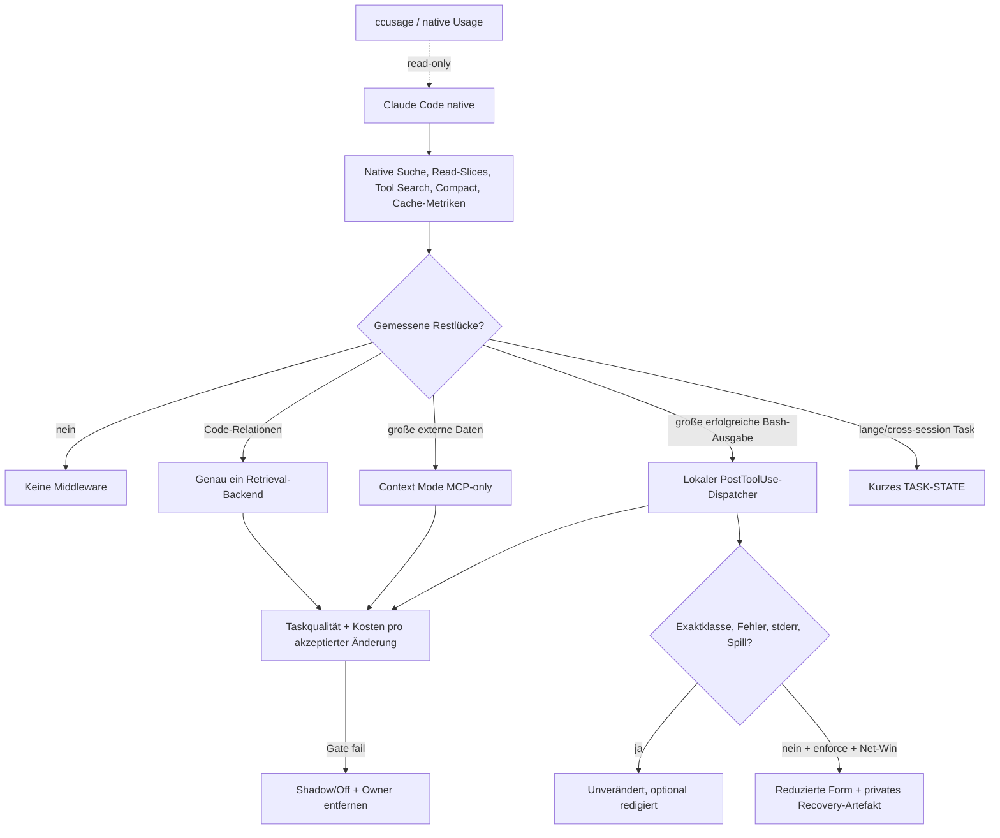

# Finale Konsolidierung: Claude Code Token Stack

## 1. Kanonisches Ergebnis

```yaml
final_decision:
  architecture: native_first_single_owner_recoverable
  default_runtime_mode: shadow
  deployment_state: not_installed
  promotion_state: blocked_until_local_canary_passes
  core:
    - native_claude_code
    - ccusage_observer_optional
    - local_dispatcher_release_candidate
    - concise_claude_md
  conditional:
    external_bulk_data: context_mode_mcp_only
    code_retrieval:
      default: native_rg_and_bounded_read
      exact_signatures: sigmap
      caller_impact_architecture: codegraph
      huge_polyglot: codebase_memory_mcp
      lsp_edit_refactor: serena
    durable_task_state: task_state_template_for_long_or_cross_session_work
  rejected_defaults:
    - multiple_bash_mutators
    - multiple_retrieval_indexes
    - full_context_mode_hook_installation
    - magic_compact
    - claude_code_cache_fix_proxy
    - proxy_chain
  invariant:
    mutating_owner_per_surface_max: 1
    bash_input_owner_default: null
    bash_output_owner_candidate: claudestack_dispatcher
    compact_owner: native_claude_code
    observer_may_mutate: false
```

Kernentscheidung: Stack wird nicht durch Addition aller guten Repos besser. Beste Kombination ist eine kleine native Basis mit exklusiven, messpflichtigen Ersatzprofilen. Squeez-RTK-Ladder liefert wertvolle Planungs-, Wellen- und Recovery-Muster; seine konkrete Runtime wird nicht übernommen.

## 2. Artefakt- und Datenstruktur

| artifact_id | Pfad | Inhalt | Kanonische Rolle |
|---|---|---|---|
| `A01` | `01-validation-crosswalk-5point.md` | 32 Titel-/Entscheidungsbereiche × 4 Datensätze; 1–5 | vollständiger Erstabgleich ohne neue Messung |
| `A02` | `02-squeez-rtk-ladder-reference-audit.md` | Planung, Waves, Dateien, Settings, Code, Tests, Risiken | Referenz-/Ist-Audit |
| `A03` | `03-file-token-metrics.csv` | 58 Dateiwerte | tabellarische Rohmessung |
| `A04` | `03-file-token-metrics.json` | gleiche Messung plus SHA-/Duplikatgruppen | maschinenlesbare Messquelle |
| `A04R` | `03-measure-token-surfaces.py` | reproduzierbarer Extraktor (`tiktoken` nötig) | erzeugt A03/A04 byteidentisch aus Snapshot |
| `A05` | `04-second-validation-100point.md` | Rubrik, 18 Scores, Issues, Aktualität, Ersatzpfade | kanonische Zweitvalidierung |
| `A06` | `claude-code-token-stack/` | Core, Hook, CLI, Config, Tests, Docs, Waves, Templates | nicht installierter Release Candidate |

Details werden nicht zwischen Berichten mehrfach gepflegt. Diese Datei ist Navigations- und Entscheidungs-SSOT; die genannten Artefakte sind SSOT für ihre jeweilige Detailfläche.

## 3. Vierfach-Abgleich

### 3.1 Abdeckung und Validität

| dataset_id | Quelldateien | decisions_covered | rows | score_1_5 | score_1_100 | stärkste Rolle | Hauptgrenze |
|---|---:|---:|---:|---:|---:|---|---|
| `GPT` | 4 | 32 | 32 | 4.88 | 91 | deploybare Synthese, Owner-/Guard-Vertrag | keine eigene produktive E2E-Serie |
| `OPUS` | 4 | 32 | 32 | 4.63 | 85 | Vollprüfung, Governance, Katalogstruktur | Katalogzählung/Lieferumfang teils widersprüchlich |
| `KIMI` | 1 | 32 | 32 | 4.19 | 79 | tiefste Themen-/Issue-/Benchmarkbreite | mehrere native Fähigkeiten/Stacküberlappungen überholt |
| `K3` | 2 | 32 | 32 | 3.91 | 63 | verständlicher Best-of-Merge | kein reproduzierbares Samplemanifest/Log/API-Snapshot |

Crosswalk-Invarianten:

```yaml
crosswalk_validation:
  decision_ids: D01..D32
  source_ids: [GPT, OPUS, K3, KIMI]
  expected_rows: 128
  actual_rows: 128
  missing_marked_not_present: 3
  invalid_score_rows: 0
  missing_source_rows: 0
```

Alle Themen aus den Überschriften wurden auf Entscheidungsrecords normalisiert: Auftrag/Evidenz, Inventar, Claude-Fakten, Prefix/Cache/Tool Search, Skills, Bash/Read, Sandbox, Toolschemas, Retrieval, Compact/Memory, Proxys, Packaging, Ownership, Security/Recovery, Guard/Ladder, Messung, Profile, Rollout und Grenzen. Nicht vorhandene Behandlung ist explizit `not_present`, nicht leer oder still interpoliert.

### 3.2 Wesentliche korrigierte Ausgangsclaims

| correction_id | Ausgangsclaim | Validierter Befund |
|---|---|---|
| `FC01` | OPUS-Katalog enthält 376 saubere Repos | 372 normalisierte IDs, vier Duplikate plus ungültiges `harrisonsec/`; Zahl nicht als Vollständigkeitsbeleg nutzen |
| `FC02` | OPUS R1–R5 vollständig geliefert | R2 `bash-output-owner.mjs` fehlt |
| `FC03` | K3 liefert unabhängige externe Validierung | überwiegend Synthese; Samplemanifest, Befehle, Snapshots und Logs fehlen |
| `FC04` | K3 hat neun Schichten | Tabelle nummeriert zehn; Profil A verletzt Exklusivität durch additive Tools |
| `FC05` | eigener Compact-Rewriter ist Kern | native automatische/fokussierte Kompaktierung und Root-CLAUDE-Re-Injection sind dokumentiert |
| `FC06` | Cache-Proxy ist allgemeiner Kern | Claude Code verwaltet Prompt Caching nativ und zeigt Cache-Metriken; Proxy erst nach gemessenem Defekt |
| `FC07` | `permissionDecision:"allow"` überschreibt deny/ask | aktuelle Doku: normale Rückfrage wird übersprungen; explizite deny-/ask-Regeln werden weiter ausgewertet |
| `FC08` | Hooks in verschiedenen Settings ersetzen sich | Hook-Einträge verschiedener Settings-Ebenen werden additiv gemergt; Konflikte bleiben möglich |

## 4. Squeez-RTK-Ladder und aktueller Stack

```yaml
squeez_rtk_reference:
  reference_value_score_1_100: 88
  production_readiness_score_1_100: 42
  verdict: valuable_experiment_not_reproducible_production_package
  tests:
    reference: 38_passed_0_failed
    deployed: exit_0_but_disabled_rungs_not_exercised
    current_guard_suite: passed
```

Stärken:

- nachvollziehbare Vorplanung, Waves, verworfene Messreihen und Messfehler;
- progressive Ladder statt Alles-oder-nichts-Rollout;
- Retrieval-/Recovery-Idee und schmale v5-Teilflächenmessung;
- Dokumentation von Hypothesenrevisionen.

Blocker:

- RTK und Squeez sind parallel als Bash-Input-Rewriter registriert;
- Runtime hängt an nicht versioniertem `/Users/rob/.local/bin/ladder`;
- Gate/Filter sind registriert, aber `enabled:false` und `rung2Mode:"off"`;
- Ledger-Load verliert `filtered`-State; spätere Writes können Loopzustand löschen;
- vorhersehbarer `/tmp`-State, unsanitized Session-IDs und unklare Symlink-/Rechtepolitik;
- relevante Scripts sind im Git-Snapshot `100644`; direkte Ausführung kann Exit 126 liefern;
- v5 −27,2 % betrifft sechs Runs einer Source-Structure-Teilfläche; Output steigt dort +31 %; Rohtranskripte fehlen.

Übernommen werden Muster, nicht Implementierung: Waves, explizite Owner, Fail-open, Exaktklassen, Net-Win, private Recovery, kalibrierte Gates und messbarer Rückbau.

## 5. Datei- und Tokenbefunde

### 5.1 Vollständige Datensatzflächen

| dataset_id | files | bytes | lines | o200k_proxy_tokens |
|---|---:|---:|---:|---:|
| `CURRENT_CLAUDE_FILES` | 15 | 107364 | 2586 | 29131 |
| `GPT` | 4 | 359510 | 8554 | 109575 |
| `OPUS` | 4 | 445070 | 13608 | 140205 |
| `K3` | 2 | 42399 | 329 | 12375 |
| `KIMI` | 1 | 224270 | 1351 | 64242 |
| `SQUEEZ_RTK_REFERENCE` | 32 | 220750 | 4692 | 66793 |

Die vier Validierungen umfassen 1.071.249 Bytes und 326.397 o200k-Proxy-Token. Das ist Forschungs-/Dateifläche, nicht ein einzelner Claude-Prompt.

### 5.2 Direkt modellrelevanter Prefix

| surface_id | bytes | lines | o200k_proxy_tokens | delta_vs_current |
|---|---:|---:|---:|---:|
| aktuelles Root-`CLAUDE.md` | 8416 | 173 | 1975 | Baseline |
| neues `templates/CLAUDE.md` | 839 | 21 | 219 | −1756 / −88.91 % Proxy-Token |
| optionale ausführliche `rules/token-stack.md` | 1408 | 32 | 362 | separat/lazy oder statt Duplikat verwenden |

Die Template-Differenz ist eine statische Proxy-Berechnung, keine Providerrechnung. Template und ausführliche Rule nicht redundant als zwei unbedingte Quellen installieren. Root enthält nur globale Invarianten; längere Regeln path-scoped oder on-demand.

### 5.3 Operative Dateien

`settings.json` und Hook-Code werden nicht wortgetreu als Prompt geladen. Ihre 27.156 gemessenen Proxy-Token (`settings.json` 2.984 plus Hooks 24.172) dürfen deshalb nicht als laufende Tokenersparnis verbucht werden. Drei Ladder-Dateien existieren byteidentisch in Referenz und Runtime; 7.419 Proxy-Token sind vermeidbare Repo-Duplikatfläche, keine automatische API-Kostenfläche.

## 6. Zweitvalidierung der Repos

| rank | repo_id | score_1_100 | decision | Rolle/Gate |
|---:|---|---:|---|---|
| 1 | `native-claude-code` | 96 | `use` | Basis |
| 2 | `ccusage` | 86 | `use` | read-only Observer |
| 3 | `sigmap` | 85 | `conditional` | exakte Signatur-/Evidence-Map |
| 4 | `local-dispatcher` | 84 | `conditional` | einziger Bash-Output-Owner nach Canary |
| 5 | `codegraph` | 80 | `conditional` | Caller/Impact/Architektur |
| 6 | `codebase-memory-mcp` | 76 | `conditional` | riesige/polyglotte Repos; ersetzt anderen Index |
| 7 | `planning-with-files` | 75 | `conditional` | lange/cross-session Tasks; meist nur Muster |
| 8 | `ponytail` | 74 | `conditional` | kurze Rule vor Plugin |
| 9 | `codeburn` | 70 | `conditional` | read-only Waste-Diagnose |
| 10 | `serena` | 69 | `conditional` | LSP-Edit/Refactor |
| 11 | `context-mode-mcp-only` | 66 | `conditional` | externe Massendaten; Full-Hooks reject |
| 12 | `token-saver` | 61 | `replace` | isolierter Dritt-Bash-Owner, kein Default |
| 13 | `squeez` | 59 | `replace` | Forschungsreferenz/Sole-Owner-Experiment |
| 14 | `tokf` | 58 | `replace` | nur mit externer Permission-Engine/unmaskierten Exitcodes |
| 15 | `omni` | 57 | `replace` | Ledger/Dedup nach Wiederholungsbaseline |
| 16 | `compact-plus` | 50 | `replace` | erst nach Härtung und nachgewiesenem Native-Gap |
| 17 | `claude-code-cache-fix` | 39 | `reject` | kein Default-Proxy |
| 18 | `magic-compact` | 34 | `reject` | kein Claude-Compact-Rewriter |

Scores bewerten Fit, Evidenz, Korrektheit, Security/Recovery, Claude-/Owner-Kompatibilität, Wartung, Lizenz/Privacy und Betrieb. Sterne oder README-Prozente sind keine eigene Komponente. Vollständige Commit-/Release-/Issuebefunde, Quellenlinks, Fallbacks und Nenner stehen in `04-second-validation-100point.md`.

## 7. Zielarchitektur



### 7.1 Surface-Ownership

| surface_id | Default-Owner | Alternativen | Kardinalität |
|---|---|---|---:|
| `prefix` | kurzes Root-`CLAUDE.md` | path-scoped Rule/Skill | eine Regelquelle je Bereich |
| `bash_input` | keiner | einzelner gehärteter Rewriter | 0 oder 1 |
| `bash_output` | lokaler Dispatcher-Kandidat | token-saver/tokf/Squeez/OMNI als Ersatz | 1 |
| `read_advisory` | lokaler Dispatcher-Kandidat | native bounded Reads | höchstens 1 Mutator |
| `external_data` | native Ableitung | Context Mode MCP-only | 1 je Aufgabe |
| `code_retrieval` | native Suche | SigMap/CodeGraph/CBM/Serena | exakt 1 je Aufgabe |
| `compaction` | native Claude Code | kein Default-Ersatz | 1 |
| `usage_observer` | native Usage + optional ccusage | CodeBurn read-only | Observer ohne Mutation |
| `api_proxy` | keiner | nur neuer isolierter Entscheid | 0 oder 1 |

## 8. Implementierungspaket

### 8.1 Runtime-Vertrag

```yaml
package:
  name: claude-code-token-stack
  version: 0.1.0
  runtime: node_gte_18
  dependencies: 0
  installer: none
  settings_mutation: none
  cli:
    - doctor
    - fragment
    - recover
    - prune
    - hook
  modes:
    off: complete_hook_noop
    shadow: complete_hook_noop_external_measurement_only
    enforce: read_advisory_and_bash_output_policy
  pretooluse_bash_registered: false
  posttooluse_bash_owner: hooks/claudestack.mjs
  permission_allow_emitted: false
```

### 8.2 Dateien

| group | Pfade |
|---|---|
| Core/Transport | `src/stack.mjs`, `hooks/claudestack.mjs` |
| CLI | `bin/claudestack.mjs` |
| Config/Owner | `config/token-stack.default.json`, `config/token-stack.schema.json`, `config/context-surface-owners.json` |
| Messung | `scripts/evaluate-benchmark.mjs`, `examples/benchmark-runs.example.jsonl` |
| Verifikation | `scripts/verify-package.mjs`, `tests/*.test.mjs` |
| Integrität | `SHA256SUMS.txt` |
| Planung/Betrieb | `docs/ARCHITECTURE.md`, `DECISIONS.md`, `MIGRATION.md`, `BENCHMARK.md`, `WAVES.md`, `SECURITY.md`, `REPO-MATRIX.md` |
| Instruktionen | `templates/CLAUDE.md`, `templates/TASK-STATE.md`, `rules/token-stack.md` |

### 8.3 Sicherheits- und Korrektheitsregeln

- Hook bleibt bei Parser-/I/O-/Configfehlern still und fail-open.
- `off` und `shadow` mutieren, redigieren, blockieren und speichern nichts.
- `enforce` redigiert bekannte Secrets best effort; Secret-Hygiene bleibt Pflicht.
- Fehler, `stderr`, Unterbrechungen, Images, Diffs, Security-, IaC-, Migrations- und Kryptoklassen werden nicht verlustbehaftet reduziert.
- Bereits nativ gespillte/trunkierte Ausgabe wird nicht erneut komprimiert.
- Reduktion braucht Mindestgröße, Mindestbytes, Mindestratio und positiven Net-Win inklusive Footer.
- Artefaktverzeichnis `0700`, Dateien `0600`, atomarer exklusiver Write, SHA-gebundene ID und Recovery-Integritätscheck.
- Unkeyed SHA-256 erkennt Versehen/Inkonsistenz, schützt nicht vor einem Angreifer mit Schreibzugriff, der Payload und Hash gemeinsam ersetzt.
- Command-Text im Artefakt ist nicht redigiert; keine Secrets in Kommandoargumente.
- Kein automatisches Settings-Merge; `fragment` erzeugt nur prüfbares JSON.

## 9. Wellen- und Gateplan

| wave_id | Änderung | Exit-Gate | Rollback |
|---|---|---|---|
| `W000` | 10–20 repräsentative Baseline-Tasks | Taskset/Nenner eingefroren | n/a |
| `W010` | Prefix-Hygiene | Kontext kleiner/gleich, Qualität stabil | alte CLAUDE/Rules |
| `W020` | Dispatcher `shadow` | kein unerwartetes JSON/Block, Owner sauber | `off`/Settingsbackup |
| `W030` | Read-Canary mit begrenztem `enforce` | Escape-Valve/State/Qualität | `shadow` |
| `W040` | Bash-Output-Canary | 100 % erwartete Recovery, keine Exaktverluste | `shadow` |
| `W050` | Population erweitern | Kosten/Qualität innerhalb Gates | Scope zurück |
| `W060` | genau ein Retrieval-Pilot | Gewinner nach Qualität/Kosten/Kontext | native Suche |
| `W070` | optional TASK-STATE | Resume ohne veralteten/unsicheren State | Datei entfernen |
| `W080` | isoliertes experimentelles Profil | eigener Entscheid oder Entfernung | alle Hook/Env/State-Reste entfernen |
| `W090` | Betrieb | Doctor, Tests, Recovery, Prune | letzte gepinnte Revision |

Automatischer Evaluator:

```yaml
evaluation:
  input: jsonl_one_record_per_pair_and_arm
  minimum_complete_pairs: 10
  arms: [baseline, candidate]
  primary: cost_per_accepted_change
  non_regression:
    - task_success_rate
    - accepted_change_rate
    - permission_regressions_zero
    - unrecoverable_outputs_zero
  exits:
    0: promote
    1: reject
    2: insufficient_or_invalid
```

## 10. Verifikation

```yaml
verification_result:
  source_snapshot:
    commit: b0b300c43188f237c9e0317b9a95370db767db5d
    tracked_files: 190
  initial_crosswalk:
    decisions: 32
    source_rows: 128
    rows_valid: 128
  measurements:
    files: 58
    json_parse: passed
    csv_generated: true
  reference_tests:
    squeez_ladder: 38_passed_0_failed
    current_guard_suite: passed
    deployed_ladder_effective_coverage: insufficient_disabled_rungs
  release_candidate:
    required_files: 20_of_20
    checksum_entries: 24
    checksum_errors: 0
    node_tests: 26_passed_0_failed
    json_configs_parsed: 4
    permission_allow_pattern: absent
    cli_and_hook_syntax: passed
    documentation_contract_checks: 20_of_20
    end_to_end_claude_canary: not_run
```

TDD-Sequenz war sichtbar rot→grün:

1. Core-Test ohne `src/stack.mjs`: `ERR_MODULE_NOT_FOUND`.
2. Implementierung: 10/10 grün.
3. neue Mode-Semantiktests: 2 rot; zentraler `off`/`shadow`-No-op-Fix; 12/12 grün.
4. manipuliertes Recovery-Artefakt: rot; Digest-/ID-Bindung ergänzt; grün.
5. Benchmarktest ohne Evaluator: `ERR_MODULE_NOT_FOUND`; Implementierung; 4/4 grün.
6. CLI-Test ohne Entry-Point: 0/9; Implementierung und aktualisierte Integritäts-/Enforce-Fixtures; Gesamt 26/26 grün.

## 11. Noch nicht behauptet oder ausgeführt

| limit_id | Grenze | Folge |
|---|---|---|
| `L01` | keine exakte Claude-Tokenizerzählung | o200k-Werte nur Vergleichsproxy |
| `L02` | kein produktiver Claude-Code-E2E-Canary | Dispatcher bleibt `conditional`/Release Candidate |
| `L03` | keine Settings- oder Hookinstallation | bestehende Nutzerumgebung wurde nicht verändert |
| `L04` | keine lokale Kosten-A/B-Serie | keine Gesamtprozentersparnis |
| `L05` | GitHub-/Issuezustand ist Stichtagsdaten | vor realem Pilot Revisionen neu prüfen |
| `L06` | Doctor liest eine Settingsdatei und bekannte Muster | kein Beweis für unbekannte/managed/plugin Owner im Gesamtsystem |
| `L07` | Secret-Redaction ist patternbasiert | keine Vertraulichkeitsgarantie |
| `L08` | Recovery-Hash ist unkeyed | Manipulation durch schreibberechtigten Angreifer nicht ausgeschlossen |
| `L09` | POSIX-Rechte sind getestet, Windows-ACL/Hookpfade nicht | Windows braucht eigenen Contract-/Canary-Lauf |

## 12. Offizielle Faktenbasis

- [Claude Code Hooks](https://code.claude.com/docs/en/hooks): Hook-Merge, Event-/Payloadvertrag, `updatedToolOutput`, Permission-Semantik.
- [CLAUDE.md, Rules und Auto Memory](https://code.claude.com/docs/en/memory): Ladeflächen, Kürze, path-scoped Rules, Compact-Re-Injection.
- [Context Window und fokussiertes Compact](https://code.claude.com/docs/en/context-window).
- [Native Prompt-Caching-Metriken](https://code.claude.com/docs/en/prompt-caching).
- [MCP Tool Search](https://code.claude.com/docs/en/mcp): standardmäßig deferred/on-demand bei unterstützten Deployments.

Repo-, Commit-, Release-, Issue-, Lizenz- und Benchmark-Primärlinks stehen kandidatennah in `04-second-validation-100point.md`. Upstream-Claims bleiben als Upstream-Claims markiert und werden nicht in lokale Gesamtersparnis umgerechnet.
