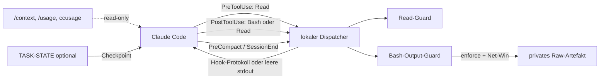

# Architektur

## CTS-ARCH-001 — Ziel

Stack begrenzt vermeidbaren Kontext, ohne Korrektheit, Recovery oder Claude
Codes native Mechanismen zu verdrängen. Folgendes Diagramm zeigt den Zielpfad
nach expliziter Installation und Promotion; im ausgelieferten Paket ist kein
Paket-Hook aktiv:

## CTS-ARCH-002 — Native-first

Reihenfolge pro Informationsbedarf:

1. bestätigte Fakten im aktuellen Kontext wiederverwenden;
2. native Suche nach bekanntem Namen/Text;
3. exakten Symbol- oder Zeilenbereich lesen;
4. nur für Relationsfragen genau einen Graph-/Index-Owner wählen;
5. externe Massendaten isoliert ableiten;
6. Findings persistieren und Exploration beenden.

Native Ausgabegrenzen und Spill-Pointer bleiben unangetastet. Guard erkennt
bekannte Truncation-/Spillmarker und komprimiert sie nicht erneut.

## CTS-ARCH-003 — Surface Ownership

„Owner“ meint Komponente, die eine Oberfläche mutieren darf. Observer zählen
nicht, solange sie keinen Kontext injizieren oder Payload verändern.

| Surface-ID | Oberfläche | Ziel-Owner nach Promotion | Kardinalität |
|---|---|---|---|
| `CTS-SURF-PREFIX` | Request-Prefix | Root-`CLAUDE.md` + path-scoped Rules | genau eine Quelle je Regelbereich |
| `CTS-SURF-BASH-GATE` | `PreToolUse:Bash` deny-only | bestehender Root-Guard nach Policy-Prüfung | mehrere Gates technisch möglich; explizit inventarisieren |
| `CTS-SURF-BASH-IN` | `PreToolUse:Bash` | Default: keiner | höchstens einer, falls aktiviert |
| `CTS-SURF-BASH-OUT` | `PostToolUse:Bash` | `hooks/claudestack.mjs` | genau einer |
| `CTS-SURF-READ` | `Pre/PostToolUse:Read` | `hooks/claudestack.mjs` | genau einer |
| `CTS-SURF-RETRIEVAL` | Code-Retrieval | native Suche oder ein gewählter Index | exklusiv je Aufgabe |
| `CTS-SURF-STATE` | Task-Checkpoint | `TASK-STATE.md`, falls genutzt | eine Datei |
| `CTS-SURF-OBSERVE` | Usage-Messung | native Usage + optional ccusage | read-only, mehrere zulässig |

Kein `PreToolUse:Bash`-Input-Rewriter im Dispatcher-Default. Dadurch gibt es
keinen Command-Rewrite. Ein bestehender deny-only Security-Gate ist eine
getrennte Rolle; er bleibt nur nach bewusster Policy-Prüfung registriert.
Wird später ein Bash-Input-Rewriter pilotiert, ersetzt er jede Alternative auf
dieser Surface; er wird nicht als Pipeline gestapelt.

## CTS-ARCH-004 — Dispatcher

`hooks/claudestack.mjs` kapselt Claude-Hooktransport und ruft Pure-Core-Logik
auf. Ein Fragment registriert denselben absoluten Node-Aufruf für:

- `PreToolUse` mit Matcher `Read`;
- `PostToolUse` mit Matcher `Bash|Read`;
- `PreCompact`;
- `SessionEnd`.

Parser-, I/O-, State- und unerwartete Hookfehler sind fail-open: keine Mutation,
leere stdout. Dispatcher entscheidet nie pauschal `allow`. Read-Guard darf in
`enforce` einmalig `deny` melden; identische Wiederholung ist Escape-Valve.

## CTS-ARCH-005 — Bash-Datenfluss

1. Nur `PostToolUse:Bash` besitzt tatsächliche Ausgabe.
2. Response-Objektform und unveränderte Felder bleiben erhalten.
3. Nur in `enforce` werden Secrets vor weiterer Verarbeitung redigiert.
4. Fehler, `stderr`, Unterbrechungen, Images, exakte Kommandoklassen und native
   Spillmarker werden nicht verlustbehaftet reduziert.
5. Kleine Ausgaben passieren unverändert.
6. `shadow` mutiert nicht und erzeugt kein Raw-Artefakt.
7. `enforce` reduziert deterministisch. Nur positiver Net-Win nach Footer erlaubt
   Ersetzung.
8. Vor Ausgabe der Ersetzung wird ein privates, größenbegrenztes Artefakt atomar
   geschrieben; Footer enthält ID, Hash-Präfix, Bytezahl und Recovery-Befehl.

„Raw-Artefakt“ bezeichnet hier die vollständige Tool-Response nach Redaction.
Recovery ist gegenüber dieser redigierten Response exakt; entfernte Secretbytes
werden absichtlich nicht gespeichert und sind nicht wiederherstellbar.

Eine lokale Byte-Reduktion ist keine Aussage über Provider-Tokens oder Kosten.

## CTS-ARCH-006 — Read-Datenfluss

Read-Schutz ist nur in `enforce` mutierend:

- große Ganzdatei: einmaliger Hinweis auf `offset`/`limit`;
- unveränderter identischer Read: einmaliger Wiederverwendungs-Hinweis;
- zweiter identischer Versuch innerhalb des Fensters: erlaubt;
- Dateiidentität: Größe, mtime und für begrenzte Dateien SHA-256;
- `PreCompact`/`SessionEnd`: Session-Read-State wird in `enforce` entfernt.

`shadow` und `off` sind vollständige Hook-No-ops: keine Mutation, Redaction,
Artefakte oder Statepflege. Bereits vorhandener Enforce-State bleibt liegen.
Shadow-Messung erfolgt extern.

## CTS-ARCH-007 — Konfiguration und State

Config-Auflösung: explizite Env-Datei → Repo-Datei → Benutzerdatei → Defaults.
State liegt außerhalb des Repos unter
`$CLAUDE_CONFIG_DIR/token-stack/state/` beziehungsweise `~/.claude/...`.

| State | Lebensdauer | Löschung |
|---|---|---|
| Session-Read-State | Enforce-Session | `PreCompact`, `SessionEnd` in Enforce; manuell bei Störung |
| Raw-Artefakt | konfigurierte Retention | `prune` |
| `TASK-STATE.md` | Aufgabe | manuell nach Abschluss archivieren/löschen |

## CTS-ARCH-008 — Erweiterungspunkte

Neue Reducer werden nicht in Dispatcher „hineingestapelt“. Zuerst Surface und
Owner benennen, Konflikte mit `doctor` prüfen, isolierten Benchmarkarm bauen und
Rollback definieren. Retrieval-, Memory- und Proxy-Produkte bleiben austauschbare
Profile. Squeez/RTK liefern Referenzmuster; ihre Hook-Ketten sind kein Default.
