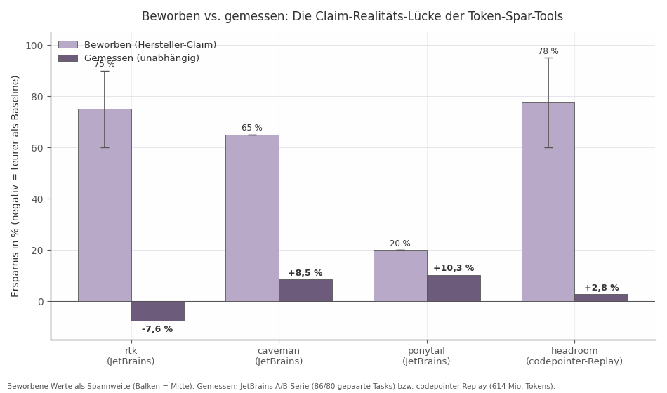

# Token-Optimierung für Claude Code: Die vollständige Repo-Landschaft und der empfohlene Stack

*Konzept-Report · Stand 2026-08-13*


# Kurzfassung

Wer Claude Code billiger machen will, braucht nicht mehr Tools, sondern mehr Hygiene. Das ist die erste Botschaft dieses Reports: Die nativen Hebel — Prompt-Cache-Schutz, Env-Aufräumen, CLAUDE.md-Disziplin, Compact-Instructions, `/clear` statt Auto-Compact — schlagen jedes Dritt-Tool am Markt. Im 614-Millionen-Token-Replay eines realen Nutzungsmonats entfielen auf die drei viralsten Spar-Tools (rtk, headroom, caveman) kombiniert gerade einmal 3,7 % der Rechnung[^1^] — während der ungeschützte Prompt-Cache, den dieselben Tools teilweise beschädigen, als größter Dollar-Hebel der gesamten Kette im Hintergrund lag[^2^][^7^][^8^]. Der Cache-Read-Faktor 0,1× macht Prefix-Stabilität zur Kennzahl Nummer eins: Eine Optimierung, die den Prefix verändert, ohne die Cache-Hit-Rate zu messen, ist keine Optimierung, sondern ein Blindflug.

Die zweite Botschaft betrifft die Marktstruktur: Dieser Report hat rund 180 Repositories erfasst, davon etwa 40 direkt stack-relevant. Die Star-Rangliste des Feldes wird durch unabhängige Messung nicht bestätigt, sondern invertiert. rtk (≈76k Stars) fällt mit drei offenen Security-Befunden und zwei unabhängigen Negativ-Messungen aus dem Stack; caveman (≈98k Stars) liefert gemessene 8,5 % statt beworbener 65 % bei dokumentierten 12,5 % Fehlentscheidungen; headroom (≈66k Stars) ist wegen eines gemessenen Cache-Bruchs (2–7× Kostensteigerung) nur nach Verifikation des Fixes zulässig[^2^][^7^][^8^][^17^][^68^]. In den Stack kommen stattdessen die leisen Kandidaten: ponytail als einziger unabhängig bestätigter Gewinn (−10,3 % Kosten, p=0,004), squeez auf der Filter-Schicht, context-mode als Output-Sandbox und magic-compact als Session-Verdichtung mit Rückhol-Garantie[^18^][^69^][^73^][^29^]. Ehrlichkeit ist in diesem Feld ein besserer Prädiktor für Wirksamkeit als Adoption.

Die dritte Botschaft ist architektonisch: Der empfohlene Stack ist keine Tool-Liste, sondern eine Mechanismus-Reihenfolge — Vermeiden → Verlagern → Verdichten (nur reversibel) → Verbilligen. Operationalisiert wird sie über ein Regelwerk, nicht über Installationen: der Hook `bash-dump-guard.mjs` (Loop-Guard, Spill über 2.000 Tokens, Dedup, niemals `allow`) deckt die Always-on-Stufe ab, das Ladder-Modell (Stufe 0 Filtern → Stufe 1 Straffen → Stufe 2 Compact+Snapshot → Stufe 3 Clear+Handoff) regelt die Eskalation an gemessenen Triggern[^146^][^148^]. Drei Profile teilen die Zielkorridore: A (kurze Sessions) braucht null zusätzliche Tools, B (lange Sessions) erreicht ehrliche 15–30 % Input-Ersparnis, C (Budget-getrieben) 30–70 % Kosten über Routing[^124^][^14^].

Zum Vorgehen: Der Report konsolidiert sechs Wide-Recherche-Facetten und acht Deep-Dive-Dimensionen mit rund 70 README-Volllektüren, ergänzt um Issue-Tracker, unabhängige Benchmarks und eine Cross-Verification aller Konfliktfälle. Alle Star-Zahlen und Push-Daten wurden per GitHub-API am 2026-08-13 verifiziert. Jede Empfehlung trägt ein Evidenz-Tier, jede Absage einen Re-Evaluierungs-Trigger.

## 1. Auftrag, Methode und Evidenz-Standard

### 1.1 Auftrag und Abgrenzung

Dieser Report beantwortet eine Frage: Wie sieht der bestmögliche kombinierte Stack zur Token-Minimierung für Claude Code aus, wenn man alles zur Verfügung hat, was das Open-Source-Feld 2026 hervorgebracht hat? Das Ergebnis ist ein Konzept — ein Set aus kompatiblen Komponenten, Aktivierungsregeln und einem Regelwerk —, keine Bestandsaufnahme. Was ein konkreter Nutzer heute installiert hat, ist für die Empfehlung nicht maßgebend; maßgebend ist, was unter unabhängiger Messung wirkt.

Der Untersuchungsgegenstand ist vollständig: alle Repository-Klassen, die Tokens minimieren — PreToolUse-/PostToolUse-Hooks, Proxys, MCP-Server, Skills und Plugins, Datenformate, Session-Kompressoren sowie die nativen Hebel von Claude Code selbst (Cache-Steuerung, Compaction, Effort-Level, CLAUDE.md-Disziplin). Ausgeschlossen sind Werkzeuge, die Tokens nur verpacken statt reduzieren (Repo-Dumper) oder Kosten über Modell-Routing senken, ohne das Token-Volumen anzufassen; beide Klassen werden dort markiert, wo sie im Feld mit Token-Tools verwechselt werden.

Die Methode folgt diesem Anspruch an Vollständigkeit und Prüfbarkeit. Sechs parallel laufende Wide-Research-Facetten haben zunächst die 31 bekannten Ausgangs-Repos einzeln verifiziert, einen Lesezeichen-Ordner mit 108 Links vollständig kategorisiert und vier unabhängige Breitensuchen über das Claude-Code-Ökosystem, die allgemeine LLM-Kompressionslandschaft, angrenzende Kategorien (Memory, Code-Intelligence, Messung) sowie Community-Best-Practices durchgeführt. Darauf aufbauend haben acht Deep-Dive-Dimensionen — je eine pro Stack-Schicht — die READMEs von rund 70 Repositories vollständig gelesen, Metadaten über die GitHub-API vermessen und die offenen Issue-Tracker auf sicherheits- und qualitätsrelevante Befunde durchsucht. Eine anschließende Cross-Verification hat alle Aussagen in Vertrauensstufen einsortiert und widersprüchliche Messungen als Konfliktzonen analysiert statt geglättet[^1^][^2^].

Drei Gründe machen diesen Auftrag nicht trivial. Erstens ist das Feld laut: Die sichtbarsten Projekte erreichen 66.000 bis 101.000 GitHub-Sterne[^3^], und ihre READMEs versprechen 60–95 % Ersparnis. Zweitens ist das Feld widersprüchlich: Derselbe Tool-Stack spart in der einen Produktionsmessung 1,5 Milliarden Tokens pro Monat und verteuert in der anderen die Rechnung um 7,6 %[^4^][^1^]. Drittens ist das Feld jung: Die meisten Benchmarks sind Eigenmessungen der Hersteller, und erst seit Mitte 2026 existiert mit der JetBrains-Serie und dem codepointer-Replay unabhängige Gegenrechnung[^1^][^2^]. Wer hier nach Sternezahlen priorisiert, baut den schlechtesten Stack.

### 1.2 Evidenz-Standard

Der Report arbeitet deshalb mit einem dreistufigen Evidenz-Standard, den jede nachfolgende Bewertung durchläuft:

- **Tier 1 — Unabhängig gemessen.** Mindestens zwei voneinander unabhängige, konsistente Belege oder ein fremder Benchmark mit offengelegter Methodik (gepaarte A/B-Runs, Kontaminationskontrolle, Signifikanzangabe). Beispiel: die JetBrains-Serie auf SkillsBench mit 86 gepaarten Tasks[^2^]. Tier-1-Befunde werden in diesem Report als Fakten behandelt.
- **Tier 2 — Dokumentiert und reproduzierbar.** Eigenmessung des Herstellers mit nachvollziehbarer Methodik, committeten Daten oder wiederholbarem Skript. Tier-2-Befunde werden als plausible Arbeitshypothesen geführt und mit dem Hersteller-Vorbehalt gekennzeichnet.
- **Tier 3 — Behauptet.** Marketing-Claim ohne Prüfpfad. Tier-3-Zahlen erscheinen nur als Kontrastfolie, niemals als Entscheidungsgrundlage.

Zwei Prüfregeln ergänzen die Stufen. Die erste betrifft den Nenner: Ersparnis pro Payload ist nicht Ersparnis pro Rechnung. Ein Filter, der einen `npm install`-Output um 90 % kürzt, kann an der Monatsrechnung unsichtbar bleiben, weil die komprimierbaren Payloads einen kleinen Anteil des Gesamtstroms ausmachen. Das codepointer-Replay — 614 Millionen Tokens realer Claude-Code-Sessions, nachgespielt gegen den beworbenen Referenz-Stack — quantifiziert die Lücke: rtk, headroom und caveman zusammen erreichten 3,7 % der Rechnung, nicht 60–95 %[^1^][^5^]. Deshalb gilt im ganzen Report: Kompressionsraten werden nur mit dem jeweiligen Nenner angegeben, und Stack-Erwartungswerte werden auf der Rechnungsebene formuliert.

Die zweite Regel betrifft die viralen Defaults. Die drei meistinstallierten Spar-Tools des Feldes — rtk, caveman, headroom — sind zugleich die drei mit den schärfsten Claim-Realitäts-Lücken: rtk (76k★) wurde in der JetBrains-Messung um 7,6 % teurer statt 60–90 % billiger und räumt im eigenen README ein, Output-Kürzung sei „not the same as cutting your bill"[^2^][^6^]; caveman (98k★) erreichte 8,5 % statt 65 %[^7^]; headroom (66k★) steht mit einem offenen Issue in der Kritik, in gemessenen A/B-Läufen den Prompt-Cache zu brechen und die Kosten um das Zwei- bis Siebenfache zu erhöhen[^8^]. Kapitel 2.3 legt diese Messungen vollständig dar. Die Konsequenz für die Methode: Kein Tool erhält aufgrund von Verbreitung einen Vertrauensvorschuss; jeder virale Default wird gegen Tier-1-Evidenz neu bewertet, bevor er in den Stack aufgenommen, ersetzt oder verworfen wird.

Die Bedeutung für die Lektüre: Die Fußnoten in diesem Report sind keine Dekoration, sondern das Prüfprotokoll. Aussagen ohne Tier-1- oder Tier-2-Beleg werden ausdrücklich als offen markiert — und genau diese Markierung entscheidet später, welche Stack-Komponenten als Kern gelten und welche auf der Watchlist bleiben.

## 2. Die Anatomie des Token-Verbrauchs

Der Token-Verbrauch einer Claude-Code-Session folgt einer festen Anatomie — und genau diese Anatomie erklärt, warum die populärsten Spar-Tools an der Rechnung fast nichts verändern: Sie zielen auf den kleinsten Kostenblock. Wer die Blöcke und ihre Größenordnungen kennt, kann jedes Werkzeug in diesem Report in Sekunden einordnen, ohne ein einziges README zu lesen. Dieses Kapitel liefert dafür das Begriffsgerüst, auf dem alle folgenden Kapitel aufbauen: fünf Kostenblöcke, vier Spar-Mechanismen und eine Trennlinie — die Cache-Kohärenz.

### 2.1 Die fünf Kostenblöcke

Fünf Blöcke machen praktisch den gesamten Token-Strom aus. **Erstens Systemprompt und Tool-Schemas:** Bevor die erste Nutzernachricht gelesen wird, belegt Claude Code typischerweise 15.000–35.000 Tokens mit Systemprompt, Builtin-Tool-Beschreibungen, CLAUDE.md und Skill-Metadaten[^9^]; ein vielgeteilter Vergleich maß 33.000 Tokens vor dem ersten Prompt[^10^]. Jeder MCP-Server addiert rund 1.000 Tokens pro Tool-Schema — sieben Server summieren sich auf etwa 67.000 Tokens, eine dokumentierte Community-Messung fand 81 exponierte Tools mit 143.000 Tokens, das sind 72 % eines 200k-Fensters[^11^][^12^]. **Zweitens File-Reads und Discovery:** Der größte native Strom. Rund 78 % des Tool-Traffics laufen über die eingebauten Werkzeuge Read, Grep und Glob — sie passieren keinen CLI-Filter[^13^]. **Drittens Bash-/CLI-Output:** nur etwa 22 % des Stroms[^13^] — ausgerechnet der Block, den die viralsten Tools adressieren. **Viertens Transcript-Replay:** Claude Code sendet pro Turn die gesamte Konversation erneut; ohne Begrenzung wachsen die Session-Kosten damit quadratisch in der Sessionlänge[^14^]. **Fünftens der eigene Output** des Modells, der zum rund Fünffachen des Input-Preises abgerechnet wird[^15^].

Über alle Blöcke spannt sich die Cache-Ökonomie: Der Prompt-Cache macht Wiederhol-Lesungen des Prefix billig — Cache-Reads kosten das 0,1-Fache des Input-Preises, Cache-Writes das 1,25-Fache (5-Minuten-TTL) bis 2-Fache (1-Stunde-TTL)[^11^][^16^]. Ein durchgerechnetes Beispiel (40k-Prefix, 30 Turns, Opus) zeigt die Größenordnung: $6,30 ohne gegenüber $1,13 mit Cache — rund 82 % der Input-Kosten hängen an dieser einen Mechanik[^16^].

| Kostenblock | Typischer Anteil | Haupttreiber | Direkter Zugriff |
|---|---|---|---|
| Systemprompt + Tool-Schemas | 15–35k Basis, bis 72 % des Fensters | MCP-Server (~1k Tokens/Schema), Rule-Files, CLAUDE.md | Schema-Diät, Tool Search, Budget-Regeln |
| File-Reads / Discovery | ~78 % des Tool-Stroms | Read/Grep/Glob auf große Dateien | Read-Clamps, Indizes, deny-Guards |
| Bash-/CLI-Output | ~22 % des Tool-Stroms | Test-Logs, Builds, Package-Manager | Output-Filter, Sandbox, Truncate-Guards |
| Transcript-Replay | Multiplikator über alle Turns | Prefix wächst pro Turn; Kosten quadratisch | Prefix-Cap, Compaction, Cache-Hygiene |
| Eigener Output | ~5× Input-Preis je Token | Geschwätzigkeit, Over-Engineering | Verhaltens-Skills, Effort-Level |

Die Tabelle ordnet die Blöcke nach Hebelgröße — und invertiert damit die Popularity-Rangliste des Feldes. Die beiden kleinsten Blöcke (Bash-Output, eigener Output) sind diejenigen, für die die meisten Werkzeuge existieren; die beiden größten (Discovery-Strom, Replay-Multiplikator) werden von kaum einem viralen Tool angefasst. Für die Stack-Architektur folgt daraus eine harte Priorisierungsregel: Maßnahmen werden nach ihrem Anteil am Token-Strom gewichtet, nicht nach Sichtbarkeit. Ein Werkzeug, das den 22-%-Block um die Hälfte kürzt, leistet weniger als eine Cache-Hygiene, die den Replay-Multiplikator um den Faktor zehn verbilligt — und beides ist weniger wert als eine Read-Disziplin, die den 78-%-Block erst gar nicht entstehen lässt. Diese Reihenfolge trägt die Kapitel 3 bis 15.

### 2.2 Die vier Spar-Mechanismen

„Kompression" ist das falsche Frame für dieses Feld. Tatsächlich existieren vier mechanistisch verschiedene Wege, Tokens zu reduzieren — mit unterschiedlichen Obergrenzen, Risiken und Erfolgskriterien:

| Mechanismus | Prinzip | Ceiling | Hauptrisiko | Erfolgskriterium |
|---|---|---|---|---|
| **Vermeiden** | Token entsteht gar nicht (Sandbox, Read-Clamps, Plan Mode, deny-Guards) | Höchster | Kein Qualitätsrisiko | Geblockte Tokens, null Regression |
| **Verlagern** | Token verlässt das Fenster, bleibt abrufbar (Spill-Files, FTS5-Index, Retrieve-Marker) | Hoch | Retrieve-Disziplin fehlt | Retrieve-Rate bei erhaltener Qualität |
| **Verdichten** | Information geht verloren (Summaries, LLMLingua, Terse-Personas) | Niedrig | Stille Fehlentscheidungen | Qualitäts-A/B mit Signifikanz |
| **Verbilligen** | Gleiche Tokens, billiger (Cache-Hygiene, Routing, Effort-Level) | Rechnung, nicht Fenster | Cache-Bruch dreht das Vorzeichen | Cache-Hit-Rate > 90 % |

Die Interpretation dieser Matrix ist die strategische Kernsache des Reports. Vermeiden und Verlagern sind qualitätsneutral, weil keine Information zerstört wird — was nicht im Fenster steht, kann nicht falsch erinnert werden, und was abrufbar ausgelagert ist, bleibt exakt rekonstruierbar. Verdichten ist der einzige Mechanismus mit dokumentiertem Qualitätsschaden: Im Governor-Benchmark produzierte das aggressive Verdichtungs-Setup 12,5 % falsche Entscheidungen bei einer Valid-Context-Loss-Ratio von 0,14[^17^]. Verbilligen schließlich wirkt auf einer anderen Achse — es verkleinert nicht das Fenster, sondern die Rechnung — und ist zugleich der Mechanismus mit dem größten belegten Einzeleffekt (82 % im Cache-Rechenbeispiel)[^16^]. Daraus ergibt sich die Bewertungslogik für jedes Kandidaten-Tool: Erst den Mechanismus bestimmen, dann gegen das Erfolgskriterium des Mechanismus prüfen. Ein Verdichter ohne Qualitätsbenchmark ist kein Sparmodell, sondern eine Wette; ein Verlagerer ohne funktionierenden Retrieve-Pfad ist kein Verlagerer, sondern ein Verdichter in Verkleidung. Die Stack-Empfehlung folgt konsequent der Reihenfolge Vermeiden → Verlagern → Verdichten (nur reversibel) → Verbilligen.

### 2.3 Advertised vs. Real: Was unabhängige Messung zeigt

Die wichtigste empirische Tatsache des Feldes: Unabhängige Messung invertiert die Rangliste. Vier Zahlenpaare tragen diese Erkenntnis — und keines stammt vom Hersteller.



*Abbildung: Hersteller-Claims gegen unabhängige Messungen. Quellen: JetBrains-Serie (rtk, caveman, ponytail)[^2^][^7^][^18^], codepointer-Replay (headroom)[^1^][^5^].*

Das **codepointer-Replay** spielte 614 Millionen Tokens realer Sessions (Baseline ≈ $926) gegen den beworbenen Referenz-Stack nach: rtk, headroom und caveman kombiniert sparten **3,7 % der Rechnung** — headroom 2,8 %, rtk 0,5 %, caveman 0,4 %[^1^][^5^]. Die **JetBrains-Serie** (SkillsBench, gepaarte A/B-Runs) ergänzt das Bild: rtk wurde bei niedrigem Reasoning-Effort **7,6 % teurer** statt 60–90 % billiger (bei hohem Effort ±0)[^2^]; caveman erreichte **8,5 %** statt 65 %[^7^]; ponytail lieferte mit **−10,3 % Kosten bei p=0,004** den einzigen statistisch soliden Gewinn der Serie[^18^]. Die beworbenen Zahlen sind dabei nicht gelogen — sie sind pro Payload korrekt und nur gegen den falschen Nenner gelesen.

Der Patterson-Gegenbeleg verhindert eine vorschnelle Verallgemeinerung: In einem extrem CLI-lastigen Produktionsworkflow sparten RTK und Headroom in einem Monat 1,5 Milliarden Tokens und $3.808 — bei 96 % Prefix-Cache-Hit[^4^]. Beide Wahrheiten koexistieren, und die Konfliktzone löst sich über eine einzige Variable: **Cache-Kohärenz**. Der Anthropic-Prompt-Cache greift nur, wenn der Prefix Byte für Byte identisch ankommt; ein einziges mutiertes Byte invalidiert ihn ab dieser Stelle[^19^]. Wo der Cache intakt bleibt (Patterson: 96 % Hit-Rate), schlagen Spar-Tools voll durch; wo ein Tool den Prefix pro Turn umschreibt, frisst die Invalidierung die Ersparnis — im dokumentierten Extremfall headroom Issue #2438 kostete der Proxy das Zwei- bis Siebenfache des Direktbetriebs, während die eigene Telemetrie fälschlich Ersparnis anzeigte[^8^].

Drei Brecher-Muster trennen die sicheren von den gefährlichen Werkzeugen; sie stammen aus der einzigen öffentlichen Postmortem-Doku eines Cache-Desasters (squeezr: 50 % des 5-Stunden-Kontingents in 10 Minuten verbrannt)[^19^]:

1. **Nicht-deterministische Kompression** — AI-Summaries variieren pro Durchlauf, der Prefix mutiert permanent.
2. **Variable Parameter** — ein Pressure-/Threshold-Wert, der an der wachsenden Konversation hängt, komprimiert denselben Block pro Turn anders.
3. **Gleitende Fenster** — „behalte die letzten N Turns" rutscht pro Turn weiter und kollabiert jedes Mal einen anderen Block.

Die Entscheidungsbedeutung ist unmittelbar: Cache-Hit-Rate ist die Pflichtmetrik jeder Token-Optimierung, Kompressionsrate ohne sie ist bedeutungslos. Konkret heißt das für die Folgekapitel: Jeder Proxy-Kandidat wird gegen die drei Brecher-Muster geprüft, jede Installation verlangt einen einmaligen Abgleich der Provider-Abrechnung (`cache_read` vs. `cache_creation`) gegen den Direktbetrieb, und eine Hit-Rate unter 90 % disqualifiziert — unabhängig davon, was die Tool-eigene Savings-Anzeige behauptet. Damit ist das Begriffsgerüst vollständig: fünf Kostenblöcke setzen die Prioritäten, vier Mechanismen strukturieren die Auswahl, Cache-Kohärenz entscheidet über die Zulassung. Kapitel 3 wendet dieses Gerüst auf die Repo-Landschaft an.

## 3. Die Repo-Landschaft im Überblick

Das Token-Optimierungs-Ökosystem für Claude Code ist 2026 von einer Handvoll Einzelprojekten zu einem industriellen Feld geworden. Die entscheidende Konsequenz: Das Problem ist nicht mehr die Versorgung mit Werkzeugen, sondern die Auswahl — und die Verfallsrate des Materials. Wer heute einen Stack entscheidet, braucht eine verifizierte Landkarte, keine Star-sortierte Bestenliste.

### 3.1 Gesamtbild: ~180 Repos in 15 Schichten

Die Master-Repo-Matrix (Vollversion in Anhang A, Datei `cc-token_repo_matrix.md`) konsolidiert rund 180 einzigartige Repos aus vier Herkunftsströmen: 31 in der Mission vorab verifizierte Ausgangs-Repos, 108 gesichtete Lesezeichen (davon 102 GitHub-Repos, allesamt per GitHub-API auf Existenz, Stars und letzten Push geprüft), rund 70 Neufunde aus der Breitenrecherche und etwa 35 allgemeine Referenz-Repos. Davon sind nur rund 40 direkt stack-relevant, rund 60 indirekt relevant (Memory, Code-Intelligence, Messung) — der Rest ist Workflow-, UI- oder Off-Topic-Material. Das Aktivitätsbild ist bemerkenswert: Die meisten Marktführer wurden erst zwischen Februar und April 2026 erstellt und erreichten in unter sechs Monaten 30.000 bis über 100.000 Stars[^20^] — Memory und Code-Intelligence sind das Hype-Thema des Jahres, gefolgt von einer Explosion der Kompressions- und Filter-Tools: Allein die GitHub-Suche nach „claude code token compress" liefert über 30 Repos, fast alle zwischen Juni und August 2026 aktiv[^21^][^22^].

Vor jeder Nutzung der Landkarte steht die Bereinigung, und sie ist größer als üblich. **Umbenennungen:** headroom wanderte von chopratejas zu headroomlabs-ai, yek von bodo-run zu mohsen1 — ältere Artikel verweisen auf tote Pfade. **Namens-Doppelgänger:** Es existieren zwei unabhängige Projekte namens *squeez* (claudioemmanuel/squeez als Hook-Kompressor vs. KRLabsOrg/squeez als Qwen-basiertes Pruning-Modell), zwei namens *snip* (edouard-claude/snip als Filter-Proxy vs. rixinhahaha/snip als Visual-Mode-App), und headroom (Kompressions-Layer) ist nicht headroom-meter (dessen TUI-Dashboard). **Obsolet durch native Features:** ccundo (Undo inzwischen nativ), claude-code-costs (von ccusage abgelöst), claude-code-otel (von nativer OpenTelemetry-Unterstützung überholt). **Nicht deploybar:** 500xCompressor benötigt Zugriff auf Modellgewichte und scheidet für eine gehostete API per Definition aus[^23^]; RouteLLM und FrugalGPT sind Forschungs-Frameworks ohne Integrationspfad für Claude Code. Bedeutung für die Entscheidung: Jede Tool-Liste, die älter als drei Monate ist, muss vor Stack-Entscheidungen re-verifiziert werden — die in Kapitel 1 eingeführte Evidenz-Tier-Einstufung gilt nur für den verifizierten Ist-Stand vom 13.08.2026.

| Herkunftsstrom | Umfang | Charakter | Beitrag zum Stack |
|---|---|---|---|
| Verifizierte Ausgangs-Repos | 31 | Kuratiert, teils tief recherchiert | Kern der Empfehlungen |
| Lesezeichen-Screening | 108 (102 GitHub-Repos) | Gemischt: 14 direkt relevant, ~45 indirekt, Rest Peripherie | Breite + Bereinigungsarbeit |
| Breitenrecherche-Neufunde | ~70 | Überwiegend Juni–August 2026, klein, jung | Zeigt Trends, wenig Reife |
| Allgemeine Referenz | ~35 | Forschung, Frameworks, Doku | Konzepte, kaum Deployables |

Die Tabelle macht das Auswahlproblem sichtbar: Über die Hälfte des Korpus ist jünger als drei Monate und entsprechend dünn belegt — die handlungsrelevante Substanz konzentriert sich auf rund 40 Repos. Für die Stack-Entscheidung heißt das: Strenge bei der Aufnahme, Großzügigkeit beim Beobachten. Konkret verteilt sich die handlungsrelevante Substanz ungleich: Die 31 verifizierten Ausgangs-Repos liefern fast alle Kern-Empfehlungen der Folgekapitel; aus dem Lesezeichen-Korpus kamen mit 14 direkt relevanten Treffern vor allem Ergänzungen für Messung und Hook-Design; die rund 70 Neufunde sind überwiegend Watchlist-Material — sie belegen Trendrichtungen wie Reversibilität, Cache-Ehrlichkeit und Multi-Agent-Support, ohne bereits Stack-Reife zu haben. Die allgemeine Referenzschicht schließlich liefert die Konzepte (Cache-Ökonomie, Kompressionsforschung), an denen die Claims der deploybaren Tools überhaupt erst gemessen werden können.

| Schicht | Zweck | Schlüssel-Repos | Status |
|---|---|---|---|
| 0 — Messung & Observability | Governance-Basis, spart nicht direkt | ccusage, CodeBurn, CodexBar, toktrack | ✅ Pflichtfundament |
| 1 — Systemprompt/Prompt-Hygiene | Input-Overhead kürzen | tweakcc, claude-code-system-prompts | 🟡 mächtig, brüchig |
| 2 — Output-Stil-Skills | Output-Tokens reduzieren | ponytail, caveman, i-have-adhd | ⚠️ kleine Effekte, Qualitätsrisiko |
| 3 — Shell-/Tool-Output-Filter | Erste Verteidigungslinie | rtk, squeez, tokf, token-saver | 🟡 einstellige Gesamtersparnis |
| 4 — MCP-Sandbox & Kompressions-Engines | Tool-Outputs/Schemas vor dem Kontext | context-mode, Paritok-4B, bifrost | 🟡–✅ situativ stark |
| 5 — Session-Kompression | /compact-Alternativen, History | headroom, magic-compact, rolling-context | ✅ mit realistischer Erwartung |
| 6 — Formate & lossless | Datenformat-Kompression | toon, toonify-mcp, sigmap | 🟡 Baustein |
| 7 — Code-Intelligence | File-Reads vermeiden (größter nativer Block) | serena, graphify, codegraph, claude-context | 🟡 E2E-Effekt umstritten |
| 8 — Memory & Persistenz | Wiederholungs-Lesen verhindern | claude-mem, MemPalace, planning-with-files | ✅ Footprint beachten |
| 9 — Routing & Gateways | Kosten- (nicht Token-)Hebel | claude-code-router, litellm, OmniRoute | 🟡 Tarif-Frage |
| 10 — Cache-Ebene | Größter Input-Kostenhebel | claude-code-cache-fix, native Env-Flags | ✅ hoher ROI |
| 11 — Repo→Kontext-Packaging | Einmal-Onboarding | repomix, gitingest, yek | 🟡 nicht für Dauerbetrieb |
| 12 — Hook-Sammlungen & Guards | Regelwerk-Rohmaterial | claude-code-hooks, governor, overloop | ✅ Design-Vorlagen |
| 13 — Peripherie | Indirekt relevant | gstack, spec-kit, ruflo | 🔵 Kontext |
| 14 — Obsolet/Nicht-deploybar | Referenz | ccundo, claude-code-otel, 500xCompressor | ❌ aussortieren |

Die kondensierte Matrix zeigt drei strukturelle Befunde. Erstens: Die ✅-Schichten (0, 5, 8, 10, 12) sind genau die, in denen Messbarkeit und Reversibilität gegeben sind — sie bilden das Rückgrat jeder Empfehlung in den Folgekapiteln. Zweitens: Die lautesten Schichten nach Star-Zahlen (2, 3, 7) sind nicht die wirksamsten; caveman (97,8k★) und rtk (75,9k★) überstehen die unabhängige Nachmessung nur mit drastisch reduzierten Effekten, wie Kapitel 2 gezeigt hat. Drittens: Keine einzelne Schicht löst das Problem — die Wirkung entsteht erst aus der Kombination, was das Stack-Design in den Kapiteln 5 ff. trägt. Für die Umsetzungsreihenfolge in Kapitel 16 folgt daraus eine klare Regel: Zuerst die ✅-Schichten instrumentieren und stabilisieren, dann situativ aus den 🟡-Schichten ergänzen — niemals umgekehrt, denn jede 🟡-Komponente ohne ✅-Messbasis darunter ist eine ungeprüfte Wette.

### 3.2 Architektur-Generationen und die Trends 2026

Das Feld hat in kurzer Zeit drei klar unterscheidbare Architektur-Generationen durchlaufen. Die erste Generation arbeitet **deterministisch vor dem Modell**: CLI-Filter und PreToolUse-Hooks, die Kommando-Outputs regelbasiert kürzen (rtk, tokf, thlibo, token-saver)[^24^][^25^]. Die zweite Generation setzt auf **transparente HTTP-Proxys** zwischen Agent und API, die Requests und Responses semantisch komprimieren (squeezr, headroom, TokenSnap)[^26^]. Die dritte, 2026 entstandene Welle nutzt **lokale Kleinmodelle als semantische Kompressoren** — Paritok-4B ist das erste Open-Source-Modell, das speziell auf Kompression von Coding-Agent-Trajektorien trainiert wurde (45.000 Trajektorien, 25 % Ersparnis ab Turn 1 bis >85 % in gesättigten Sessions)[^27^]; thlibo kombiniert deterministische Filter mit einem lokalen Gemma-4-Fallback[^25^]. Parallel haben sich MCP und Hooks als Standard-Integrationsmuster durchgesetzt, und der Vertrieb wandert von settings.json-Hooks in native Plugins über die offiziellen Marketplaces — sichtbar an der Migration von token-saver v2 in anthropics/claude-plugins-community[^28^].

Vier Trends bestimmen die Entscheidungslage 2026. **Erstens: Reversibilität wird Pflicht.** Nach der Kritik an /compact („summary of a summary") werben magic-compact (rückholbare Einzel-Turn-Summaries via read_omitted_content), densely (sha256-verifizierte Rekonstruktion) und headroom (retrieve) mit abrufbaren Originalen[^29^][^30^] — verlustbehaftete Kompression ohne Rückhol-Pfad ist nicht mehr vertretbar. **Zweitens: Cache-Ehrlichkeit.** Proxys, die den Request-Prefix verändern, zerstören Anthropic Prompt Caching und können Mehrkosten statt Ersparnis erzeugen; squeezr wirbt explizit mit Cache-Sicherheit, kuro-lean mit Cache-Rescue[^26^][^31^] — das bestätigt die Cache-Kohärenz-These aus Kapitel 2 als Markt-Konsens. **Drittens: Terse-Style- und CLAUDE.md-Audit-Explosion.** Output-Styles werden inzwischen benchmarked statt nur behauptet (beeline, native Output-Styles, taxman)[^32^][^33^], und eine neue Audit-Kategorie quantifiziert den System-Overhead: token-hygiene misst 15.000–35.000 Tokens Basiskosten pro Konversation (CLAUDE.md, MEMORY.md, Skill-Beschreibungen, MCP-Schemas), ein vielbeachteter HN-Thread bezifferte Claude Codes Systemprompt-Vorschuss auf 33.000 Tokens vor dem ersten Prompt[^9^][^10^]. **Viertens: Multi-Agent-Support ist Tabellenpflicht** — nahezu jeder Neufund unterstützt Codex CLI, Cursor und Gemini CLI neben Claude Code; CC-only-Tools wirken zunehmend wie Nischenprodukte. Bedeutung für die Entscheidung: Investieren Sie in Architekturen der dritten Generation mit Reversibilitäts- und Cache-Garantie, nicht in Regelwerke der ersten — und verlangen Sie von jedem Kandidaten einen gemessenen statt behaupteten Effekt.

## 4. Messung und Governance-Basis

Keine Optimierung ohne Messung — und keine Messung ohne Datenhaltung. Dieses Kapitel legt die Messkette fest, auf der alle nachfolgenden Stack-Empfehlungen verifiziert werden, und die vier Governance-Regeln, die vor jeder Optimierungsentscheidung gelten.

### 4.1 Die Messkette: Von der Baseline zum geschlossenen Kreis

Der Markt hat sich auf eine klare Rollenverteilung geeinigt. **ccusage** (17,9k★) ist der De-facto-Standard für die historische Baseline: Das CLI liest die lokalen JSONL-Session-Dateien von 16 Coding-Agenten und liefert Tages-, Wochen-, Monats- und Session-Reports inklusive 5-Stunden-Billing-Windows und Cache-Token-Aufschlüsselung[^34^]. **CodeBurn** (9,3k★) geht als einziges Tool über die Messung hinaus und schließt den Kreis: `optimize` findet Waste-Muster (wiederholte File-Reads, ungenutzte MCP-Server, aufgeblähte CLAUDE.md) mit Dollar-Schätzung, `--apply` wendet Fixes mit Journal und Undo an, `guard` installiert Budget-Hooks (Soft-Cap 5 $, Hard-Cap 15 $, fail-open), und `act report` vergleicht nach mindestens drei Tagen realisierte gegen geschätzte Ersparnis[^35^]. Für den Live-Betrieb ergänzen **claude-monitor** (plattformübergreifend, Burn-Rate-Prognose für das 5-Stunden-Fenster mit ehrlich gelabelten Schätzwerten: `official` vs. `local_estimate`) und **CodexBar** (macOS-Menüleiste, Kontingent-Fenster über 69 Provider) die operative Sicht[^36^][^37^].

Zwei Detailbefunde verdienen Aufmerksamkeit, weil sie die Messbasis selbst betreffen. **Claude Code löscht Session-Dateien nach 30 Tagen** (`cleanupPeriodDays`, Default 30) — die Rust-CLI toktrack cached Tages-Summaries immutabel und übersteht die Löschung; die ebenso wirksame Gegenmaßnahme ist `"cleanupPeriodDays": 9999999999` in der eigenen settings.json[^38^]. Wer das versäumt, verliert rückwirkend die Beweislage für jede Optimierungsentscheidung. Und eine neue Kategorie von **Audit-Tools** misst den versteckten System-Overhead: claude-token-hygiene quantifiziert 15.000–35.000 Tokens Basisbelastung pro Konversation, claude-markdown-health-check scannt das .claude/-Setup auf Token-Bloat und tote Referenzen, claude-context-optimizer trackt, welche Kontextbestandteile tatsächlich wiederverwendet werden, und ersetzt angenommene Konstanten durch eigene Messung (ein MCP-Tool kostete real 38.000 statt angenommener 200 Tokens)[^9^][^39^].

| Tool | Rolle | Live/historisch | Aktion? | Besonderheit |
|---|---|---|---|---|
| ccusage | Historische Baseline | historisch (+Statusline-Beta) | nein | Standard, 16 Agent-Quellen, Cache-Tokens sichtbar |
| CodeBurn | Geschlossener Kreis | beides | ja (optimize→apply→guard→report) | realized-vs-estimated nach ≥3 Tagen |
| claude-monitor | Live-Prognose 5h-Fenster | live | Warnungen | Provenance-Labels für Schätzwerte |
| CodexBar | Kontingent-Ampel | live (macOS) | nein | 69 Provider, kein Login nötig |
| toktrack | Langzeit-Archiv | historisch | nein | Überlebt 30-Tage-Löschung |
| Audit-Tools (token-hygiene, markdown-health-check, context-optimizer) | System-Overhead | historisch/live | teilweise | Machen versteckte Basiskosten sichtbar |

Die Messkette ist komplementär, nicht konkurrierend: ccusage und toktrack sichern die historische Beweislage, claude-monitor und CodexBar verhindern Quota-Überraschungen im Tagesgeschäft, CodeBurn liefert den einzigen belastbaren Nachweis, ob eine Optimierung real gespart hat, und die Audit-Tools verhindern, dass die Optimierung am Rauschen vorbei an der falschen Kostenstelle ansetzt. Für den Stack folgt daraus eine Installationspflicht in dieser Reihenfolge: Erst Baseline (ccusage), dann Langzeit-Retention (cleanupPeriodDays hochsetzen oder toktrack), dann Live-Sicht, dann CodeBurn als Governance-Schleife. Erst danach ist die Voraussetzung geschaffen, die nativen Hebel aus Kapitel 5 überhaupt bewerten zu können. Wer diese Kette überspringt und direkt optimiert, misst später gegen Erinnerung statt gegen Daten — genau der Mechanismus, mit dem im Feld Spar-Projekte als Erfolg verkauft werden, die nie einen Effekt hatten (Kapitel 2.3). Die Tabelle zeigt auch, warum kein Einzel-Tool genügt: Keine Zeile deckt alle vier Funktionen ab, und das einzige Tool mit Aktions-Schleife (CodeBurn) ersetzt weder die Langzeit-Retention noch die Live-Sicht.

### 4.2 Governance: Vier Regeln vor jeder Optimierung

**Regel 1: Messpflicht vor Optimierung.** Jede Stack-Komponente wird nur mit Vorher/Nachher-Vergleich gegen die ccusage-Baseline aufgenommen. Der headroom-meter-Befund zeigt, warum: In einer echten Feldsession sparte der Headroom-Proxy 334.462 von 14,18 Millionen Input-Tokens — 2,4 % statt der beworbenen 15–20 %, bei einer Cache-Hit-Rate von 95,2 %[^40^]. Ohne Messung wäre das als Erfolg verkauft worden.

**Regel 2: Cache-Hit-Rate >90 % ist Kennzahl Nummer eins.** Sie ist der schnellste Indikator dafür, ob der Stack für oder gegen den Prompt-Cache arbeitet. Der dokumentierte Referenzpunkt: claude-code-cache-fix hebt die Hit-Rate von 92,44 auf 94,66 Prozent, indem er drei Cache-Bugs in Claude Code (Block-Scatter bei --resume, Fingerprint-Instabilität, Tool-Sortierung) fixiert — unfixiert kosten diese Regressionen laut Maintainer bis zum 20-fachen[^41^]. Jede Dritt-Komponente, die den Request-Prefix anfasst, muss an dieser Kennzahl gemessen werden, bevor sie in den Stack darf — die direkte Anwendung des Cache-Kohärenz-Prinzips aus Kapitel 2.

**Regel 3: Realisiert schlägt geschätzt.** Spar-Claims und selbst CodeBurns eigene Waste-Schätzungen sind Hypothesen, bis `act report` sie gegen die realisierte Rechnung prüft. Doppelzählungs- und Cache-Bugs in den Messtools selbst (CodeBurn-Issues #987/#988) zeigen, dass auch die Messkette Kalibrierung braucht[^42^]. Governance-Konsequenz: Optimierungsentscheidungen nur gegen gemessene, nie gegen angenommene Kosten.

**Regel 4: Native Telemetrie nur user-seitig, niemals projekt-seitig.** Claude Code bringt mit `CLAUDE_CODE_ENABLE_TELEMETRY=1` native OpenTelemetry-Unterstützung mit (Kosten-, Token- und Tool-Events; das Dritt-Repo claude-code-otel ist damit obsolet)[^43^]. Aber dieselbe Konfiguration ist eine Angriffsfläche: „Otel Smuggling" nutzt eine bösartige `.claude/settings.json` in geklonten Repos, um Telemetrie auf Angreifer-Endpoints umzuleiten und über `otelHeadersHelper` Shell-Kommandos auszuführen — Exfiltration von Secrets noch vor der ersten Nutzereingabe; tausende Skills sind betroffen[^44^]. Die Konfiguration wird nur beim Session-Start gelesen und gehört ausschließlich in die User-Config; Projekt-Settings sind auf riskante Keys zu auditieren[^45^]. Bedeutung für die Entscheidung: Enterprise-Observability ist nativ lösbar, aber nur mit gepinnter Telemetrie-Config — andernfalls wird das Governance-Feature selbst zum Leck.

## 5. Native Hebel und Konfiguration

Die größte Einzelersparnis im gesamten Token-Stack kostet keinen Cent und erfordert kein Dritt-Tool: Sie liegt in der Disziplin der eingebauten Mechanismen von Claude Code. Die Befundlage ist eindeutig — während die populärsten Kompressions-Tools im größten unabhängigen Replay (614 Mio. Tokens, 500 Sessions) kombiniert nur 3,7 % der Rechnung senkten, adressieren native Hebel die strukturellen Kostentreiber direkt: den 0,1×-Prompt-Cache, die Read-Ströme (≈78 % des Token-Verkehrs) und die Session-Länge.[^1^][^13^] Wer dieses Kapitel konsequent umsetzt, hat den Kern des Optimierungsproblems bereits gelöst; alles in den Folgekapiteln ist Ergänzung.

### 5.1 Kontext-Disziplin: Fenster als Budget behandeln

**CLAUDE.md: kurz aus Kostengründen, nicht aus Gehorsamsgründen.** Die Anthropic-Zielvorgabe lautet unter 200 Zeilen pro Datei — eine weiche Empfehlung, denn der oft zitierte Hard-Cap (200 Zeilen/25 KB) gilt für MEMORY.md, nicht für CLAUDE.md.[^46^] Der verbreitete Mythos „Claude liest nur die ersten 200 Zeilen" ist empirisch widerlegt: Eine Studie über 25–500 Zeilen fand keinen messbaren Unterschied in der Befolgung.[^46^] Die Konsequenz für die Entscheidung: CLAUDE.md gehört gekürzt, weil jede Zeile in jeder Session als gecachter Prefix mitläuft — nicht, weil lange Dateien ignoriert würden. Community-Praxis hat sich auf Root-CLAUDE.md unter 60 Zeilen mit nur dem eingependelt, was das Modell nicht selbst aus dem Code ableiten kann.[^46^][^47^] In dieselbe Datei gehört ein „Compact Instructions"-Block: eine stehende Keep/Summarize/Drop-Retention-Policy, die bei jeder Compaction als Default greift und verhindert, dass die Auto-Zusammenfassung Entscheidungen und offene Fehlerbilder verwässert.[^48^]

**Die .claude/rules-Falle.** Die verbreitete Empfehlung, Regeln in path-scoped Dateien unter `.claude/rules/` aufzuteilen, hat eine messbare Schattenseite: Rule-Files werden als `<system-reminder>` bei *jedem Tool-Call* neu injiziert. In einer dokumentierten Session mit elf Rule-Files und 30 Tool-Calls fraßen allein die Re-Injektionen 93.000 Tokens — 46 % des Kontextfensters (Issue #32057).[^47^] Das Urteil ist klar: Rule-Splitting nur mit aggressivem Path-Scoping und harter Zeilenobergrenze (3–5 Files à <30 Zeilen); wer Regeln global lädt, zahlt sie pro Tool-Call, nicht pro Session.

**Reset schlägt Kompression — und gesteuerte Kompression schlägt Auto-Compact.** Die Eskalationslogik lautet: `/clear` zwischen unverbundenen Tasks (Anthropic-Doku), kombiniert mit dem HANDOFF.md-Pattern — vor dem Reset schreibt das Modell Ziel, geänderte Dateien, Entscheidungen, failende Tests und den nächsten Schritt in eine Datei, aus der die Folgesession verlustfrei rehydratiert.[^48^][^49^] Innerhalb einer Aufgabe ist `/compact` mit expliziter Fokus-Instruktion (`/compact Focus on code samples and API usage`) die offiziell dokumentierte Steuerung der Summary; Auto-Compact (Default ab >95 % Fensterfüllung) feuert dagegen ohne saubere Task-Grenze und gehört per `/config` abgeschaltet bzw. kontrolliert.[^48^][^50^] Für fehlgeschlagene Versuche ist `/rewind` die cache-schonendste Option: Es schneidet auf einen bereits gecachten Prefix zurück statt den Verlauf umzuschreiben — `/compact` invalidiert den Cache, `/rewind` nicht.[^11^] Ergänzend erlaubt der `PreCompact`-Hook (Matcher `manual`/`auto`) einen deterministischen State-Snapshot unmittelbar vor der Kompression; Vorsicht bei der Konfiguration — ein blockierender PreCompact-Hook kann Compaction unmöglich machen und damit Datenverlust garantieren.[^49^][^51^]

| Kontext-Hebel | Mechanismus | Befund / Beleg |
|---|---|---|
| CLAUDE.md <200 Zeilen | Prefix-Größe pro Session | Anthropic-Zielvorgabe; Adherence-Mythos empirisch widerlegt — Kürzung ist Kostentreiber-Logik, nicht Aufmerksamkeits-Logik[^46^] |
| Compact-Instructions-Block | Stehende Retention-Policy für jede Compaction | Dokumentierter CLAUDE.md-Mechanismus; verhindert generische Template-Summaries[^48^] |
| `.claude/rules/` mit Path-Scoping | Regeln nur beim Arbeiten im Verzeichnis laden | Re-Injektion pro Tool-Call: 93k Tokens = 46 % Fenster gemessen (Issue #32057)[^47^] |
| `/clear` + HANDOFF.md | Voller Reset mit externem State | Anthropic empfiehlt `/clear` zwischen Tasks; Handoff-Datei macht Neustart verlustfrei[^48^][^49^] |
| `/compact [Fokus]` | Gelenkte Zusammenfassung | Offiziell dokumentierte Custom-Instructions[^48^] |
| `/rewind` | Rückschnitt auf gecachten Prefix | Cache-schonender als `/compact` (keine Prefix-Umschreibung)[^11^] |
| `PreCompact`-Hook | Deterministischer Snapshot vor Kompression | Matcher `manual`/`auto`; Block-Konfiguration als dokumentierte Falle[^49^][^51^] |

Die Tabelle ordnet die Hebel nicht zufällig von Datei- über Session- zu Lifecycle-Ebene: Die Kostenlogik verläuft in dieselbe Richtung. CLAUDE.md und Rule-Files wirken auf den statischen Prefix, der dank Cache zwar nur 0,1× kostet, aber bei jedem Cache-Bust und jedem ersten Turn voll zuschlägt — hier entscheiden Kilobytes über wiederkehrende Fixkosten. Die Session-Hebel (`/compact`, `/rewind`) wirken auf den wachsenden Verlauf, der den quadratischen Transcript-Replay treibt; `/rewind` ist die einzige Option, die den Verlauf verkürzt, ohne den Cache-Key zu verändern, und verdient deshalb den ersten Zugriff bei Fehlversuchen. Der Lifecycle-Block (`/clear`, Handoff, PreCompact) schließlich verhindert, dass Kontext überhaupt in die teuren Regionen jenseits der 95-%-Auto-Compact-Schwelle wächst. Für die Entscheidung heißt das: Wer nur einen Hebel einführt, beginnt mit dem HANDOFF-Pattern — es ersetzt die riskanteste Operation (Auto-Compact ohne Task-Grenze) durch eine deterministische und kostet pro Taskwechsel nur wenige hundert Output-Tokens.

### 5.2 Kosten- und Cache-Konfiguration: Der stille Hebel

**Cache-Ökonomie zuerst.** Cache-Reads kosten 10 % des Input-Preises, Writes 1,25× (5-min-TTL) bzw. 2× (1-h-TTL); das Referenz-Rechenbeispiel (40k-Prefix, 30 Turns, Opus) zeigt $6,30 ohne versus $1,13 mit intaktem Cache — 82 % Ersparnis.[^11^][^16^] Jede Prefix-Änderung zahlt die Write-Kosten erneut. Damit wird Env-Hygiene zur wichtigsten Konfigurationsmaßnahme des Reports:

**Stufe 0 — kostenlos, sofort, für jedermann:**[^41^]

- `CLAUDE_CODE_DISABLE_GIT_INSTRUCTIONS=1` — Claude Code injiziert live `git status` in den Systemprompt; jede Dateiänderung ändert damit den Prefix und bustet den Cache. Abschalten spart ~1.800 Tokens pro Call und stabilisiert den Prefix.[^41^]
- Modell-Pinning: `ANTHROPIC_MODEL` und `ANTHROPIC_SMALL_FAST_MODEL` explizit setzen, dazu `CLAUDE_CODE_DISABLE_LEGACY_MODEL_REMAP=1` — verhindert stilles Modell-Remapping nach Updates; vom cache-fix-Projekt als „single most impactful flag" bezeichnet.[^41^]
- `MAX_MCP_OUTPUT_TOKENS` (Default 25.000) deckelt einzelne Tool-Outputs, bevor sie das Fenster fluten.[^52^]
- `CLAUDE_CODE_SUBAGENT_MODEL=haiku` pinnt Subagenten für Exploration und Log-Inspection auf das billige Modell, während der Hauptthread auf Sonnet bleibt — kostenloses Rollen-Splitting ohne Router.[^52^][^53^]

**Keine Mid-Session-Wechsel.** `/model`- und `/effort`-Wechsel, MCP-Server an-/abmelden und Claude-Code-Upgrades invalidieren den Cache jeweils vollständig; Modell- und Effort-Wahl gehören an den Sessionstart.[^11^][^54^]

**MCP-Diät.** MCP ist Lösung und Krankheit zugleich: Jedes Tool-Schema kostet ~1.000 Tokens, sieben Server summieren sich auf ~67.000 Tokens — vor der ersten Nachricht.[^52^] Drei Gegenmittel: Tool Search (inzwischen Default) senkte Gesamt-Tokens in MCP-lastigen Setups um ~47 %; ungenutzte Server per `/mcp` trennen (An/Aus wechselt die Tool-Liste und damit den Prefix — also sessionstabil halten); Nischen-Server in das `mcpServers`-Frontmatter eines Subagenten scopen statt global zu laden.[^52^]

**Subagenten-Ökonomie.** Subagenten isolieren Kontext — jeder pflegt ein eigenes Fenster und gibt nur eine Summary zurück —, multiplizieren aber das Token-Volumen um den Faktor ~7 gegenüber Single-Thread-Arbeit.[^55^] Sie sparen netto nur mit hart begrenzten Prompts („nur src/auth, max 15 Bullets, kein Repo-Scan"); pauschales Fan-out ist ein Kostenvervielfacher, kein Sparmechanismus.[^52^][^55^]

**Effort-Level und opusplan.** Der Effort-Level (low/medium/high) ist 2026 ein First-Class-Kostenhebel: Anthropic empfiehlt, low/medium großzügig als Primärkontrolle zu nutzen, sofern eigene Evals die Qualität bestätigen; Effort beeinflusst sämtliche Tokens inklusive Tool-Calls.[^54^] `/model opusplan` kombiniert Opus im Plan Mode mit Sonnet für die Ausführung und gilt als eine der kosteneffizientesten Arten, schweres Reasoning zu nutzen.[^56^] Beide Hebel teilen dieselbe Falle: Der Wechsel mitten in der Session invalidiert den Prompt-Cache und kann Thinking-Signaturen brechen — Effort- und Modellstrategie werden deshalb pro Session *einmal* festgelegt.[^11^][^54^]

| Konfiguration | Effekt | Befund / Beleg |
|---|---|---|
| `CLAUDE_CODE_DISABLE_GIT_INSTRUCTIONS=1` | ~1.800 Tokens/Call gespart; Prefix stabil | cache-fix-Projekt; git-status-Injektion als Cache-Brecher[^41^] |
| `ANTHROPIC_MODEL` / `ANTHROPIC_SMALL_FAST_MODEL` + `CLAUDE_CODE_DISABLE_LEGACY_MODEL_REMAP=1` | Prefix-Stabilität über Updates | „single most impactful flag"[^41^] |
| `MAX_MCP_OUTPUT_TOKENS` (Default 25k) | Deckel für Tool-Outputs | MCP-Bloat-Messungen[^52^] |
| `CLAUDE_CODE_SUBAGENT_MODEL=haiku` | Exploration auf Billigmodell | Workflow-Guides; Minimalvariante des Rollen-Splittings[^52^][^53^] |
| Tool Search + Server-Scoping | −47 % Tokens in MCP-Setups; ~1k Tokens/Schema vermieden | Tool-Search-Messung; 7 Server ≈ 67k vor Nachricht 1[^52^] |
| Effort low/medium, `opusplan` | Kosten- und Latenzhebel | Anthropic-Empfehlung; opusplan als effiziente Opus-Nutzung[^54^][^56^] |
| Keine Mid-Session-Wechsel | Cache-Erhalt | Invalidatoren-Liste; Thinking-Signature-Bruch[^11^][^54^] |

Die Konfigurationstabelle unterscheidet bewusst zwei Wirkungsklassen. Die Env-Variablen der ersten vier Zeilen sind Set-and-forget-Maßnahmen: Sie kosten nichts, bergen kein Qualitätsrisiko und wirken ab dem nächsten Sessionstart — ihre kumulierte Wirkung (Git-Instructions, Remap-Schutz, Output-Deckel, Haiku-Subagenten) liegt erfahrungsgemäß über der jeder einzelnen Kompressions-Software, weil sie den 0,1×-Cache schützt, auf dem die gesamte Kostenstruktur langer Sessions ruht. Die unteren drei Zeilen sind dagegen Verhaltensregeln mit Messpflicht: MCP-Diät und Effort-Level verändern, was das Modell sieht und wie es arbeitet, und gehören deshalb in den Messrahmen aus Kapitel 4, bevor sie zum Default werden. Entscheidungsrelevant ist die Asymmetrie des Risikos: Stufe-0-Hygiene kann man blind übernehmen, alles darüber hinaus nur mit Cache-Hit-Rate als Pflichtmetrik — denn eine Konfiguration, die Tokens spart, aber den Cache bricht, optimiert am falschen Ende.

## 6. Verhaltens- und Output-Stil-Skills

Verhaltens-Skills sind die am meisten überbewertete und zugleich die am schlechtesten vermessene Schicht des Feldes. Die unabhängige JetBrains-Benchmark-Serie (SkillsBench, gepaarte A/B-Runs, Claude Sonnet 5) hat als bislang einzige Drittinstanz die populärsten Vertreter gegeneinander getestet — mit einem Ergebnis, das die Star-Rangliste als Wegweiser entwertet: Der am lautesten beworbene Skill (caveman, 98k★) liefert fast nichts, der meistgestartete (ponytail, 101k★) liefert den einzigen statistisch soliden Gewinn der gesamten Tool-Landschaft.[^7^][^18^][^2^]

### 6.1 Was wirkt: ponytail — und warum der Mechanismus zählt

**ponytail ist der einzige unabhängig bestätigte Gewinn unter allen getesteten Token-Tools.** Der Skill lässt den Agenten „wie den faulsten Senior-Dev" arbeiten — YAGNI-Prinzip, minimaler Code — und erreichte im JetBrains-Benchmark über 80 gepaarte Tasks: −15 % geschriebener Code, **−10,3 % Kosten (p=0,004)**, −11 % Zeit, ohne messbare Qualitätsdifferenz.[^18^] Die Eigenmessung des Projekts (−54 % Code, −22 % Tokens auf zwölf Feature-Tasks) liegt über dem unabhängigen Wert, ist aber ungewöhnlich ehrlich kalibriert — das README hat eine frühere 80–94-%-Single-Shot-Zahl selbst als Baseline-Artefakt korrigiert.[^57^] Entscheidend ist der Mechanismus: ponytail *vermeidet* Tokens, statt sie nachträglich zu komprimieren. Ungeschriebener Code erzeugt keine Output-Tokens, keine Folge-Edits, keine Debug-Schleifen — der Hebel greift am Anfang der Kostenkette, nicht am Ende, und ist deshalb zu jedem Filter- und Cache-Stack komplementär stapelbar.[^18^][^57^]

**karpathy-skills dagegen ist trotz 202.000 Sternen ungemessen.** Das Plugin kodiert vier Prinzipien gegen LLM-Fehlmodi (stille Annahmen, Over-Engineering, unbeabsichtigte Änderungen, fehlende Erfolgskriterien) und macht keinen expliziten Token-Claim; der indirekte Spareffekt über weniger Over-Engineering ist plausibel, wurde aber nie quantifiziert, und die Wartungsmetriken (Agentiquette 61/100, 125 offene Issues, seit April 2026 ohne Push) raten zur Vorsicht.[^58^] Konsequenz: Als Qualitäts-CLAUDE.md einsetzbar, als Token-Maßnahme nicht einplanbar.

### 6.2 Warnstudien und die disziplinierte Alternative

**caveman ist die Lehrstudie des Feldes.** Beworben mit 65 % Output-Ersparnis, maß JetBrains auf agentischen Tasks 8,5 % — die Decke bei erzwungener Aktivierung, nicht der Alltag; die Gesamtrechnung stieg in einem Lauf sogar um 11,6 % (Long-Context-Tier-Ausreißer).[^7^] Der Governor-Benchmark dokumentiert zusätzlich das Qualitätsrisiko: 69,1 % Token-Ersparnis erkauft mit einer Valid-Context-Loss-Ratio von 0,14 und **12,5 % falschen Entscheidungen**.[^17^] Das inzwischen gewachsene caveman-Ökosystem (Caveman 2 mit Proxy-basierter Input-Kompression, ~46 % auf CLAUDE.md-Inputs) verschiebt das Problem nur: Der Skill kostet selbst 1–1,5k Input-Tokens pro Turn, und jede Prefix-verändernde Kompression gefährdet den Cache — das Projekt führt die 8,5-%-JetBrains-Zahl mittlerweile selbst im README.[^59^][^60^]

**Die Terse-Welle ist eine Nische, kein Programm.** Nach caveman entstand 2026 ein Subgenre knapper Output-Styles: beeline (benchmarked Merge aus caveman und i-have-adhd), taxman (Filler-/Preamble-Schnitt), carlosduplars native Output-Styles (~40 % weniger Output-Tokens behauptet) und faa-speak (FAA-Funkstil, ~53 % gemessen, mit on-device Re-Expansion via Apple Intelligence).[^32^][^33^] Gemeinsam ist allen: einstellige bis keine Adoption (0–17 Sterne), keine unabhängige Messung, und sie adressieren nur die Output-Seite — die bei Coding-Agenten den kleinsten Anteil der Rechnung ausmacht. Sie sind als stilistische Präferenz legitim, als Kostenstrategie irrelevant.

**Governor und die valorisa-Skills zeigen die disziplinierte Alternative.** Governor komprimiert content-aware statt pauschal: Tool-Output wird nur kondensiert, wenn mehr als 40 % der Zeilen Duplikate sind (Test-Failures, Log-Spam); einzigartige Daten passieren ungefiltert. Ergebnis im direkten Vergleich: 45,5 % Ersparnis bei VCLR 0,00 und 100 % erhaltenen Entscheidungen — gegen cavemans 12,5 % Fehlrate.[^17^] Im Multi-Turn-Pilot: −8,0 % Output-Tokens, −4,6 % Kosten, ohne Regression.[^17^] Die valorisa-Skill-Sammlung ergänzt die Verhaltensseite: `rescue-tokens` erkennt neun Token-Trap-Patterns und verkürzte Antworten in der Eigenmessung von 950 auf 97 Wörter (−90 %); `spec-driven` erzwingt eine Pipeline mit expliziten Token-Budgets; `token-optimization` berichtet selbst $750→$100 pro Monat (−85 %, nicht unabhängig verifiziert).[^61^]

| Skill | Behauptet | Unabhängig gemessen | Qualitätsrisiko | Urteil |
|---|---|---|---|---|
| ponytail (101k★) | −22 % Tokens, −20 % Kosten | −10,3 % Kosten (p=0,004), −15 % Code, keine Qualitätsdifferenz[^18^] | Nicht nachgewiesen | **Einziger bestätigter Gewinn — Standard** |
| karpathy-skills (202k★) | Kein Token-Claim | Ungemessen[^58^] | Unbekannt | Qualitäts-Skill, kein Spar-Hebel |
| caveman (98k★) | 65 % Output | 8,5 % (JetBrains); 12,5 % Fehlentscheidungen (Governor)[^7^][^17^] | VCLR 0,14; Cache-Gefährdung bei Input-Kompression | Warnstudie — nicht einsetzen |
| beeline / taxman / faa-speak / Output-Styles | 40–53 % Output | Keine unabhängige Messung[^32^][^33^] | Unbekannt | Nische, stilistische Option |
| Governor | 45,5 % bei VCLR 0,00 | Eigenbenchmark mit sauberem Design; Pilot −4,6 % Kosten[^17^] | Nicht messbar (unique data pass-through) | Referenzdesign für Filter |
| valorisa-Skills | −90 % Antwortlänge; −85 % Kosten | Nur Eigenmessung[^61^] | Gering (Pattern-basiert) | Pilotierbar, verifizieren |

Die Tabelle macht das strukturelle Muster sichtbar, das über alle Verhaltens-Skills hinweg gilt: Wirksamkeit korreliert mit dem Mechanismus, nicht mit der Verbreitung. Vermeidungs-Skills (ponytail) schlagen Stil-Skills (caveman, Terse-Welle), weil sie den Token gar nicht erst erzeugen lassen; content-aware Filter (Governor) schlagen pauschale Verdichter, weil sie Information nur dort opfern, wo sie redundant ist. Zugleich bleibt die Evidenzlage dünn — außer ponytail hat kein einziger Verhaltens-Skill eine unabhängige Messung vorzuweisen, und selbst der bestätigte Effekt (−10,3 %) ist kleiner als eine einzige Woche konsequenter Cache-Hygiene. Die Entscheidung folgt daraus direkt: ponytail als Default-Skill übernehmen, Governor-Mechanik als Designreferenz für die Output-Filter in Kapitel 7 nutzen, caveman und die Terse-Welle nicht einsetzen — und jeden weiteren Verhaltens-Skill erst nach einer eigenen gepaarten Messung im Rahmen von Kapitel 4 aktivieren.

## 7. Shell- und Tool-Output-Filter

**Erkenntnis vorab:** Die Filter-Schicht ist real, aber klein. Der ehrliche End-to-End-Erwartungswert liegt bei **0–3 % der Gesamtrechnung** auf typischen Workloads und bei **10–15 %** in test-/build-/log-lastigen Sessions mit häufigen >10k-Outputs — und zwar nur, wenn das gewählte Tool eine Net-Win-Logik hat. Ohne ein solches Gate ist der Effekt messbar *negativ*: drei unabhängige Datenpunkte (JetBrains-Benchmark +7,6 %, rtk-Issue #582 +18 %, kuro-lean-Benchmark +14 % vor Fix) belegen, dass komprimierter Output Verifikations-Turns auslöst, die mehr kosten als die Ersparnis bringt.[^6^][^62^][^63^] Der strukturelle Grund: Nur ~20 % des Kontexts fließen überhaupt durch Bash-Hooks; 78 % laufen über die nativen Read/Grep/Glob-Tools vorbei. Der Spar-Deckel reiner Bash-Filter liegt damit bei ~3 % des Inputs — ein Replay-Befund bezifferte rtk auf 0,5 % der Gesamtrechnung.[^64^] Der eigentliche Wert dieser Schicht ist **Katastrophenverhütung** (500-Zeilen-Test-Dumps, `find /`, Lock-Files), nicht ein laufender Rabatt. **Entscheidungskonsequenz:** Genau einen Rewrite-Hook installieren (Empfehlung: squeez), flankiert von Guard-Denies und einem Read-Clamp; Tool-Auswahl nach Gates und Permission-Hygiene, nicht nach Marketing-Prozent.

### 7.1 rtk-Demontage — und die drei Nachfolger

**rtk (75.916 ★) ist der bekannteste Vertreter der Schicht — und fällt im Audit durch.** Das Tool bewirbt 60–90 % Ersparnis, präzisiert im README selbst aber: „up to 90 % **der Bash-Ausgabe**" — nicht der Rechnung.[^6^] Dem stehen zwei unabhängige Messungen entgegen: der JetBrains-Benchmark (Juli 2026) maß **+7,6 % Mehrkosten** bei low effort, und das Repro-Paket in Issue #582 dokumentierte **+18 % Kosten**, weil Claude entzogenen Kontext mit +50 % Output-Tokens und zusätzlichen Tool-Calls kompensierte.[^62^][^64^] Entscheidend sind jedoch die Security-Befunde: Issue #1155 (offen) bestätigt, dass der Hook rewrite'te Befehle auto-allowt und damit das Permission-Modell umgeht; Issue #3152 (offen) zeigt, dass User-`allow`-Patterns auf Rewrites nicht greifen; Issue #2345 (offen) dokumentiert Credential-Exfiltration via `rtk proxy` trotz `.env`-Deny-Rules — klassifiziert als **CVE-2026-33068**.[^65^][^66^][^67^] Dazu 1.955 offene Issues, darunter falsche „success"-Meldungen für nichtexistierende EKS-Cluster (#3549) und verschluckte Exit-Codes (#3492).[^68^] **Urteil: nicht empfohlen** — trotz Distribution und Filter-Bibliothek. Wer dennoch rtk betreibt, muss `proxy` in die Deny-Liste aufnehmen.

**Primär-Nachfolger: squeez.** Das jüngste Tool des Feldes verbindet die breiteste Abdeckung mit der saubersten Permission-Hygiene. Installation: `npm i -g squeez` (alternativ `cargo install squeez`), dann `squeez setup`; der MCP-Retrieve-Pfad wird über `claude mcp add squeez -- squeez mcp` registriert.[^69^] Vier Eigenschaften sind entscheidungsrelevant: (1) Das **Net-Win-Gate** (Default 24 Tokens) reicht Kompressionen, die weniger sparen, verbatim durch und verbucht nichts — die direkte Antwort auf das rtk#582-Regime. (2) **PostToolUse `updatedToolOutput`** (ab Claude Code v2.1.119) komprimiert auch Read/Grep/Glob/Monitor — squeez greift damit als einziges ausgewachsenes Primär-Tool über die 20-%-Bash-Decke hinaus in den 78-%-Strom. (3) **Riskante Befehle laufen unwrapped** (`rm -rf`, `git push --force`, `npm publish`, konfigurierbar via `bash_risk_patterns`): Die nativen `permissions.deny`-/ask-Rules sehen das Original und bleiben wirksam — kein offener Permission-Bug, anders als bei rtk. (4) **Retrieve-Pfad:** Groß-Outputs werden als content-addressed Blob gestasht und per `squeez_retrieve`-MCP-Tool rückholbar; ein Identifier-Factsheet garantiert, dass SHAs, UUIDs und Ticket-IDs jede Summary überleben. Der Hersteller-Benchmark (91,4 % aggregat) wurde mit echtem cl100k-Tokenizer auf 83,5 % verifiziert (Divergenz 0,5 Punkte) — ungewöhnlich ehrlich, aber Hersteller-Messung auf eigenem Korpus.[^69^]

**Alternative für maximale Ingenieurs-Disziplin: tokf.** Installation: `brew install mpecan/tokf/tokf` oder `cargo install tokf`, dann `tokf hook install --global`. tokf ist das einzige Tool mit erzwungener **Cache-Determinismus-Garantie**: `tokf verify` führt jede Filter-Pipeline zweimal auf identischem Input aus und verlangt Byte-Identität — weil nichtdeterministischer Filter-Output das Provider-Prompt-Cache-Präfix bricht und eine 200-Token-Ersparnis 40.000 Tokens Suffix entcachen kann. Der Token-Schätzer (`bytes/3.5`) ist gegen cl100k kalibriert; der Retrieve-Pfad `tokf raw <id>` ist bewusst als pipbarer Shell-Befehl statt Tool-Call gebaut. Limitation: nur Bash.[^24^]

**Mahngang sqz.** sqz liefert mit **24,7 % Mittelwert über 3.003 echte Kompressionen** (178.442 Tokens gespart; Git-Diff nur 12 %, Stack-Trace 0 %) die ehrlichsten Zahlen des Feldes — und scheidet trotzdem aus: Issue #32 dokumentiert stillen Datenverlust (`entropy_truncate` droppt ~50 % nicht-JSON-Content inklusive Source-Code), dazu Locale-Korruption (#30), ein UTF-8-Panic (#34), keine Commits seit dem 21.06.2026 und die **ELv2-Lizenz** (kein reines Open Source).[^70^]

| Tool | ★ | Abdeckung | Kernmechanik | Mess-Disziplin | Kritisches Risiko | Urteil |
|---|---|---|---|---|---|---|
| **rtk** | 75.916 | Nur Bash | PreToolUse-Rewrite, 100+ kompilierte Filter | `bytes/4`-Schätzung; beworben 60–90 % der Bash-Ausgabe | 3 offene Security-Issues inkl. CVE-2026-33068; unabhängig +7,6/+18 % gemessen | **Nicht empfohlen** |
| **squeez** | 182 | Bash + Read/Grep/Glob/Monitor | Wrap + PostToolUse `updatedToolOutput`, Net-Win-Gate 24 tk | Hersteller-Benchmark 91,4 %, cl100k-verifiziert 83,5 %; negative Savings darstellbar | Jung; 1 offenes Issue (Windows #208) | **Primär** |
| **tokf** | 192 | Nur Bash | TOML-Filter, Double-Run-Byte-Stabilität | Kalibrierter Schätzer, ehrliche Bias-Tabelle | Klein; Windows-Cache-Bug #455 | **Alternative** |
| **sqz** | 593 | Bash + Session-Dedup | SHA-256-Content-Refs `§ref:HASH§` | Ehrlichster Mittelwert: 24,7 % Ø | Datenverlust-Bug #32 offen, stale, ELv2 | **Nicht empfohlen** |

Die Tabelle zeigt das zentrale Muster dieser Schicht: **Adoption und Qualität sind entkoppelt.** rtk dominiert die Stars um zwei Größenordnungen und trägt gleichzeitig die schwersten ungelösten Risiken — drei offene Security-Issues, eine CVE-Klassifikation und zwei unabhängige Negativ-Messungen sind eine Kombination, die kein Governance-Prozess durchwinken kann. Umgekehrt punkten die kleinen Projekte genau dort, wo es ökonomisch zählt: squeez adressiert mit Net-Win-Gate und PostToolUse-Abdeckung die beiden empirisch belegten Verlustmechanismen (Extra-Turns, 78-%-Read-Strom), tokf eliminiert mit erzwungener Byte-Stabilität den stillsten Kostenfaktor (Cache-Bruch), und sqz beweist mit seinem 24,7-%-Mittelwert, wie weit Hersteller-Prozente (60–90 %) und gemessene Realität auseinanderliegen. Für die Werkzeugwahl folgt daraus ein klarer Filter: Wer keinen Retrieve-Pfad, kein Net-Win-Gate und keine Permission-Hygiene nachweisen kann, kommt nicht in den Stack — unabhängig von der Sternezahl.

### 7.2 Guards, Nischen und der ehrliche Erwartungswert

Kompressoren filtern, was bereits gelaufen ist. **Guards verhindern, dass Token-Müll überhaupt entsteht** — „the cheapest token is the one that never enters the context".[^63^] Vier Werkzeuge besetzen diese Flanke, alle orthogonal zu einem Rewrite-Hook und daher stackbar.

**kuro-lean** (`bun add -g kuro-lean`, dann `kt init`) ist zugleich Guard und methodische Referenz: Der `hook-guard` deny't token-hungrige Calls *vor* Ausführung (`find /`, `cat` >100 KB, auf Read: Lock-Files, minified Files, >500 KB). Sein A/B-Benchmark `kt bench` gegen echte Headless-Sessions publizierte zunächst **+14 % Kosten und +38 % Turns** für den eigenen Kompressions-Arm, nach dem Small-Output-Passthrough-Fix +6 % ≈ Rauschen; über 12.220 echte Bash-Calls spart die Default-Config **~0–1 %**.[^63^] **STK** schließt die größte verbleibende Lücke: Das Mining von 250 echten Sessions ergab, dass **85 % aller oversized Kontext-Blöcke (>8 KB) vom nativen Read-Tool stammen** — STK clamp't große Reads per PreToolUse-deny-with-outline auf ~2 KB zeilennummerierte Outlines plus offset/limit-Anleitung.[^71^] **ppgranger/token-saver** ist das einzige Primär-Tool aus dem offiziellen Community-Marketplace (`/plugin install token-saver@claude-community`): 36 spezialisierte Prozessoren, 1.300+ Tests, gehärteter Hook (`shlex.quote`, `sh -n`-Syntax-Check, fail-open), Critical-Line-Recovery — die beste Installations-UX der Schicht, akzeptiert werden Python-Latenz (~60 ms) und fehlender Full-Retrieve.[^72^] **thlibo** schließlich ist die Architektur-Referenz: das sauberste PreToolUse+`updatedInput`-Pattern im Feld (Hook emittiert `updatedInput = "thlibo exec -- <cmd>"`; original stderr und Exit-Code pass-through), dazu das einzige echte Threat-Model mit cosign-signierten Releases — aber schwerster Footprint (Gemma-4-Sidecar-Daemon) und ein dokumentiertes Auto-Allow der eigenen Rewrites.[^25^]

| Werkzeug | Typ | Adressierter Strom | Belegter Effekt | Installations-Footprint | Rolle im Stack |
|---|---|---|---|---|---|
| **kuro-lean** | Guard (Deny) + Bench | Bash + Read vor Ausführung | +14 % → +6 % Kosten nach Fix; ~0–1 % Default-Ersparnis | Bun ≥ 1.3, `kt init` | Guard-Schicht + Messinstrument (`kt cost`) |
| **STK** | Read-Clamp (Deny-with-Outline) | Read-Tool (85 % der Oversize-Blöcke) | ~2 KB statt Voll-Dump großer Files | Ein JS-Hook | Lückenschließer neben jedem Bash-Filter |
| **token-saver** | Rewrite-Hook (Plugin) | Nur Bash | Critical-Line-Recovery, Ratio-Gate | `/plugin install`, Python-Runtime | Plugin-Minimalisten-Option |
| **thlibo** | Rewrite-Hook + LLM-Fallback | Bash/PowerShell/Read/Write/Edit | Token-basierte Messung, reproduzierbar | Sidecar-Daemon (Gemma 4) | Architektur-Referenz; Nische Log/PDF |

Die Interpretation dieser vier Werkzeuge verändert die Architektur-Entscheidung: **Die Guard-Ebene ist kein Add-on, sondern die ökonomisch robustere Hälfte der Schicht.** Kompressoren tragen das dokumentierte Negativ-ROI-Risiko (+7,6/+18/+14 % ohne Gates); Guards tragen es nicht, weil ein Deny vor Ausführung definitionsgemäß keine komprimierte Information erzeugt, die das Modell teuer zurückfordern könnte. Gleichzeitig zeigen die Zahlen die Grenze: STKs 85-%-Befund belegt, dass der voluminöseste Einzelstrom (Read) von keinem Bash-Hook erreicht wird — wer nur einen Bash-Filter installiert, optimiert das kleinere Fünftel des Problems. kuro-leans Selbstmessung (~0–1 % Default-Ersparnis) liefert zudem die kalibrierende Erwartung: Auch die beste Kombination aus Filter, Guard und Clamp bleibt ein Hygiene-Eingriff im einstelligen Prozentbereich der Rechnung. Für Entscheider heißt das: Budgeterwartung auf 0–3 % (typisch) bzw. 10–15 % (test-log-lastig) festlegen, genau **einen** Rewrite-Hook installieren (Hook-Stacking konkurrierender PreToolUse-Rewrites vermeiden — token-saver warnt explizit vor Dual-Installation[^72^]) und die Schicht danach nicht weiter tunen; die großen Hebel (Session-Splitting, Subagents, Cache-Ökonomie) liegen außerhalb dieser Schicht.

## 8. MCP-Sandbox, Tool-Schema-Kompression und Kompressions-Engines

**Erkenntnis vorab:** Der größte ungenutzte Hebel des gesamten Stacks liegt nicht im Filtern von Shell-Output, sondern darin, **Tool-Output gar nicht erst in die Konversation gelangen zu lassen** — und die Tool-Definitionen zu kollabieren, die vor der ersten User-Nachricht 30–143k Tokens belegen. Der offizielle GitHub-MCP-Server allein exponiert 94 Tools ≈ 17.600 Tokens; Community-Messungen fanden 81 Tools ≈ 143k Tokens ≈ **72 % eines 200k-Fensters vor der ersten Nachricht**.[^73^][^15^] Drei Werkzeugklassen adressieren das: Sandbox-Execution (context-mode), Schema-Kollaps (mcp-compressor, bifrost Code Mode, Edgee, natives Tool Search) und modellbasierte Kompressions-Engines (Paritok, KRLabsOrg/squeez u. a.). **Entscheidungskonsequenz:** context-mode ist der beste Preis/Leistungs-Eingriff der Dimension; Schema-Reduktion beginnt mit dem nativen, kostenlosen Tool Search; Proxys sind auf genau **einen** BASE_URL-Slot begrenzt (Verkettungsregeln unten, Fortsetzung in Kapitel 9).

### 8.1 context-mode: Sandbox-Execution mit FTS5-Gedächtnis

**mksglu/context-mode (19.825 ★)** implementiert das konsequenteste Output-Containment im Ökosystem. Die Mechanik: Sechs Sandbox-Tools (`ctx_execute` u. a., 12 Sprachen) führen Code in isolierten Subprozessen aus — **nur stdout gelangt in den Kontext**, Rohdaten (Logs, API-Responses, Playwright-Snapshots) verlassen die Sandbox nie. Zweiter Pfeiler: Hooks schreiben Session-Events in eine projektbezogene SQLite-DB; bei `/compact` oder `--continue` wird kein Dump in den Kontext gespült, sondern ein ≤2-KB-Snapshot gebaut, der Rest bleibt über **SQLite FTS5 (BM25, Porter-Stemming, Trigram-RRF)** abrufbar — der Index **überlebt /compact**.[^73^] Die eigenen 21-Szenarien-Benchmarks: 98 % Output-Reduktion über eine volle Session (315 KB → 5,4 KB; Playwright-Snapshot 56,2 KB → 299 B), Session-Länge ~30 min → ~3 h. Entscheidend: **Mit Hooks ~98 %, ohne Hooks nur ~60 %** — ein unrouteter `curl` macht die Session-Ersparnis zunichte. Installation daher als Plugin (registriert Hooks + MCP):

```
/plugin marketplace add mksglu/context-mode
/plugin install context-mode@context-mode
```

Verifikation via `/context-mode:ctx-doctor`.[^73^] Kein Modell, keine GPU, keine Telemetrie, 17 Plattformen. Die Sicherheitsarchitektur ist bemerkenswert (Deny-Rules aus `settings.json` gelten auch innerhalb der Sandbox; `ctx_execute_file` ist auf den Projektroot begrenzt), aber: `ctx_execute` führt beliebigen Code mit den FS-Rechten des Prozesses aus — die Sandbox ist Defense-in-Depth, kein OS-Sandbox; wer `ctx_execute` auto-approvt, hat faktisch Bash auto-approvt. Offene Qualitäts-Issues: #911 (Session-Continuity-Framings triggern den Auto-Mode-Classifier), #1022 (Resume-Snapshot ignoriert das beworbene 2-KB-Budget, injiziert ~196 KB).[^74^] Trotzdem: **Dies ist der mit Abstand beste Preis/Leistungs-Eingriff der Dimension** — deterministischer Mechanismus, null laufende Kosten, adressiert den voluminösesten Kostenblock.

**Verkettung (kausal, nicht optional):**

```
Claude Code
  ├─ Schicht 1: HOOKS — context-mode routet Bash/Read/Grep in die
  │   MCP-Sandbox, BEVOR Rohoutput in die Konversation gelangt
  ├─ Schicht 0/1b: MCP-ANBINDUNG — Server direkt ODER hinter
  │   mcp-compressor-Wrapper; natives Tool Search wirkt client-seitig
  └─ Schicht 2: HTTP-PROXY (ANTHROPIC_BASE_URL) — Paritok ODER Edgee
      ODER entroly — rewrite des fertigen Requests vor dem Provider-Call
```

Was die Sandbox hält, muss kein späterer Proxy komprimieren — Output *nie entstehen lassen* ist billiger als nachträglich verdichten. Und es gibt **genau einen** BASE_URL-Slot: Zwei Proxys brechen sich gegenseitig (Paritoks `[REF:id]`-Marker würden von einem zweiten Proxy wegkomprimiert). Diese Regel setzt sich in Kapitel 9 (Session-Kompression) fort.[^75^]

### 8.2 Tool-Schema-Kompression: vom nativen Baseline-Hebel zum Meta-Tool-Gateway

Die Baseline kostet nichts: **Natives Tool Search** (Default in Claude Code) lädt MCP-Tool-Schemas deferred und senkt den Schema-Block in MCP-schweren Setups um **~47 %**; die API-Beta-Werte reichen bis 85 % Token-Reduktion bei gleichzeitig gesteigerter Tool-Accuracy (Opus 4.5: 79,5 % → 88,1 %).[^11^][^76^] Erst wer darüber hinauswill, braucht einen dedizierten Kollaps.

**atlassian-labs/mcp-compressor** kollabiert einen MCP-Server auf 2–3 Wrapper-Tools (`get_tool_schema`, `invoke_tool`, optional `list_tools`). Gemessen am GitHub-MCP: **17.600 → 3.900 (low) / 3.300 (medium) / 2.200 (high) / 500 (max) Tokens = 70–97 % Schema-Reduktion**, bei laut interner Eval „almost no impact on end-to-end quality" (nicht im Detail publiziert — Caveat).[^15^] Die kleine stabile Wrapper-Oberfläche hält das Prompt-Cache-Präfix byte-stabil. Integration:

```json
{ "mcpServers": { "github": { "command": "uvx",
  "args": ["mcp-compressor", "https://api.githubcopilot.com/mcp/", "--server-name", "github"] } } }
```

Der Compressor läuft alternativ als CLI (`mcp-compressor -c medium -- python server.py`) oder eingebettet via SDK (Python/TypeScript/Rust).[^77^] **maximhq/bifrost Code Mode** (7.267 ★, Enterprise-AI-Gateway)[^78^] geht weiter: beliebig viele MCP-Server kollabieren auf vier Meta-Tools, Ausführung in einer Starlark-Sandbox, Zwischenergebnisse verlassen die Sandbox nicht. Eigene 3-Runden-Benchmarks: **−58,2 % Input bei 96 Tools, −84,5 % bei 251, −92,8 % bei 508 Tools (1,15M → 83k Tokens, −92,2 % Kosten, Pass-Rate 100 %)**.[^79^] Relevant primär für eigene Agent-Anwendungen über das Bifrost-Gateway; Atlassian selbst ordnet Code-Mode-Ansätze als riskanter ein („nothing works unless valid code is produced and executed successfully").[^15^] **Edgee Compressor V2** ist die hosted Variante (`edgee launch claude`): drei toggelbare Techniken (Tool-Result-Trimming ~10 % Kosten, Tool-Surface-Reduction ~33 % Volumen, Output-Brevity ~30 %). Evidenz: SWE-bench-Lite 6/6 bzw. 8/8 ohne Qualitätsverlust — **statistisch sauber gerechnet, aber winzige Stichprobe**; die belastbarere Zahl ist das Kunden-Aggregat von **~20 % Rechnungsreduktion** über 30 Tage rollierend.[^80^][^81^] Hosted bedeutet: Alle Prompts laufen durch Edgees Infrastruktur (Compliance-Frage); realistisch sind ~20–50 % je nach aktivierten Layern, nicht die Marketing-50 %.

| Lösung | Typ | Belegte Schema-/Kostenwirkung | Evidenzqualität | Nebenkosten/Konflikt |
|---|---|---|---|---|
| **Natives Tool Search** | Client-seitig, Default | ~47 % MCP-Schema-Tokens; Beta bis 85 % | Vendor + Community | Kann MCP-Tools *wegdeferren* (siehe 8.3) |
| **mcp-compressor** | MCP-Proxy (lokal) | 70–97 % Schema-Reduktion (17,6k→0,5–3,9k) | Hersteller-Tier-Messung, Qualitätsclaim unauditiert | Extra-Indirektion pro unbekanntem Tool |
| **bifrost Code Mode** | Gateway + Starlark-Sandbox | −58,2 bis −92,8 % Input (96→508 Tools) | Eigene 3-Runden-Benchmarks, Pass 100 % | Enterprise-Fokus; Code-Generierung als Failure-Mode |
| **Edgee V2** | Hosted Gateway | ~20 % Rechnung (Kunden-Aggregat); Brevity 6/6, TSR 8/8 | Kleine n; Aggregat belastbarer | Datenfluss an Dritte; TSR overlappt Tool Search |

Die Tabelle ordnet die Schicht nach dem entscheidenden Kriterium: **Wirkung pro eingeführtem Risiko.** Natives Tool Search liefert knapp die Hälfte der Schema-Ersparnis bei null Abhängigkeiten — jede weitere Lösung muss sich an diesem Gratis-Baseline messen lassen, und bei mittleren Setups macht sie mcp-compressor oft überflüssig. mcp-compressor ist der logische zweite Schritt, weil er deterministisch, lokal und cache-stabil ist und erst ab ~2 schweren Servern (GitHub-/Atlassian-Klasse) nennenswert zuschlägt; beide auf demselben Server zu stapeln ist redundant (⚠️). bifrost Code Mode zeigt die größten Prozente, ist aber architektonisch ein Gateway-Ersatz, kein Add-on — für Claude-Code-CLI-Workflows nur relevant, wenn ohnehin ein Enterprise-Gateway geplant ist. Edgee schließlich kauft Operations-Komfort mit einem Datenschutz-Trade-off und der fragilsten Teilschicht (Output-Brevity-Eingriffe in Prosa degradieren Coding-Benchmarks; die Belege sind dünn). **Regel für alle Progressive-Disclosure-Lösungen:** Eine Schema-Schicht pro Server, und nach der Aktivierung verifizieren, dass der Agent die Lookup-Tools tatsächlich aufruft — sonst misst man Token-Ersparnis und unbemerkt Qualitätsverfall.

### 8.3 Modellbasierte Kompressions-Engines: stärkste Hebel, höchstes Vertrauensrisiko

**Paritok-4B** ist der ambitionierteste Kandidat: ein auf 45k realen Coding-Trajektorien trainiertes 4B-Modell (LoRA auf Qwen3-4B) hinter einem Drop-in-Proxy (`export ANTHROPIC_BASE_URL=http://127.0.0.1:8080`). Drei Hebel: Embedding-basierter Tool-Schema-Filter (~29k → ~8k Tokens, pro Konversation eingefroren = cache-stabil), Content-Kompression auf **25,7 %** mit `[REF:id]`-Tags (Originale lokal via `read_original` rückholbar — non-destruktiv), History-Summarization. SWE-bench Lite: **86,5 % Qualitätsretention bei 25,7 % Kompressionsrate**; Session-Ökonomie ehrlich modelliert: ~25 % Ersparnis ab Turn 1 bis 85 %+ in gesättigten Sessions, ~3× mehr Turns pro Fenster.[^27^] Self-host via Ollama (q4, ~2,5 GB) oder vLLM. Offene Schwachstellen: **Issue #40** (OpenAI-Proxy-Pfad verwirft komprimierte History — nur Anthropic-Pfad nutzen), **Issue #41** (Kostenschätzung überzeichnet, weil der Cache-Write des vollen Prefix bei Recovery nicht eingepreist ist), #31/#38 (stille No-op-Kompression nicht von „nichts zu komprimieren" unterscheidbar).[^82^] **KRLabsOrg/squeez** ist die akademisch sauberste Engine (arXiv:2604.04979): ein 2B-Generativmodell (alternativ ModernBERT 150M), trainiert auf 27 Tool-Output-Typen, F1 0,80 bei 92 % Kompression über 618 kuratierte Beispiele — schlägt Qwen-3.5-35B zero-shot um 11 Recall-Punkte. Betrieb als vLLM-Server, Integration per CLAUDE.md-Anweisung (`pytest -v 2>&1 | squeez "find the auth test failure"`) — die Nutzung hängt folglich an der Modell-Disziplin (offenes Issue #1).[^83^] **DietCode** ist Pre-Launch (kein Code, keine Benchmarks) und damit Watchlist, nicht Stack.[^84^]

**Kontraindiziert: LLMLingua-2 und Ableger (leanctx, llmlingua-cursor).** Für Coding-Agent-Kontext bricht die Engine strukturierte Daten und Code (Retrieval <50 %) und zerstört das Prompt-Cache-Präfix durch nichtdeterministische Umformulierung — bestätigt durch Paritoks Vergleichstabelle und unabhängige Berichte.[^27^][^85^] **Eingeordnet:** entroly (Selektion vor Kompression, byte-exakte Recovery, ehrlich ausgewiesener SQuAD-Verlust 80 %→72 %) ist die vertrauenswürdigste Multi-Schicht-Option, kollidiert als Proxy aber mit dem BASE_URL-Slot;[^75^] ooples/token-optimizer-mcp überzeugt mit der ehrlichsten Metrik-Disziplin (43.491 netto *verifizierte* Tokens, Quarantäne für unbelegte historische Zahlen), überlappt aber funktional mit context-mode — **nicht beide parallel installieren**;[^86^] und token-savior liefert den wichtigsten Interoperabilitäts-Befund dieser Dimension: Ein nachgeschobenes Re-Masurement wurde zurückgezogen, weil **natives Tool Search alle 18 MCP-Tools des Servers wegdeferred hatte — das Modell rief sie nie auf** (1 MCP-Call in 143 Sessions). Wer MCP-Tools *will*, muss prüfen, dass Tool Search sie nicht unsichtbar macht; bei Wrapper-Servern kann Tool Search die gesamte Pipeline kaltlegen.[^87^]

| Engine | Mechanismus | Belegte Wirkung | Offene Schwachstelle | Status/Empfehlung |
|---|---|---|---|---|
| **Paritok-4B** | Proxy + trainiertes 4B-Modell | 25,7 % CR, 86,5 % Retention (SWE-bench Lite); 25→85 % über Session | #40 OpenAI-Pfad, #41 Cache-Write nicht eingepreist | Self-host, Anthropic-Pfad only; `/stats` gegen Billing prüfen |
| **KRLabsOrg/squeez** | CLI-Pipe + 2B-Modell (vLLM) | F1 0,80 @ 92 % Kompression, 618 Beispiele | Kein Hook-Enforcement; Fail-Open bei falschen Zeilen | Punktuell für CI-/Log-Workflows |
| **entroly** | Selektion + CCR-Recovery, Proxy/MCP | LongBench 103 % @ 85 % Ersparnis; SQuAD 80→72 % ehrlich | Proxy-Pfad belegt BASE_URL-Slot | Option mit Receipts; ein Proxy maximal |
| **LLMLingua-2 (leanctx u. a.)** | Prompt-Kompression generisch | 40–60 % behauptet | Bricht Code (<50 % Retrieval) + Prompt-Cache | **Kontraindiziert für Code** |
| **DietCode** | Proxy-Kompaktion (geplant) | Keine Belege | Kein Code released | Watchlist |

Die Einordnung der Engines bestätigt die Kapitelthese: **Modellbasierte Kompression ist die wirkmächtigste, aber vertrauensabhängigste Schicht — sie gehört hinter feste Gates, nie an den Anfang des Stacks.** Paritok zeigt mit 86,5 % Retention bei doppelt so harter Kompression wie gpt-4.1-mini, dass spezialtrainierte Kleinmodelle das Generalklassen-Niveau überholen; gleichzeitig zeigen Issues #40/#41, dass selbst der beste Kandidat an Telemetrie-Ehrlichkeit und Pfad-Reife arbeitet. KRLabsOrg/squeez beweist mit seinem arXiv-Beleg, dass Training auf Tool-Output-Domänen trägt (untrainiertes Basismodell nur F1 0,55) — doch ohne Hook-Enforcement bleibt die Ersparnis der Modell-Disziplin überlassen. Der token-savior-Rückzug ist der eigentliche Weckruf: Ersparnis-Messungen können schlicht *Nicht-Nutzung* messen. Für die Entscheidung folgt eine klare Sequenz: context-mode zuerst (deterministisch, gratis), Tool Search als Schema-Baseline, mcp-compressor bei schweren Servern, Paritok erst mit vorhandener GPU/Ollama-Infrastruktur und verifizierter Eigenmessung — und in der gesamten Kette maximal **ein** Proxy, wie es die Verkettungsregeln aus Abschnitt 8.1 vorgeben und Kapitel 9 fortsetzt.

## 9. Session-Kompression und Compact-Alternativen

Kapitel 8 endete mit der Regel „maximal EIN Proxy". Dieses Kapitel präzisiert, welcher — und die Antwort hängt nicht an der Kompressionsrate, sondern an einer einzigen Eigenschaft: Bleibt der gecachte Prefix byte-stabil? Ein History-rewritender Proxy, der den Anthropic-Prompt-Cache bricht, ist im gemessenen Extremfall 2–7× teurer als gar kein Proxy[^8^]. Ein cache-sicherer Proxy dagegen behält seine Einsparung tatsächlich. Die Trennlinie dieser Schicht verläuft also nicht zwischen „viel" und „wenig" Kompression, sondern zwischen Cache-Disziplin und Cache-Bruch.

Die Ökonomie dahinter: Claude Code sendet pro Turn die komplette Konversation erneut. Selbst mit perfektem Cache kostet jeder Turn `Prefix × 0,1×` (Cache-Read-Rate); die Session-Gesamtkosten wachsen damit quadratisch in der Sessionlänge. Nach Ablauf der Cache-TTL wird der volle Prefix einmal zur 1,25×-Rate neu geschrieben — bei 900K Prefix entspricht ein kalter Turn rund 1,1M Fresh-Input-Tokens, bei einem Prefix-Cap von 100K etwa neunmal weniger[^14^]. Session-Kompression ist somit keine Kosmetik, sondern der einzige strukturelle Hebel gegen die quadratische Grundkrankheit.

### 9.1 Die Cache-Sicherheits-Trennlinie

**Der headroom-Streit: README-Claim gegen Messung.** headroom (66k★) ist das funktionsreichste Kompressions-Projekt der Schicht — Content-Router, AST-Kompressoren, eigenes Kompressions-Modell, CCR-Retrieve — und verspricht im README „frozen prefix": Die Live-Zone-Kompression formt nur neue Bytes, der eingefrorene Prefix bleibt byte-identisch, der CacheAligner warnt bei volatilem Content, rewritet aber nie[^88^]. Dem steht das offene Issue #2438 entgegen: Ein Matched-A/B auf echtem Claude-Code-Traffic (v0.31.0) misst in **beiden** Modi (`token` und `cache`, jeweils `--lossless`) eine **2–7× Gesamtkostensteigerung** gegenüber Direktbetrieb — rund 2 uncached Tokens pro Call direkt versus ~3.000 über den Proxy, 260K Cache-Creation-Tokens statt 51K. Gleichzeitig zeigte die Proxy-Telemetrie `cache_hit: true` und 0,00 % Savings, während der Client Cache-Writes bezahlte — die Ersparnis-Anzeige spiegelte die Provider-Realität nicht[^8^]. Dazu korruptierte `--target-ratio` einen `server_tool_use`-Block und löste einen fatalen API-400 aus[^8^]. Beides — README und Issue — kann gleichzeitig stimmen (Versionen, Modi, Workloads unterscheiden sich); deshalb lautet die Entscheidungsregel: headroom nur einsetzen, **nachdem** die installierte Version gegen #2438 verifiziert ist und die Provider-Usage-Felder (`cache_read` vs. `cache_creation`) gegen Direktbetrieb gegengeprüft wurden — nie der Proxy-Telemetrie allein trauen.

**Vier Proxys bestehen die Cache-Prüfung nachweislich.** squeezr liefert den Analyserahmen für alle: Die Postmortem-Doku des eigenen Incidents (50 % des 5h-Plans in 10 Minuten verbrannt) benennt die drei Cache-Brecher-Muster, an denen sich jeder Proxy prüfen lässt[^19^]: **#1** nicht-deterministische Kompression (AI-Summaries variieren pro Durchlauf → permanenter Cache-Miss); **#2** variable Parameter (pressure hängt an der wachsenden Konversation → gleicher Block wird pro Turn anders komprimiert → Prefix mutiert); **#3** gleitende Fenster („behalte die letzten N Turns" rutscht pro Turn → Prefix mutiert pro Turn). squeezrs Fixes — fester, byte-stabiler Pressure; instabile Pässe nur hinter dem letzten `cache_control`-Marker; Stale-Turn-Collapse AUS sobald Cache-Marker existieren — hoben die Cache-Hit-Health von 23 % auf 72 %[^26^][^19^]. llmtrim formuliert die Invariante direkt („nothing under a `cache_control` marker is rewritten") und misst jede Stufe mit dem Provider-Tokenizer nach; spart sie nicht, wird sie zurückgerollt — „worst case is zero savings"[^89^]. tokdiet rührt nichts an oder vor einem `cache_control`-Breakpoint an, ist thinking-safe und regressionstestiert[^90^]. densely formt Tool-Outputs einmalig bei Ankunft, vor dem ersten Cache-Write — danach byte-stabil[^30^].

| Proxy | Cache-Mechanismus | Gemessene Ersparnis | Qualitätsnachweis | Urteil |
|---|---|---|---|---|
| **llmtrim** (208★) | `cache_control`-Invariante + Re-measure-and-revert pro Stufe | −31 % Input / −74 % Output / −66 % Kosten (112 Live-A/B) | Qualität 78,9→82,2 %; ehrliche Ausnahme GSM8K −8pp | **Sicher**; technisch konservativste Wahl |
| **tokdiet** (33★) | Breakpoint-Respekt, thinking-safe, fail-open | −71 % Input (5,07M→1,46M) | **Einziger mit gemessenem A/B**: 66 Tasks, 198 gepaarte Runs, 64/66→63/66 | **Sicher**; beste Qualitäts-Governance |
| **squeezr** (34★) | Cache-Barriere hinter letztem `cache_control`, byte-stabile Deterministik | Tool-Desc-Truncation ~17k Tokens/Request; Health 23 %→72 % | Guards: Structured-Data-Schutz, Acceptance-Guardrail, Circuit-Breaker | **Sicher**; härtester Cache-Fokus |
| **densely** (6★) | Shaping einmalig bei Output-Ankunft, vor erstem Cache-Write | 2–8× auf Logs/JSON, sha256-verifiziert lossless | Kein Verlust, aber Payload für Modell unlesbar (`expand`-Call nötig) | **Sicher**; Nische Tool-Output-Archivierung |
| **headroom** (66k★) | Behauptet: frozen prefix/Live-Zone | Issue #2438: **2–7× Kostensteigerung**, falsche `cache_hit`-Telemetrie | Benchmarks ±0, aber `target-ratio` korruptiert `server_tool_use` | **Nur nach Fix-Verifikation** |

**Interpretation:** Die Tabelle ordnet die Schicht entlang der einzigen harten Währung — Provider-abgerechnete Cache-Ökonomie, nicht Proxy-Marketing. Drei Befunde tragen die Entscheidung. Erstens korreliert die Beweisqualität invers mit der Star-Zahl: tokdiet (33★) ist der einzige Proxy mit einem mitgelieferten, reproduzierbaren Qualitäts-A/B-Benchmark (66 Tasks, −71 % Input bei statistischer Parität 63/66 vs. 64/66, LLM-Judge 92 % Similarity)[^90^], während das 66.000-Sterne-Projekt headroom den einzigen gemessenen Cache-Bruch der Schicht aufweist[^8^]. Zweitens sind llmtrim und squeezr konzeptionell austauschbar cache-sicher, unterscheiden sich aber im Zusatznutzen: llmtrim adressiert mit Cold-Cache-Guard und billigerem `/compact` bei kaltem Cache Kostenfallen, die kein anderes Tool sieht[^89^]; squeezr liefert mit der Live-Cache-Health-Karte die Diagnose, ohne die Cache-Brüche unsichtbar bleiben[^26^]. Drittens ist densely ein Sonderfall: Die 2–8×-Ersparnis ist sha256-verifiziert lossless, aber die Payload ist für das Modell unlesbar — das Werkzeug eignet sich zum exakten Einlagern großer Logs, nicht als History-Kompressor[^30^]. Praktische Konsequenz: Für API-Pay-per-Token-Nutzer mit log-/JSON-lastigem Traffic ist llmtrim oder tokdiet die Default-Wahl; Extended-Thinking-Nutzer bleiben in der tokdiet/llmtrim/squeezr-Klasse, weil nur dort Thinking-Sicherheit dokumentiert ist.

### 9.2 Compact-Strategien jenseits des Proxys

Das native `/compact` kollabiert die gesamte Session in einen generischen Summary-Blob — und feuert bei niedriger Schwelle so oft, dass „summary of a summary of a summary" entsteht[^14^]. Drei Alternativmuster sind messbar besser.

**magic-compact (134★) — die beste /compact-Alternative.** Statt Session-Blob bleibt das Konversations-Skelett erhalten: Jeder alte Assistant-Turn wird einzeln summarisiert, User-Messages bleiben verbatim, die Tool-Call-Struktur bleibt stehen; `/magic-compact [N]` erhält die letzten N Turns intakt. Jedes prunierte Tool-I/O ist per Content-ID über `read_omitted_content` zurückholbar, und vor jeder Compaction wird eine Backup-Session angelegt[^29^]. Cache-seitig ist das Design explizit „no cache churn": Der Rewrite läuft einmal pro Kommando, nicht im agentischen Loop — danach ist die Session stabil[^29^]. Einschränkung auf Claude Code: Plugins dürfen das Transkript nicht in-place umschreiben; magic-compact erzeugt eine Ziel-Session, der User muss `/resume <new-session-id>` ausführen[^29^].

**claude-rolling-context (27★) — der Prefix-Cap-Ansatz.** Ein transparenter, vollständig zustandsloser Proxy: Unter 100K Tokens passthrough, darüber Hintergrund-Summarization alter Messages mit ~40K verbatim Tail, rollierend gemergt (kein Summary-of-Summary-Verfall), nie blockierend[^14^]. Der ökonomische Kern: Der Prefix-Cap macht aus quadratischen lineare Kosten — und die Summarization selbst ist ein Cache-Read (gemessen ~400 Fresh-Tokens für eine 72K-Kompression), weil der Proxy die exakte Request-Shape klont; das passiert nebenbei die OAuth-Klassifizierung auf Pro/Max-Abos[^14^]. Die Ehrlichkeit des Projekts ist vorbildlich: „Short sessions are a wash; don't expect magic on a 20-minute task" — unter ~100K akkumuliertem Kontext lohnt nichts davon[^14^]. Einzige echte Lücke: kein Retrieve-Pfad; was aus dem Kontext rollt, ist für das Modell weg, nur die Summary bleibt[^14^].

| Werkzeug | Mechanismus | Reversibilität | Cache-Interaktion | Trägt |
|---|---|---|---|---|
| **magic-compact** | Per-Turn-Summaries statt Session-Blob, manuell via Kommando | Voll: `read_omitted_content` per ID + Backup-Session | Einmaliger Rewrite pro Kommando, „no cache churn" | Qualität unter Wiederholung (User-Intent verbatim) |
| **claude-rolling-context** | Prefix-Cap 100K→40K, rollierende Merge-Summary | Kein Retrieve; JSONL-Transkript bleibt lokal intakt | Rewrite 1× pro Zyklus; Summarization selbst Cache-Read (~400/72K) | Lineare statt quadratische Kosten; Cold-Turn ~9× billiger |
| **Kontext-Überlebens-Bundles** (c0ntextKeeper u. a.) | 7 Hooks: PreCompact-Snapshot, Rehydration, durchsuchbares Archiv | Voll (Archiv/Sidecar außerhalb des Fensters) | Neutral (kein Rewrite) | Sicherheitsnetz bei Auto-Compaction, null Token-Kosten |

**Interpretation:** Die drei Muster sind keine Konkurrenten, sondern Schichten einer Session-Strategie. magic-compact kauft *Qualität*: Wer in Mehr-Stunden-Sessions auf frühere Entscheidungen zurückgreifen muss, behält User-Intent und Tool-Struktur wortgetreu, während natives `/compact` genau diese Information weg-abstrahiert[^29^]. rolling-context kauft *Ökonomie* als einziges Werkzeug, das die Kostenkurve selbst verändert — relevant ab ~100K akkumuliertem Kontext und auf Abos, wo Cache-Reads die Fenster-Geschwindigkeit dominieren[^14^]. Die Überlebens-Bundles (c0ntextKeeper mit 7 Hooks und 483 Tests, das minimalistische unforget, cc-parachute mit 4 auditierbaren Shell-Hooks) kaufen *Risikoabsicherung*: Sie komprimieren nichts, sondern snapshoten vor `/compact` (PreCompact) und rehydratisieren danach — bei null Token-Kosten[^91^]. Zwei Pflichtregeln gelten: PreCompact-Hooks müssen **fail-open** sein, sonst blockieren sie die Compaction ganz (Referenzmuster MemPalace #856)[^91^]; und der PreCompact-Snapshot ist Pflicht, weil Auto-Compaction sonst irreversibel ist. Die Entscheidung fällt damit entlang der Sessionlänge: unter 1–2 Stunden nur das Notfallnetz (Bundle), lange API-Sessions magic-compact plus ein cache-sicherer Proxy, Abo-Poweruser rolling-context im Native Mode plus magic-compact.

### 9.3 Nische: optische Kompression

pxpipe (7,1k★) rendert sperrige Request-Teile — System-Prompt-Slab, alte Turns, große Tool-Results — als PNG-Seiten, weil Bild-Token fix nach Pixeln kosten (~3,1 Zeichen pro Bild-Token vs. ~1 pro Text-Token). Die Messmethodik ist Referenzklasse (paralleler `count_tokens`-Kontrafakt plus echter Usage-Block, Cache-Rabatt beidseitig gerechnet) und die Headline end-to-end auf der ganzen Rechnung: 59 % auf einem 13.709-Request-Snapshot, ~70 % auf einer späteren Trace[^92^]. Der Preis ist das höchste Qualitätsrisiko der Schicht: Dense-Hex-Recall (12-Zeichen-Strings) liegt bei Fable 5 bei 13/15, bei Opus 5 bei **2/15**, bei Sol/Grok bei **0/15** — und die Fehler sind keine Lesefehler, sondern **stille Konfabulationen**: Bei unterbestimmten Glyphen füllt die Sprachprior die Lücke plausibel[^92^]. Dazu trüben offene Issues den Cache-Claim: #210 (eingefrorene History-Pages werden pro Turn neu gerendert = Prefix-Mutation) und #216 (Collapse bails → mehrere Megabyte Rohtext in langen Sessions)[^93^]. OmniGlyph, ein pxpipe-Fork, ist die risikobewusstere Variante: fail-closed für Modelle ohne Lesereife-Receipt, exakte Identifier reisen als Text neben dem Bild, und ein Cold-Prefix-Break-even-Gate verhindert die teure Umschreibung text-gecachter Sessions, wenn sie sich nicht lohnt[^94^]. **Bedeutung für die Entscheidung:** Optische Kompression ist ein Nischeninstrument für Verbatim-unkritische Blöcke (Logs, Prosa-History) und nur mit Fable 5 als Reader; byte-exakte Arbeit gehört auf Escape-Hatch-Subagenten im Textkanal, und die Issues #210/#216 sind vor Einsatz in langen Sessions zu prüfen.

## 10. Token-effiziente Formate und Repo-Packaging

Diese Schicht liefert die am leichtesten messbaren — und am häufigsten überverkauften — Einsparungen des gesamten Stacks. Die zentrale Erkenntnis vorweg: Fast alle beworbenen Prozentzahlen sind gegen hübsch formatiertes JSON gemessen; gegen kompaktes JSON schrumpft der Vorteil auf Parität oder kehrt sich um. Formate sind ein Input-Seiten-Werkzeug für strukturierte Payloads, kein Default.

### 10.1 TOON, toonify-mcp und PAKT

**TOON — die Baseline-Inflation als Kernbefund.** Das Format (25,1k★, Spec v4.1) kodiert uniforme Arrays tabellarisch mit deklarierten Längen und Feldlisten und spart im eigenen Benchmark **−42,6 % Tokens gegen pretty-printed JSON** bei gleicher Retrieval-Accuracy (72,2 % vs. 71,4 %)[^95^]. Dieselbe Benchmark-Suite zeigt aber auf dem Mixed-Structure-Track gegen **kompaktes** JSON nahezu Parität — 264.734 vs. 260.451 Tokens, also +1,6 % zugunsten kompaktem JSON[^95^]. Unabhängige Drittmessungen bestätigen die Größenordnung: −55 % gegen pretty, aber nur −25 % gegen kompakt; ein weiterer Test 15–26 % mit sinkendem Vorteil bei wachsenden Datensätzen[^96^]. Da Claude-Code-Tool-Output oft bereits kompakt/minifiziert ankommt, liegt die reale Ersparnis näher am unteren Ende.

Schwerwiegender ist der Multi-Turn-Befund: Die TRON-Studie (arXiv 2605.29676) misst TOON **in agentischen Tool-Calling-Loops** — −18 % Token, aber Accuracy-Verluste von 1–9 Prozentpunkten; generiert das Modell Tool-Calls in TOON, entstehen Parse-Fehler, die über Turns kaskadieren und den Gewinn auffressen — Fazit der Autoren: „not safe as a default"[^97^]. Hinzu kommen der fixe Lehr-Overhead (Modelle kennen TOON schwach aus dem Pretraining; bei kurzen Payloads frisst die Syntax-Erklärung die Ersparnis) und eine Injection-Oberfläche, weil fehlende Delimiter erlauben, dass angreiferkontrollierte Strings als Schema-Felder reparst werden[^98^]. **Konsequenz: TOON nur input-seitig** — Tool-Results, RAG-Payloads —, niemals als Output-Format für Tool-Calls.

**toonify-mcp (64★) setzt genau diese Konsequenz um.** Das Claude-Code-Plugin kodiert großen JSON/YAML-Tool-Output automatisch über den `updatedToolOutput`-Hook als TOON und faltet repetitive Logs, bevor sie ins Fenster gelangen; Source-Code, Prosa und präzisionssensible Zahlen bleiben unangetastet, und als Pipe-Filter gilt die Passthrough-Garantie „never breaks a pipe" — was nicht lossless komprimierbar ist, geht byte-für-byte durch[^99^]. Die ehrlich dokumentierte Grenze: Auf Codex nur on-demand, weil dort Hooks Tool-Output nicht ersetzen können — eine angehängte komprimierte Kopie würde den Kontext *vergrößern*[^99^].

**PAKT (20★) ist der lossless-first-Gegenentwurf.** Die Schichten L1 (strukturelle Umschreibung), L2 (Dictionary-Aliase) und L3 (tokenizer-aware Formwahl) dekomprimieren **byte-identisch**; typisch 27–33 % auf JSON, 57 % auf Logs[^100^]. Die Seriosität zeigt sich an den Gegenbeispielen im README: Ein kleines, tief verschachteltes Config-Objekt **expandiert um 25 %**, Prosa ohne Wiederholung geht unverändert durch — `pakt_inspect` sagt vorher, ob sich ein Payload lohnt[^100^]. Die Comprehension-Evidenz ist allerdings dünn (36 Fragen, eine Suite, Ceiling-Effekt bei p=1,00): „Verlustfrei auf Bytes" sagt nichts über Modell-Verständnis[^100^]. Alleinstellungsmerkmal ist die Context-Engine mit byte-stabilem `@shared`-Dictionary und Cache-Breakpoint-Hint — die Ersparnis kommt bewusst vom Provider-Cache, PAKT hält nur das Präfix stabil[^100^].

### 10.2 Repo-Packaging: Karte statt Dump

**sigmap always-on, repomix nur Cold-Start.** Signatur-Karten sind der größte Hebel dieser Schicht: sigmap (614★) erzeugt deterministische Signatur-/Evidence-Maps (TF-IDF, 33 Sprachen, byte-stabil) und misst **−96,8 % Token gegen Volltext** über 21 Repos, mit hit@5 82,2 % gegen 44,8 % der grep-Baseline (1,59× Lift); der Task-Success-Wert von 64,8 % ist dabei ehrlich als *modelliert*, nicht gemessen, gekennzeichnet[^101^]. Über `sigmap mcp install claude` stehen 21 MCP-Tools bereit, darunter `get_diff_context`, `verify_suggestion` (prüft AI-Code gegen Repo-Symbole) und `squeeze_output`[^101^]. Dem gegenüber steht die Dumper-Falle: Volltext-Packer (repomix, gitingest, code2prompt) produzieren 50k–500k Tokens pro Dump — bei großem Repo und langer Session wird Neu-Packen selbst zum Kostenfaktor, und der Agent parst trotzdem alles selbst[^102^]. repomix `--compress` (Tree-sitter-Elision der Funktionsbodies, ~70 % laut Plugin-Doku) bleibt datei-lokal ohne Cross-File-Graph und ist als *experimental* markiert[^103^]. Zwei Korrektheits-Warnungen sind Pflichtlektüre vor Dump-Vertrauen: **repomix-Bug #1503 überspringt Dateien mit identischen Namen in verschiedenen Unterverzeichnissen still** — fehlender Kontext ohne Fehlermeldung —, und #1765 scheitert an Backslashes in .gitignore-Patterns[^104^].

| Situation | Empfehlung | Begründung |
|---|---|---|
| Fremdes/kleines Repo (<5k LOC), One-Shot-Frage | repomix (`--compress`) oder gitingest, One-Shot ok | Dump-Kosten amortisieren sich in einer Session |
| Eigenes Arbeits-Repo, tägliche Sessions | **Kein Dumper** — Signatur-Karte always-on (sigmap MCP oder stacklit-Index + Hook) | Index ersetzt Discovery-Traffic dauerhaft; Dump würde pro Session neu gezahlt |
| Lange Session, großes Repo | Index einmal bauen, dann gezielte Reads; **nie pro Turn neu packen** | Re-Pack multipliziert Dump-Kosten mit Turn-Zahl |
| Budget-Enforcement | `repomix --token-budget` in CI (Exit ≠ 0 bei Überschreitung) | Macht Token-Wachstum zum Build-Fehler |
| Wiederholt konsultierte Referenz-Codebase | `repomix --skill-generate` statt Re-Pack pro Session | Wiederverwendbarer Skill amortisiert den Dump |

**Interpretation:** Die Packer-Policy folgt einer einfachen Amortisationsrechnung. Ein Dump von 50k–500k Tokens ist eine Einmalinvestition: Lohnt sie sich, wenn die Antwort in derselben Session konsumiert wird (fremdes Repo, One-Shot-Audit, Web-Chat ohne Tooling), und verliert sie gegen jede Alternative, sobald dieselbe Codebase wiederholt befragt wird — dann ist der wiederkehrende Preis eines frischen Index (sigmap byte-stabil, stacklit ~250 Token für die Navigationskarte bei 108k LOC) um Größenordnungen niedriger[^101^][^102^]. Die Staleness-Klausel gehört zwingend dazu: Ein Signatur-Index ohne Hook-/CI-Regeneration entwertet bei Repo-Drift zur Falschinformation — schlimmer als keine Karte[^101^]. Und die Korrektheitslücke #1503 macht jeden unverifizierten Dump zur stillen Risiko-Quelle: Wer einen repomix-Export als „vollständig" annimmt, baut Entscheidungen auf fehlendem Kontext auf[^104^]. Die Default-Kombination für Claude Code lautet daher: toonify-mcp als Auto-Filter für Tool-Output, sigmap als always-on-Grounding, repomix `--compress --token-budget` ausschließlich für Cold-Start und Fremd-Repos — drei Werkzeuge, minimal überlappt, ohne Format-Dogma[^99^][^101^][^103^].

## 11. Code-Intelligence und Indizes

Code-Indizes sind die am häufigsten überkaufte Schicht im gesamten Stack. Die Aktivierungsregel vorweg: Ein Index ist ein Werkzeug für große, fremde Repos und breite Architektur-Fragen — kein Default. Für Repos unter ~300 Dateien, enge Einzelfragen und kurze Sessions ist die native agentische Suche messbar die bessere Wahl.

### 11.1 Evidenz: Der Mechanismus funktioniert, die Rechnung nicht zwingend

Der Kernmechanismus ist unstrittig belegt: Vorberechnete Code-Indizes senken Navigationsaufwand reproduzierbar. Im unabhängigen Hono-Test (40 Runs, Opus 4.8) reduzierte codegraph die Tool-Calls um 55 % — der stärkste robuste Einzelbefund dieser Schicht[^105^]. Doch sobald End-to-End gemessen wird, kollabiert der Dollar-Effekt: Im offenen THOL-Benchmark über zwölf Tools und ganze Sessions landet codegraph auf Platz 9 ohne messbare Ersparnis[^106^], und im selben Hono-Test stiegen die Kosten um 6,8 %; enge Fragen wurden 20–43 % **teurer**, nur die breite Architektur-Frage sparte 29 %[^105^].

Die Erklärung ist strukturell, nicht tool-spezifisch: Navigation ist nur eine Teilmenge der Token-Rechnung. File-Reads, Command-Output und Transcript-Replay dominieren den Bill — und Graph-Antworten sind dichte Payloads, die im Kontextfenster liegen bleiben. codegraph selbst dokumentiert ehrlich +80 % residenten Retrieval-Kontext am Sessionende (67k vs. 18k Tokens auf VS Code)[^107^]. Wer einen Index ohne Compact-Disziplin und Output-Filter betreibt, spart an der Navigation und zahlt an der Session-Länge zurück.

Anthropic hat diese Rechnung intern längst gemacht. Boris Cherny, Creator von Claude Code: „Early versions of Claude Code used RAG + a local vector db, but we found pretty quickly that agentic search generally works better"[^108^]. Wichtige Differenzierung: Dieses Urteil trifft primär Vektor-RAG. Struktur-Graphen mit aktivem Watcher (codegraph) adressieren das Staleness-Problem konstruktiv, und LSP-basierte Ansätze (serena) kennen es prinzipiell nicht. Trotzdem deckt sich die unabhängige Messung mit Anthropics Position: Für den Gesamtbill ändert ein Index wenig[^105^][^106^].

**Bedeutung für die Entscheidung:** Budgetieren Sie Code-Intelligence als Präzisionswerkzeug, nicht als Infrastruktur. Aktivierung erst ab einer klaren Schwellenbedingung — großes unbekanntes Repo, mehrtägiges Onboarding, PR-Review-Pflicht oder Refactor-lastige Arbeit — und immer im Verbund mit Output-Filtern (Kapitel 7) und Compact-Disziplin (Kapitel 9), weil der Index allein den Bill nicht bewegt.

### 11.2 Einsatzmatrix: Welcher Index für welchen Workflow

Die sechs relevanten Kandidaten unterscheiden sich weniger in der Retrieval-Qualität als in ihrem Einsatzzweck und ihrem Kontext-Preis. Die Matrix ordnet nach Aktivierungsregel, nicht nach Popularität.

| Tool | Einsatzzweck | Aktivierungsregel | Kontext-Preis | Hauptrisiko |
|---|---|---|---|---|
| **serena** | Edit-/Refactor-lastige Arbeit; einziger Kandidat mit symbolischem Editing (replace_symbol_body, rename)[^109^] | Tägliches Editieren in typisierten Sprachen; Fehlervermeidung wichtiger als Token-Bilanz | Mittel (~25–30 Tools, Basis-Tools in CC default deaktiviert)[^109^] | LSP-Staleness-Bugs (#1593, #1744); kein Token-Benchmark |
| **codegraph** | Exploration großer, unbekannter Repos | Onboarding ab ~300+ Dateien; breite Architektur-Fragen | Minimal: 1-Tool-Manifest (`codegraph_explore`), Rest opt-in[^107^] | +80 % residenter Kontext[^107^]; enge Fragen 20–43 % teurer[^105^] |
| **code-review-graph** | PR-Gates und CI-Review (detect_changes, Risk-Scoring, GitHub Action) | Merge-Gates mit Blast-Radius-Pflicht | Hoch: 30 Tools default; Allowlist via `CRG_TOOLS` auf 3–5 senkbar[^110^] | Unabhängig nur −5 % Gesamttokens[^111^]; zirkulärer Recall-Caveat |
| **graphify** | Gemischte Corpora: Code **plus** Docs, PDFs, SQL im Knowledge-Graph | Wenn Dokumente Teil der Codebase-Wahrheit sind | Gering (Skill mit Progressive Disclosure statt MCP-first)[^112^] | 915 offene Issues, Doku-Bugs; 71,5×-Claim ist kein E2E[^112^] |
| **claude-context** | Semantische Konzept-Fragen auf sehr großen Repos („wo wird Auth gehandhabt?") | Nur mit vorhandenem Infra-Budget (Milvus/Zilliz + Embedding-Key) | Klein (4 Tools), aber laufende Embedding-Kosten[^113^] | Genau der Vektor-Ansatz, den Anthropic verworfen hat[^108^] |
| **codebase-memory-mcp** | Mono-/Multi-Repo-Speed, Cross-Repo-Cypher | Erst nach Fix der Staleness-Issues #1296/#1191 oder mit Reindex-Ritual[^114^] | Mittel (15 Tools) | Silent Staleness: serviert veralteten Graph unbegrenzt ohne Warnung[^114^] |

Diese Matrix ersetzt die Star-Rangliste, weil die beliebtesten Tools nicht die passendsten sind. graphify führt den Markt mit 105,7k★ bei gleichzeitig 915 offenen Issues und dokumentierten Doku-Fehlern — Adoption ist hier kein Reife-Indikator. Entscheidend ist die Passung zum Workflow: serena gewinnt seinen Wert aus Edit-Qualität, nicht aus der Token-Bilanz, und verzichtet bewusst auf jeden Spar-Claim[^109^]. codegraph ist der einzige Kandidat, der das Manifest-Problem konsequent löst (ein sichtbares Tool) und Staleness aktiv signalisiert (⚠️-Banner statt silent failure) — beides Eigenschaften, die in der Praxis mehr wiegen als Prozentpunkte im Vendor-Benchmark[^107^]. code-review-graph ist als Token-Sparer überbewertet (−5 % unabhängig gemessen[^111^]), als PR-Gate aber fachlich der richtige Einsatz, weil dort der Blast-Radius den Mehrwert trägt. codebase-memory-mcp ist technisch der schnellste Index, aber mit offenen Silent-Staleness-Bugs aktuell nicht vertrauenswürdig für Absence-Claims („X wird nirgends aufgerufen")[^114^].

**Anti-Kontext-Fresser-Regeln für jeden Index-Einsatz:**

1. **Manifest minimieren.** Die einzige gemessene Kostenreihe stammt von token-savior: Profil „tiny" mit 6 Tools ≈ 0,6k Tokens pro Session versus „full" mit 68 Tools ≈ 6k Tokens[^87^]. Konsequenz: codegraph bei einem Tool belassen, CRG per `CRG_TOOLS`-Allowlist von 30 auf 3–5 Tools drücken, serenas Basis-Tools deaktiviert lassen[^107^][^110^][^109^].
2. **Projekt-lokal aktivieren, nie global.** Der Server gehört in die `.mcp.json` des Repos, nicht in die User-Config — er läuft nur dort, wo auch indexiert ist.
3. **Die Deferred-Loading-Falle kennen.** Tools, die hinter nativem Tool-Search verschwinden, werden praktisch nie aufgerufen: In token-saviors zurückgezogener Re-Messung feuerte in 143 Sessions genau ein Tool-Call — der „Benchmark" maß zwei identische Agenten[^87^]. Regel: Lieber gar nicht laden als deferred.
4. **Ein Navigator pro Session.** Zwei Index-MCPs parallel bedeuten doppeltes Manifest plus widersprüchliche Navigationshinweise. Kombinationen nur über dokumentierte Off-Schalter.
5. **Lizenz prüfen vor Rollout.** jcodemunch — mit der fairsten Baseline im Feld (grep-top-3) — steht unter Dual-Use-Lizenz: Kommerzielle Nutzung erfordert eine Paid License ($79–2.499) und ist für Firmen-Stacks ohne Klärung ein Blocker[^115^]. Alle sechs Kandidaten der Matrix stehen unter MIT/Apache.

**Bedeutung für die Entscheidung:** Wählen Sie maximal einen Kandidaten aus der Matrix, binden Sie ihn projekt-lokal mit minimalem Manifest ein und messen Sie nach zwei Wochen Tool-Calls und Session-Kosten gegen die Vorwoche. Ohne diese Gegenprobe bleibt der Index ein Glaubenssatz — die unabhängige Evidenzlage zeigt, dass er im ungünstigsten Fall mehr kostet als er spart[^105^][^106^].

## 12. Memory und Persistenz

Memory-Systeme versprechen, das Neu-Erkunden abgeschlossener Wissensbestände zu verhindern — und erzeugen dabei selbst Kontextkosten über MCP-Tool-Definitionen, Session-Injection und laufende Kompressions-APIs. Die Aktivierungsregel vorweg: Dateibasierte Persistenz ist das Fundament für jeden; ein echtes Memory-System lohnt sich erst ab etwa vier Wochen Projekthistorie oder Multi-Projekt-Nutzung, und dann genau eines — niemals global als MCP registriert.

### 12.1 Die Token-Kosten-Wahrheit der Memory-Systeme

Die Marktführer nach Stars sind zugleich die Systeme mit dem höchsten versteckten Overhead. Werbehinweise wie „~170 Token Startup" oder „92 % weniger Token" ignorieren systematisch, dass MCP-Tool-Definitionen jede Session mitgeschleppt werden. Die ehrliche Bilanz:

| System | Philosophie | Statischer Overhead/Session | Laufende Kosten | Ehrliches Urteil |
|---|---|---|---|---|
| **claude-mem** | Lossy: LLM komprimiert Observationen, Push-Injection zum Sessionstart | Klein (3–4 MCP-Tools); Injection ~800–3.000 T, Worst Case ~12.500 T[^116^] | $5–15/Monat Kompression[^116^] | Der Pragmatik-Standard — mit offenem Re-Injection-Bug #3480[^117^] |
| **MemPalace** | Verbatim: nichts wird zusammengefasst, Pull-only | **44 MCP-Tools = 4.370–8.570 T/Session** — widerlegt jeden 170-Token-Claim[^118^] | $0 (lokale Embeddings) | Bester dokumentierter Recall des Feldes; nur Subagent-Frontmatter-scoped einsetzbar |
| **agentmemory (rohitg00)** | Lossy + 4-Tier-Konsolidierung | **54 MCP-Tools** — größte Tool-Fläche im Feld; Injection per Default aus[^119^] | $0 lokal bis ~$5/35h (Sonnet)[^119^] | Spart 92 % Injection und verschenkt es an Tool-Defs — außer man scoped |
| **auto-memory** | CLAUDE.md-Sync per isoliertem Subagent | 0 Main-Session-Kosten[^120^] | Subagent-Tokens pro Sync (versteckt, aber real) | Sauberstes Design gegen CLAUDE.md-Staleness |
| **memsearch** | Markdown = Wahrheit, Vektor-Shadow-Index | 0 MCP-Tools (Skill + CLI)[^121^] | Haiku-Summary/Turn, auf $0 lokal routingbar[^121^] | Sauberstes Kostenmodell unter den Auto-Capture-Systemen |

Die Tabelle zeigt das Tool-Def-Paradox dieser Schicht: Die recall-stärksten Systeme erzeugen den größten statischen Kontext-Overhead. Ein Memory-Server, der 8k Tokens an Tool-Definitionen lädt, muss erst dreißig bis vierzig Datei-Neu-Reads einsparen, um die Nulllinie zu erreichen — in Sessions ohne Recall-Bedarf zahlt er drauf. claude-mem bleibt trotzdem der sinnvolle Default für den Einstieg: kleine MCP-Fläche, konfigurierbare Injection, nachvollziehbare laufende Kosten. Zwei offene Bugs sind dabei token-relevant und gehören auf die Watchlist: #3480 re-injiziert denselben Observations-Block bei jedem Read derselben Datei, #3511 ignoriert EXCLUDED_PROJECTS[^117^]. MemPalace liefert die beste dokumentierte Recall-Qualität des Feldes (LongMemEval R@5 96,6 % ohne LLM[^118^]), versagt aber ausgerechnet im kritischen Moment: Die PreCompact-Hooks #1601 und #906 blockieren die Compaction genau dann, wenn Memory am wichtigsten wäre[^122^]. Wer es einsetzt, registriert die 44 Tools ausschließlich im Frontmatter eines dedizierten Subagenten — nie im Hauptfenster.

**Bedeutung für die Entscheidung:** Rechnen Sie jedes Memory-System mit drei Posten — Tool-Defs, Injection, API — und nicht mit dem Marketing-Footprint. Unter dieser Rechnung bleibt claude-mem der vertretbare Standard, MemPalace der Spezialfall für Langzeit-Archäologie unter Scoping-Zwang, und alles mit mehr als ~15 globalen Tool-Definitionen ist strukturell im Defizit.

### 12.2 Dateibasierte Persistenz als Fundament — und wann Memory sich lohnt

Für statische Fakten — Konventionen, Build-Commands, aktuelle Task-Lage — schlägt Datei-Disziplin jeden Memory-Server: null Tool-Definitionen, null API-Kosten, git-versioniert, kein Staleness-Mechanismus nötig. Das planning-with-files-Muster (task_plan.md, findings.md, progress.md) quantifiziert den Gewinn: Resume nach `/clear` gelingt in 5,0 statt 13,3 Turns, weil der Agent nicht neu erkundet — die gesparten Re-Orientierungs-Turns übersteigen die Injektionskosten der Hooks deutlich[^123^]. Dieselbe Logik trägt die HANDOFF.md-Disziplin aus Kapitel 5: Was diszipliniert in Dateien steht, muss kein Vektor-Index je wiederfinden.

Der Grenznutzen echter Memory-Systeme liegt ausschließlich in **episodischem Wissen**: „Welche drei Ansätze haben wir im März verworfen und warum?", „Wie haben wir den Redis-Port-Konflikt gelöst?" — Dinge, die niemand diszipliniert in eine Handoff-Datei schreibt. Daraus folgt die Schwellenregel: Unter ~4 Wochen Projekthistorie oder bei Einzel-Projekt reichen Dateien; darüber, bei Multi-Projekt oder Team-Onboarding, amortisiert sich Pull-Memory (MemPalace, memsearch); der teure Push-Komfort von claude-mem lohnt vor allem für wechselreiche Workflows. Ergänzend schließt auto-memory die gefährlichste Lücke des Fundaments: Es hält CLAUDE.md per isoliertem Subagent aktuell, ohne einen einzigen Token im Main-Kontext zu kosten — und bekämpft damit das Staleness-Problem, das alle Push-Systeme haben[^120^].

Drei Betriebsregeln verhindern, dass Memory zum Token-Fresser wird. Erstens: **ein Memory-System, nie zwei** — doppelte Tool-Fläche plus Schreib-Konfusion ist der dokumentierte Failure-Mode paralleler Systeme. Zweitens: **nie global als MCP registrieren** — Memory-Tools gehören ins Subagent-Frontmatter oder in die projekt-lokale `.mcp.json`, damit die Definitionen nur im Subagent-Kontext landen und Ergebnisse als kurze Zusammenfassung zurückkommen. Drittens: **Push minimieren, Pull budgetieren** — Injection-Budgets hart setzen und nach jedem Update auf Re-Injection-Bugs der #3480-Klasse prüfen[^117^].

**Bedeutung für die Entscheidung:** Beginnen Sie mit Datei-Disziplin plus auto-memory als Staleness-Wache — Overhead nahe null. Aktivieren Sie ein Memory-System erst, wenn episodische Fragen in Ihrer Praxis tatsächlich wiederkehren, und wählen Sie dann genau eines: claude-mem für Push-Komfort mit kalkulierbarer Rechnung, memsearch für Kostenkontrolle, MemPalace für Langzeit-Recall unter Scoping-Zwang.

## 13. Routing, Cache-Ebene und Systemprompt

Diese Schicht birgt den größten *Kosten*-Hebel des gesamten Reports — und er liegt nicht im Routing. Anthropic-Cache-Reads kosten 0,1× des Input-Preises; Claude Code cached serverseitig automatisch, bustet den Cache aber durch eigene Bugs und Nutzerverhalten. Die Aktivierungsregel vorweg: Env-Hygiene für alle, cache-fix für Resume- und Lang-Session-Nutzer, Routing nur bei echtem Multi-Provider-Bedarf, Systemprompt-Patches nur mit Augenmaß, semantisches Antwort-Caching gar nicht.

### 13.1 Cache-Hygiene zuerst: cache-fix für Resume-Nutzer, Env-Hygiene für alle

Die Ökonomie ist eindeutig: Eine resumed Session kann ohne Fix ~$5–10 pro Stunde statt ~$0,50 brennen, ohne sichtbare Warnung[^41^]. Das cache-fix-Projekt dokumentiert drei konkrete Bugs in Claude Code, die den Prefix-Cache invalidieren: **Partial Block Scatter** (Attachment-Blöcke driften bei Resume aus `messages[0]` in spätere Messages), **Fingerprint-Instabilität** (Block-Verschiebung erzeugt einen neuen Systemprompt-Fingerprint) und **nicht-deterministische Tool-Reihenfolge** in den Definitionen[^41^]. Der lokale Proxy normalisiert die Request-Struktur und misst im A/B-Vergleich 95,5 % Cache-Hit-Rate gegenüber 82,3 % direkt am ersten Warm-Turn; das 7-Tage-Dogfooding über 37 Sessions bestätigt 94,66 % vs. 92,44 %[^41^]. Ein Detail entscheidet über die Installationsvariante: Ab Claude Code ≥ 2.1.196 deaktiviert jede nicht-Anthropic Base-URL Remote Control, `/schedule` und claude.ai-MCP-Connectors — wer diese Features nutzt, wählt den Forward-Proxy-Modus mit lokaler MITM-CA statt des Reverse-Modus[^41^].

Für jeden Nutzer, ohne Proxy und ohne Kosten, gilt die Stufe-0-Env-Hygiene: `CLAUDE_CODE_DISABLE_GIT_INSTRUCTIONS=1` verhindert, dass live injizierter `git status` den Systemprompt bei jeder Dateiänderung verändert — ~1.800 Tokens pro Call und ein permanenter Prefix-Bust[^41^]. Dazu Modelle pinnen (`ANTHROPIC_MODEL`, `ANTHROPIC_SMALL_FAST_MODEL`), `CLAUDE_CODE_DISABLE_LEGACY_MODEL_REMAP=1` gegen stilles Remapping nach Updates, und keine Modell- oder Effort-Wechsel mitten in der Session[^41^].

**Bedeutung für die Entscheidung:** Messen Sie zuerst mit den mitgelieferten Transkript-Tools Ihre Cache-Read-/Create-Verhältnisse, dann entscheiden Sie. Für `--resume`-/Lang-Session-Nutzer und alle mit Quota-Druck ist cache-fix klar empfohlen; für Nutzer frischer Kurz-Sessions genügt die Env-Hygiene, die nichts kostet und nichts bricht.

### 13.2 Routing: Kostenhebel mit Qualitätsbedingungen

Routing spart Geld, nicht Tokens — und ist nur ohne Qualitätsverlust möglich, wenn Haupt- und Think-Pfade auf starken Modellen bleiben. Der Vergleich der Optionen:

| Option | Hebel | Größenordnung | Aktivierungsregel | Hauptrisiko |
|---|---|---|---|---|
| **claude-code-cache-fix** | Cache-Hit-Rate (Kosten) | 95,5 % vs. 82,3 % Hit-Rate; verhindert $0,50/h→$5–10/h bei Resume[^41^] | Resume-/Lang-Sessions, Quota-Druck | Proxy im API-Pfad; MITM-CA im Forward-Modus |
| **claude-code-router (CCR)** | Provider-Arbitrage (Geld) | Community: 50–99 % Kosten je nach Strategie[^124^] | Anthropic-Quota erschöpft, echte Multi-Provider-Strategie | 193 offene Tool-Issues; Tool-Calling-Brüche bei Non-Anthropic-Modellen[^125^] |
| **OpenRouter nativ („Anthropic Skin")** | Failover/Budgets (Geld) | 3 Env-Vars, kein lokaler Stack[^126^] | Wer keinen lokalen Proxy will | Gehosteter Dritt-Anbieter sieht Prompts; Kompatibilität nur mit Anthropic-1P garantiert[^126^] |
| **tweakcc** | Prefix-Schrumpfung (Tokens) | „several thousand tokens" durch Toolset-Entfernung, durch 0,1×-Cache gedämpft[^127^] | Nur mit Wartungsloop-Akzeptanz | Bruchzyklus bei jedem CC-Update (#861/#942); CC unbenutzbar nach Prompt-Edit (#872)[^128^] |
| **semantic-cache-mcp** | Datei-IO-Cache (Tool-Output-Tokens) | 98,9 % auf eigenem 41-Datei-Korpus (Hersteller)[^129^] | Pilot für Lese-lastige Workflows | 2★/Einzelautor; Blocken nativer Read/Edit/Write ist tiefer Eingriff |

Die qualitätssichere CCR-Konfiguration folgt drei Regeln. Erstens: `default` (Hauptdialog) und `think` auf Frontier-Niveau belassen — Anthropic oder vergleichbar —, Billigmodelle ausschließlich auf `background` und Subagenten (Titel-Generierung, Kompaktierung, Fan-out)[^124^]. Zweitens: Provider mit **nativem Anthropic-Protokoll** bevorzugen (Anthropic-1P via OpenRouter Skin, DeepSeek-`/anthropic`-Endpoint, Kimi/Z.ai-Pass-Through) statt OpenAI-Format-Transformern, weil Transformer-Pfade still versagen können[^130^]. Drittens: nach dem Setup einen Tool-Calling-Smoke-Test fahren (Multi-Turn mit mindestens einem Tool-Call). Die Risikolage ist dokumentiert: 193 offene Issues mit Tool-Bezug im CCR-Repo[^125^]; herausragend #1378, wo DeepSeek V4 im Thinking-Modus mit Tool-Calls „effectively always" mit einem `reasoning_content`-400 bricht und die Transformer-Hooks auf diesem Pfad nicht feuern[^130^]; das LiteLLM-Pendant #26005 zeigt, dass ein Mid-Session-Modellwechsel Thinking-Signaturen bricht — Modellwahl gehört an den Sessionstart, nie in die Mitte[^131^]. Wer den Nutzen ohne Router will: `CLAUDE_CODE_SUBAGENT_MODEL=haiku` ist die kostenlose Minimalvariante des Rollen-Splittings[^126^]. OpenRouter ist der sauberste Routing-Pfad ohne lokalen Proxy — drei Env-Vars, Provider-Failover unter CC —, aber die offizielle Doku empfiehlt aus Kompatibilitätsgründen, bei Anthropic-Modellen zu bleiben[^126^].

**Bedeutung für die Entscheidung:** Die Tabelle ordnet die Schicht nach Hebeltyp, und genau das ist der Entscheidungskern: Cache-Hygiene wirkt auf die Rechnung ohne jedes Qualitätsrisiko, Routing wirkt auf den Preis pro Token mit erheblichem Qualitätsrisiko außerhalb der Anthropic-1P-Linie, und Prefix-Patches wirken auf die Fenstergröße mit Wartungsfolgekosten. Wer nur eine Maßnahme aus dieser Schicht umsetzt, wählt die Cache-Ebene.

### 13.3 Systemprompt-Patches und Caching-Illusionen: Das tweakcc-Urteil

tweakcc kann den gecachten Prefix real um mehrere tausend Tokens schrumpfen — Toolsets entfernen ungenutzte Builtin-Tools komplett aus dem Systemprompt[^127^]. Doch der Nutzen ist durch den 0,1×-Cache-Preis gedämpft: Die volle Wirkung entsteht nur beim ersten Turn und bei jedem Cache-Bust. Dem steht ein dokumentierter Bruchzyklus gegenüber: Patches schlagen nach CC-Updates fehl (#861 auf 2.1.202, #942 auf 2.1.227), im schlimmsten Fall ist Claude nach einem Prompt-Edit unbenutzbar (#872), und `adhoc-patch` kann Skripte von HTTP-URLs mit Nutzerrechten ausführen — eine Supply-Chain-Fläche[^127^][^128^]. tweakcc ist damit **kein Primärhebel** der Token-Optimierung; wer patcht, versioniert Prompt-Diffs in Git und testet nach jedem Re-Patch. Bleibende Werte hat dagegen das Schwesterprojekt claude-code-system-prompts: 515 Systemprompt-Teile mit Token-Counts über 255 CC-Versionen — die Datenbasis für Prefix-Budgeting, Cache-Audits und jede Patch-Entscheidung[^132^].

Zwei weitere Kandidaten sind klar einzuordnen. **Semantisches Antwort-Caching ist für Claude Code unrealistisch:** Sessions sind stateful mit strikt wachsendem Prefix — identische oder ähnliche Gesamt-Requests wiederholen sich praktisch nie; Embedding-Caches wie LiteLLM redis-/valkey-semantic oder GPTCache sind für stateless Q&A gebaut und liefern hier ~0 Treffer bei realem Staleness-Risiko (Code-Antworten von gestern sind falsch)[^133^]. **Realistisch ist dagegen Datei-IO-Caching:** semantic-cache-mcp ersetzt Re-Reads unveränderter Dateien per mtime-/BLAKE3-Match durch ~5-Token-Stubs und liefert Diffs statt Volltext — konzeptuell der stärkste direkte Token-Hebel dieser Repo-Gruppe, weil Tool-Outputs der größte wachsende Kontextteil sind[^129^]. Wegen Einzelautor-Status, eigenem Benchmark und dem tiefen Eingriff (native Read/Edit/Write müssen geblockt werden) gilt: als Pilot projekt-lokal testen, nicht blind in den Standard-Stack[^129^].

**Bedeutung für die Entscheidung:** Priorisieren Sie diese Schicht als Bottom-up-Stack: Env-Hygiene (alle) → cache-fix (Resume-/Quota-Nutzer) → Routing mit konservativem Rollen-Mapping (Budget-Getriebene) → tweakcc-Toolsets und Datei-IO-Cache als kontrollierte Optionen. Explizit ausgeschlossen: semantische Antwort-Caches, Mid-Session-Kompression auf bezahlten Anthropic-Calls und Free-Model-Rotation im Hauptdialog.

## 14. Der empfohlene Stack — Kern-Stack und drei Profil-Varianten

Es gibt keinen einen besten Stack — es gibt einen Kern-Stack für alle und drei Profil-Varianten, die sich an der Workflow-Form entscheiden, nicht an der Tool-Neigung. Das ist die Synthese der Kapitel 2 bis 13: Die Token-Anatomie setzt die Prioritäten (Cache und Read-Disziplin vor Output-Filtern), die vier Spar-Mechanismen setzen die Reihenfolge (Vermeiden → Verlagern → Verdichten nur reversibel → Verbilligen), und die unabhängigen Messungen setzen die Besetzung (Ehrlichkeit schlägt Star-Zahl). Der Kern-Stack senkt vor allem Verschwendung und schützt den Prompt-Cache — der mit Abstand größte Dollar-Hebel; die Schichten mit Prozent-Claims (Filter 0–3 % bzw. 10–15 %, Session-Proxys 15–30 % Input bei langen Sessions) kommen mit ehrlichen Erwartungswerten und Messpflicht. Was nicht im Stack ist, ist ebenso entschieden — Abschnitt 14.4 nennt jede Absage mit ihrem Re-Evaluierungs-Trigger.

### 14.1 Architektur des Gesamt-Stacks: Verkettung und Konflikt-Matrix

Die Verkettung ist kausal, nicht dekorativ: Jede Schicht reduziert das, was die nächste noch behandeln muss. Was die Sandbox hält, muss kein Proxy komprimieren; was der Cache verbilligt, muss kein Filter retten.

```
0 Messung        ccusage + CodeBurn            → Baseline & Governance, spart nicht direkt
1 Env/Native     Stufe-0-Env, CLAUDE.md, /clear+HANDOFF   → Cache-Schutz, Vermeidung
2 Verhalten      ponytail                       → Output-Vermeidung (einziger Tier-1-Gewinn)
3 Filter         squeez ODER tokf (genau einer) → Bash-/Read-Output, Katastrophenschutz
4 MCP-Sandbox    context-mode; mcp-compressor ab ≥2 schweren MCPs → Output/Schema-Diät
5 Session        magic-compact; max. EIN cache-sicherer Proxy (llmtrim ODER tokdiet)
6 Formate        toonify-mcp (nur input-seitig) → strukturierte Tool-Results
7 Indizes        serena / codegraph / CRG       → situativ, projekt-lokal, ein Navigator
8 Memory         dateibasiert first; claude-mem optional; MemPalace nur subagent-scoped
9 Cache          cache-fix (Resume-/Lang-Session-Nutzer)  → größter $-Hebel bei Quota-Druck
10 Routing       CCR (main+think stark, background billig) → optional, Kosten-Hebel
```

Drei harte Regeln halten die Kette zusammen: genau **ein** Rewrite-Hook auf Schicht 3; genau **eine** Schema-Indirektion pro MCP-Server; genau **ein** BASE_URL-Proxy in der gesamten Kette — dieser eine Slot wird von llmtrim/tokdiet (Session-Kompression) *oder* cache-fix (Resume-Bugs) belegt, nie von zweien, und wer beides braucht, entscheidet anhand der eigenen Messung aus Schicht 0, welcher Verlust dominiert[^89^][^90^][^41^]. Zwei Proxys in Reihe brechen sich gegenseitig — Paritoks `[REF:id]`-Marker überleben keinen zweiten Kompressions-Durchgang, und jeder Prefix-verändernde Proxy multipliziert das Cache-Risiko[^19^][^27^].

| Konfliktpaar | Mechanismus des Konflikts | Auflösung |
|---|---|---|
| context-mode × token-optimizer-mcp | Doppelte Hook-/Sandbox-Pfade für denselben Output | Genau eines; context-mode hat FTS5 + Plattformbreite[^73^][^86^] |
| mcp-compressor × Paritok-Schemafilter / Edgee-TSR | Doppelte Schema-Indirektion auf demselben Server | Eine Schema-Schicht pro Server; nativ Tool Search ist die Gratis-Baseline[^15^][^27^] |
| Zwei BASE_URL-Proxys (llmtrim + tokdiet, Paritok + Edgee u. a.) | REF-Marker-Bruch, Prefix-Mutation kaskadiert | Maximal ein Proxy; Auswahl über Cache-Hit-Messung[^19^][^27^] |
| cache-fix × llmtrim/tokdiet | Beide belegen denselben BASE_URL-Slot | Ein Slot, Priorität nach dominierendem Verlust (Resume-Bugs vs. Session-Länge)[^41^] |
| headroom × Prompt-Cache | Issue #2438: gemessene 2–7× Kostensteigerung, falsche cache_hit-Telemetrie | Nicht im Stack bis Fix-Verifikation[^8^] |
| OmniRoute-Kompression × Prefix-Cache | Gateway-Kompression antagonistisch zum Prefix-Cache | Routing über CCR-Rollen statt Kompressions-Gateway[^124^][^134^] |
| Memory-MCPs global × Kontextbudget | 44–54 Tool-Definitionen ≈ 4,4–8,6k Tokens/Session vor der ersten Nachricht | Nie global; Subagent-Frontmatter oder projekt-lokale `.mcp.json`[^118^][^119^] |
| LLMLingua-2-Hooks × Code + Cache | Retrieval <50 % auf Code, nichtdeterministische Umformulierung bricht den Prefix | Kontraindiziert für Coding-Agenten[^135^] |

Die Matrix folgt einem einzigen Muster: Jeder Konflikt ist ein Streit zweier Komponenten um dieselbe Invariante — Byte-Stabilität des Prefix, Eindeutigkeit des Hook-Punkts, Einmaligkeit der Schema-Oberfläche. Wer das Muster erkennt, braucht die Tabelle nicht auswendig: Für jede neue Tool-Kombination genügt die Frage „Verletzen beide dieselbe Invariante?", und die Antwort fällt die Entscheidung. Zwei Regeln verdienen Hervorhebung. Erstens ist der BASE_URL-Slot die knappste Ressource des Stacks; er wird in der Praxis von vier Kandidaten (llmtrim, tokdiet, cache-fix, Paritok) umworben, und die Vergabe ist eine Messfrage, keine Glaubensfrage. Zweitens sind die Konflikte asymmetrisch: Eine doppelte Schema-Schicht kostet nur Effizienz, ein gebrochener Cache dreht das Vorzeichen der gesamten Ersparnis — deshalb steht die Cache-Hit-Rate über 90 % als Kennzahl Nummer eins über jeder Einzelkomponente[^19^][^8^].

### 14.2 Der Kern-Stack: Installation, Begründung, ehrlicher Erwartungswert

Der Kern-Stack gilt für jeden Nutzer, unabhängig von Session-Länge und Tarif. Er ist bewusst klein: sieben Pflichtkomponenten plus drei konditionale, jede mit eigenem Mechanismus und eigenem Erfolgskriterium.

| # | Komponente | Installation / Konfiguration | Mechanismus | Ehrlicher Erwartungswert | Confidence |
|---|---|---|---|---|---|
| 0 | ccusage + CodeBurn | `npx ccusage` Baseline; `codeburn optimize --apply`, `act report` nach ≥3 Tagen | Governance: realisiert schlägt geschätzt | Spart nicht direkt — Voraussetzung aller weiteren Entscheidungen | High[^34^][^35^] |
| 1 | Stufe-0-Env + Kontext-Disziplin | `CLAUDE_CODE_DISABLE_GIT_INSTRUCTIONS=1`, Modell-Pinning + `DISABLE_LEGACY_MODEL_REMAP=1`, `MAX_MCP_OUTPUT_TOKENS`, CLAUDE.md <60 Zeilen + Compact-Instructions, `/clear`+HANDOFF | Vermeiden + Cache-Schutz | Größter $-Hebel des Stacks: ~1.800 Tokens/Call, Cache-Read 0,1× bleibt intakt; verhindert quadratische Replay-Kosten | High[^41^] |
| 2 | ponytail | Plugin/Skill installieren, dauerhaft aktiv | Vermeiden von Output (YAGNI) | −10,3 % Kosten, p=0,004 — einziger Tier-1-bestätigte Tool-Gewinn | High[^18^] |
| 3 | squeez (Alternative: tokf) | `npm i -g squeez && squeez setup`; `claude mcp add squeez -- squeez mcp` | Verlagern mit Retrieve, Net-Win-Gate | 0–3 % der Rechnung typisch, 10–15 % in test-/log-lastigen Sessions; Kernwert ist Katastrophenschutz | High (Schicht)[^69^][^24^] |
| 4 | context-mode | `/plugin marketplace add mksglu/context-mode`, `/plugin install context-mode@context-mode` | Vermeiden: Sandbox, nur stdout im Kontext; FTS5-Index überlebt /compact | Bis ~98 % auf Tool-Outputs (Hersteller-Benchmark); größter Preis/Leistungs-Eingriff, nur mit Hooks wirksam | Medium-High[^73^] |
| 5 | toonify-mcp | Plugin installieren, Auto-Trimmung via `updatedToolOutput` | Input-seitige Format-Kompression, Passthrough-Garantie | Klein und payload-abhängig: ~25–42 % nur gegen hübsches JSON; nie output-seitig einsetzen | Medium[^99^] |
| 6 | Dateibasiertes Memory | planning-with-files-Muster (task_plan/findings/progress.md) + HANDOFF-Disziplin | Vermeiden von Re-Orientierung | Resume nach /clear in 5,0 statt 13,3 Turns; null Tool-Definitionen, null API-Kosten | Medium-High[^123^] |
| K1 | mcp-compressor (konditional: ≥2 schwere MCPs) | `uvx mcp-compressor <server> --server-name <name>` | Schema-Kollaps auf 2–3 Wrapper-Tools | 70–97 % Schema-Reduktion; unter Schwelle überflüssig, weil natives Tool Search ~47 % liefert | Medium[^15^] |
| K2 | cache-fix (konditional: Resume-/Lang-Session, Quota-Druck) | Lokaler Proxy :9801; Forward-Modus bei CC ≥2.1.196-Feature-Bedarf | Fixt 3 CC-Cache-Bugs | Hit-Rate 94,66 vs. 92,44 %; verhindert $0,50/h → $5–10/h bei Resume | Medium-High[^41^] |
| K3 | Ein cache-sicherer Proxy: llmtrim ODER tokdiet (konditional: lange API-Sessions) | `ANTHROPIC_BASE_URL` auf den Proxy; Provider-Usage gegen Direktbetrieb prüfen | Verdichten, reversibel, cache-invariant | Teil des Session-Pakets: 15–30 % Input bei langen Sessions; tokdiet mit einzigem Qualitäts-A/B (66 Tasks, Parität) | Medium[^89^][^90^] |

Drei Lesarten sind für die Entscheidung wichtig. Erstens ist die Tabelle bewusst nicht additiv: Die Erwartungswerte überlappen sich, weil jede Schicht den Nenner der nächsten verkleinert — wer die Prozente summiert, belügt sich selbst. Die realistische Summenrechnung lautet: Der Kern-Stack beseitigt den Großteil der strukturellen Verschwendung (ungeschützter Cache, Rule-Re-Injektion, Tool-Output-Dumps, Re-Orientierung) und hält die Rechnung nahe am produktiven Minimum; die Prozent-Claims der Einzelschichten sind Hygiene, kein Rabattprogramm. Zweitens folgt die Installationsreihenfolge der Tabelle: Schicht 0 vor allem anderen, weil jede spätere Komponente nur gegen die Baseline verifizierbar ist — und weil CodeBurns realized-vs-estimated-Loop der einzige belastbare Nachweis ist, dass der Stack überhaupt spart[^35^]. Drittens tragen die konditionalen Zeilen ihre Aktivierungsregel gleich mit: mcp-compressor ohne zwei schwere MCP-Server, cache-fix ohne Resume-Nutzung und ein Proxy ohne lange Sessions sind nicht „halbe Empfehlungen", sondern Fehlallokationen — sie kosten Komplexität und belegen im Fall der Proxys den einzigen BASE_URL-Slot, ohne ihren Anwendungsfall zu haben[^89^][^41^].

### 14.3 Drei Profil-Varianten: Workflow-Form entscheidet

Die Befundlage trennt drei Profile sauber. Die Aktivierungsregel steht jeweils vor dem Werkzeug — wer das Profil falsch wählt, kauft Overhead statt Ersparnis.

| Profil | Wer | Aktivierungsregel | Zusatz zum Kern-Stack | Ehrlicher Erwartungswert |
|---|---|---|---|---|
| **A — Kurze Sessions / Klein-Projekte** | <~300 Dateien, Sessions <1–2 h, klar umrissene Tasks | Default, bis Messung Gegenteil zeigt | Nichts. Kein Proxy, kein Index, kein Memory-MCP | Verschwendungsvermeidung + Katastrophenschutz; einstellige Prozentwerte — mehr ist hier nicht drin[^14^] |
| **B — Lange Sessions / Power-User** | Max-Plan oder API, Mehr-Stunden-Sessions, CLI-/test-lastig | Regelmäßig >100k akkumulierter Kontext; Auto-Compact feuert | magic-compact; ein cache-sicherer Proxy (llmtrim/tokdiet; auf Abos rolling-context); cache-fix; Filter-Schicht voll | **15–30 % Input** bei langen Sessions; linearisierte statt quadratischer Kostenkurve[^29^][^89^][^90^][^14^] |
| **C — Multi-Provider / Budget-getrieben** | Anthropic-Quota regelmäßig erschöpft, echte Zweit-Provider-Strategie | Budget-Druck nach Ausschöpfung von Kern + B | CCR: `default`+`think` stark, `background`/Subagenten billig; Minimalvariante ohne Proxy: `CLAUDE_CODE_SUBAGENT_MODEL=haiku` | Token-Hebel wird Kosten-Hebel: Community-Angaben 50–99 % je Strategie — nur mit Tool-Calling-Smoke-Test und nativem Anthropic-Protokoll-Pfad[^124^] |

Die Matrix entschärft die beiden häufigsten Fehlentscheidungen des Feldes. Profil-A-Nutzer installieren typischerweise zu viel: rolling-context sagt selbst „short sessions are a wash", Indizes kosten bei kleinen Repos mehr als sie sparen, und jeder Proxy in einer 20-Minuten-Session ist reiner Overhead — Profil A ist die Disziplin des Weglassens[^14^]. Profil B ist das einzige Profil mit einem zweistelligen ehrlichen Erwartungswert, und der Wert entsteht aus dem Zusammenspiel: magic-compact erhält die Qualität des Verlaufs, der cache-sichere Proxy senkt den Prefix, cache-fix hält die Hit-Rate — einzeln installiert bleibt jede Komponente unter ihrem Potenzial[^29^][^41^]. Profil C schließlich verlagert die Optimierung von der Fenster- auf die Preisachse; das ist legitim, aber qualitätsbedingt — 193 offene Tool-Calling-Issues im CCR-Repo und der DeepSeek-#1378-Bruch zeigen, dass Billig-Routing im Hauptdialog die falsche Stelle zum Sparen ist[^124^]. Situative Komponenten (Indizes ab ~300 Dateien/breiten Fragen, Memory-MCPs ab ~4 Wochen Historie) gelten in allen drei Profilen gleich: projekt-lokal, minimales Manifest, ein Kandidat pro Funktion, Nachmessung nach zwei Wochen[^118^][^105^].

### 14.4 Was bewusst NICHT im Stack ist — und wann sich das ändert

Absagen sind hier keine Vernachlässigung, sondern Entscheidungen mit Prüfdatum. Jede trägt ihren Re-Evaluierungs-Trigger.

**rtk — nicht im Stack.** Drei offene Security-Befunde (#1155 Permission-Bypass, #3152 Allow-Pattern-Bruch, CVE-2026-33068 Credential-Exfiltration via `rtk proxy`) plus zwei unabhängige Negativ-Messungen (+7,6 % JetBrains, +18 % Issue-#582-Repro)[^68^][^2^]. *Trigger:* Schließen aller drei Issues plus unabhängige Neu-Messung mit Net-Win-Gate.

**caveman und die Terse-Welle — nicht im Stack.** 8,5 % gemessen statt 65 % beworben, dazu 12,5 % falsche Entscheidungen im Governor-Benchmark[^7^][^17^]. *Trigger:* unabhängiger Benchmark mit Qualitäts-Scorecard auf aktuellen Modellen.

**headroom — nicht im Stack.** Issue #2438 misst 2–7× Kostensteigerung in beiden Modi bei falscher `cache_hit`-Telemetrie[^8^]. *Trigger:* Schließen von #2438 plus eigener Verifikation der Provider-Felder (`cache_read` vs. `cache_creation`) gegen Direktbetrieb — nie der Proxy-Telemetrie allein.

**PNG-Encoding (pxpipe, OmniGlyph) — nicht im Stack.** Exaktheitsrisiko: 0–2/15 Hex-Recall auf Nicht-Fable-Modellen (Opus 5: 2/15, Sol/Grok: 0/15), stille Konfabulationen statt Lesefehler; offene Cache-Issues #210/#216[^92^]. *Trigger:* belegter exakter Identifier-Recall auf dem Produktivmodell und geschlossene #210/#216.

**LLMLingua-2-Hooks — nicht im Stack.** Bricht Code (Retrieval <50 %) und den Prefix-Cache[^135^]. *Trigger:* deterministischer, cache-stabiler Modus mit Coding-Benchmark.

**Globale Memory-MCPs — nicht im Stack.** 44–54 Tool-Definitionen (4,4–8,6k Tokens/Session) kaufen statischen Overhead vor jeder Ersparnis[^118^][^119^]. *Trigger:* Manifest-Reduktion auf ≤~15 Tools oder natives Scoping-Feature; bis dahin gilt Subagent-Frontmatter.

**token-reducer — nicht im Stack.** 90–98 %-Claim ohne jeden Beleg[^136^]. *Trigger:* unabhängige Messung.

**flightlesstux/prompt-caching — nicht im Stack.** Injiziert `cache_control` in Sessions, die Claude Code bereits selbst cached — explizit nicht für CC gedacht[^137^]. *Trigger:* dokumentierter CC-Support.

**tweakcc — nicht als Primärhebel.** Toolset-Patches sparen Prefix-Tokens, der dokumentierte Bruchzyklus bei jedem CC-Update (#861/#942/#872) macht sie zur Wartungsverpflichtung[^128^]. *Trigger:* stabile Patch-API oder native Toolset-Konfiguration; als kontrollierte Option mit Git-verwalteten Diffs bleibt es zulässig.

Damit ist der Stack vollständig entschieden — und unvollständig ohne seinen Betrieb. Kapitel 15 operationalisiert ihn: Der bash-dump-guard.mjs (Loop-Guard, Spill >2k, Dedup, niemals allow) und die Ladder-Eskalation (filtern → straffen → compact+Snapshot → clear+Handoff) machen aus der Installation ein Regelwerk. Kapitel 16 legt die Roadmap fest, inklusive der Watchlist (Paritok als ernstester Kandidat der Kleinmodell-Generation) und der Re-Evaluierungs-Termine für die Trigger aus 14.4.

## 15. Das Regelwerk: bash-dump-guard.mjs, Ladder und Konfigurations-Vorlagen

Die zentrale Erkenntnis dieses Reports vorweg: Das eigentliche Produkt ist nicht das einzelne Tool, sondern das Regelwerk, in dem es läuft. Dieselben Werkzeuge wirken oder schaden je nach Verdrahtung — ein Rewrite-Hook mit `permissionDecision: "allow"` hat bei rtk sämtliche Deny-Rules der Nutzer ausgehebelt[^138^]; ein blockierender PreCompact-Hook hat bei MemPalace die Compaction unlösbar verklemmt[^51^]; Regex-basierte Command-Guards lassen sich über Compound-Befehle austricksen[^139^]. Umgekehrt erzeugt ein kleiner, korrekt verdrahteter Guard mehr realen Effekt als drei weitere Kompressions-Tools. Dieses Kapitel liefert das Regelwerk als installierbare Referenz: Design-Prinzipien (15.1), den Guard `bash-dump-guard.mjs` als lauffähige Skizze (15.2), das Ladder-Eskalationsmodell (15.3) und die zugehörigen Konfigurations-Vorlagen samt Messkette (15.4).

### 15.1 Design-Prinzipien für Guards

Sechs Prinzipien, jedes aus einem dokumentierten Schadensfall abgeleitet:

1. **Output-seitig statt command-seitig.** Token-Guards gehören in PostToolUse auf das Ergebnis, nicht in PreToolUse auf die Befehlssemantik. Die Marktanalyse von claude-command-policy zeigt: Die Star-Führer (damage-control, karanb192) matchen Regex auf den ganzen Command-String und scheitern an gequoteten Separatoren und `&&`-Ketten; selbst der AST-basierte warden hat mit Issue #123 eine offene Lücke — `for/while/if`-Konstrukte liefern `allow` und umgehen alle Regeln inklusive `alwaysDeny`[^139^][^140^]. Wer keinen Parser vendorn will, verzichtet konsequent auf Command-Analyse. Ein Guard, der nur Output-Größe und Wiederholung betrachtet, umgeht die Compound-Falle konstruktiv.
2. **Fail-open.** Jeder Fehler (korruptes stdin-JSON, I/O-Problem) endet in Exit 0 ohne Entscheidung. Ein Guard, der Arbeit blockiert, wird deinstalliert — overloop und CodeBurns Budget-Hooks sind beide explizit fail-open ausgelegt[^141^][^35^].
3. **Niemals `permissionDecision: "allow"` emittieren.** rtk-Issue #260 belegt: Ein Hook, der pauschal `allow` plus `updatedInput` zurückgibt, umging die komplette Permission-Kette inklusive aller `deny`-Regeln — `git push --force` lief trotz konfiguriertem Verbot[^138^]. Zwar behauptet die aktuelle Hook-Dokumentation, eine Hook-Entscheidung überstimme nie eine deny/ask-Regel[^142^]; der dokumentierte Bug rät zum defensiven Verzicht. Dieser Guard kennt nur zwei Ausgänge: `deny` oder pass-through.
4. **State pro Session, weil der Hook ein frischer Prozess ist.** Jeder Hook-Aufruf startet einen neuen Prozess; Zustand muss auf Disk, keyed by `session_id` — das overloop-Muster[^141^].
5. **Deny-Respekt.** Riskante Befehle bleiben unangetastet („unwrapped"): Der Guard ersetzt keine Kommandos, schreibt keine Inputs um und fasst sicherheitsrelevante Pfade nicht an. Was `permissions.deny` abfängt, erreicht den Guard gar nicht erst.
6. **stderr bzw. Deny-Reason muss eine Alternative nennen.** Ein Block ohne Handlungsalternative schickt das Modell in eine Retry-Schleife, die selbst Tokens verbrennt; die Praxis-Note aus dem Totalum-Playbook ist eindeutig: Der Block-Text muss sagen, was stattdessen zu tun ist[^143^].

Diese Prinzipien sind keine Stilfrage, sondern die Differenz zwischen „Guard hilft" und „Guard ist selbst das Problem". Tabelle 15.1 ordnet jedem Prinzip den auslösenden Issue-Befund und die konkrete Konsequenz für das Referenz-Design zu.

**Tabelle 15.1 — Guard-Prinzipien, Issue-Befunde, Design-Konsequenzen**

| Prinzip | Dokumentierter Schadensfall | Konsequenz im Referenz-Design |
|---|---|---|
| Output-seitig statt command-seitig | warden #123: `for/while/if` umgeht `alwaysDeny`[^140^]; Regex-Ganzzahl-Matching bei damage-control/karanb192[^139^][^144^] | Guard liest nur Output-Größe/Wiederholung; kein Command-Parsing, kein Compound-Problem |
| Fail-open | overloop-Philosophie; CodeBurn guard-Hooks fail-open[^141^][^35^] | Jeder `catch` endet in `process.exit(0)` |
| Nie `allow` | rtk #260: Rewrite-Hook umging alle Deny-Rules[^138^] | Nur `deny` oder nichts; Kürzung via `updatedToolOutput` in PostToolUse (verändert nur, was das Modell sieht)[^142^] |
| State pro Session | Hook-Prozess ist zustandslos (overloop `~/.overloop`)[^141^] | `~/.bash-dump-guard/<session_id>.json` + Spill-Verzeichnis pro Session |
| Deny-Respekt | rtk #260 als Negativbeleg[^138^] | Kein Rewrite, kein `updatedInput`; Sicherheit bleibt bei `permissions.deny` |
| Alternative in der Block-Reason | Retry-Schleifen ohne Alternative[^143^] | Jede Deny-Reason nennt Retrieve-Pfad oder Strategiewechsel |

Die Tabelle zeigt ein Muster, das sich durch das gesamte Research-Material zieht: Jede Zeile ist eine bezahlte Rechnung der Community. Die Compound-Lücke und der rtk-Bypass sind keine theoretischen Risiken, sondern reproduzierte Bugs in den jeweils populärsten Tools ihrer Kategorie — Popularität korreliert hier invers mit technischer Korrektheit[^139^]. Wer die sechs Prinzipien beim Selbstbau oder bei der Tool-Auswahl anlegt, filtert damit den Großteil des Marktes weg: LLM-in-the-loop-Approval-Hooks scheiden aus (kosten selbst Tokens, probabilistisch statt deterministisch), Command-Rewriter scheiden aus (rtk-Muster), blockierende State-Hooks scheiden aus (MemPalace-Muster). Übrig bleibt ein schmales, aber belastbares Design-Fenster — und genau darin sitzt der folgende Guard. Zugleich erklärt die Tabelle, warum das Referenz-Design bewusst klein ist: Jede Funktion, die man weglässt (Rewrite, Allow, Command-Analyse), ist eine Angriffs- oder Fehlerfläche weniger. Der Guard ist in unter einer Sekunde Laufzeit budgetiert, weil Hook-Latenz im Hot-Path liegt und Audit-Aufgaben asynchron laufen müssen[^145^].

### 15.2 bash-dump-guard.mjs — Referenz-Design

**Ziel:** Ein einziger Node-Hook (`.mjs`, Node ≥ 18, keine Dependencies — Claude Code bringt Node ohnehin mit), der das bewährte overloop-Muster[^141^] als ausbaubare Referenz implementiert: **Loop-Guard** (PreToolUse: identischer Call ab der dritten Wiederholung in Folge geblockt), **Spill** (PostToolUse: Output > 2.000 Tokens wandert in eine Spill-Datei unter `~/.bash-dump-guard/spill/<session>/`; das Modell bekommt eine Preview von je ~40 Zeilen Kopf und Fuß plus Retrieve-Pfad) und **Dedup-Guard** (identisches Output bzw. erneutes Lesen einer unveränderten Datei → Block bzw. Ein-Zeilen-Ersatz). Die Datei-Struktur:

```
~/.claude/hooks/bash-dump-guard.mjs     # der Hook
~/.bash-dump-guard/<session_id>.json    # State: Fingerprints, Zähler
~/.bash-dump-guard/spill/<session_id>/<ts>-<hash8>.log   # volle Outputs
```

Die Kernlogik, austüftelt auf Basis der offiziellen Hook-API (stdin-JSON, Exit 0/2, `hookSpecificOutput` mit `permissionDecision` bzw. `updatedToolOutput`)[^142^]:

```javascript
#!/usr/bin/env node
// bash-dump-guard.mjs — PreToolUse (Loop + Read-Dedup) + PostToolUse (Spill + Output-Dedup)
// Vertrag: stdin = Hook-Event-JSON; Exit 0 + optionales JSON auf stdout.
// Regeln: NIEMALS permissionDecision:"allow" (rtk #260); fail-open bei jedem Fehler;
// keine Command-Analyse (Compound-Lücke); jede deny-Reason nennt eine Alternative.
import { createHash } from 'node:crypto';
import { mkdirSync, readFileSync, writeFileSync, statSync } from 'node:fs';
import { homedir } from 'node:os';
import { join } from 'node:path';

// ---- Tunables (per Env überschreibbar, s. settings.json-Vorlage) ----
const SPILL_TOKENS  = +(process.env.BDG_SPILL_TOKENS  ?? 2000); // >N Tokens → Spill
const PREVIEW_LINES = +(process.env.BDG_PREVIEW_LINES ?? 40);   // Kopf+Fuß je
const LOOP_LIMIT    = +(process.env.BDG_LOOP_LIMIT    ?? 3);    // n-te Wiederholung → deny
const STATE_DIR = join(homedir(), '.bash-dump-guard');

// ---- stdin lesen; fail-open bei jedem Fehler ----
const raw = await new Promise(res => {
  let d = ''; process.stdin.on('data', c => d += c).on('end', () => res(d));
});
let ev; try { ev = JSON.parse(raw); } catch { process.exit(0); }

const PRE_TOOLS  = new Set(['Bash', 'Read']);                  // Loop/Dedup
const POST_TOOLS = new Set(['Bash', 'Read', 'Grep', 'Glob']);  // Spill/Dedup
if (ev.hook_event_name === 'PreToolUse'  && !PRE_TOOLS.has(ev.tool_name))  process.exit(0);
if (ev.hook_event_name === 'PostToolUse' && !POST_TOOLS.has(ev.tool_name)) process.exit(0);

// Token-Schätzung ceil(chars/4) — konservative Größenordnung, ausreichend für Guards
const estTokens = s => Math.ceil((s?.length ?? 0) / 4);
// Fingerprint: sha1(tool_name + canonical(args)) — overloop-Muster
const canon = o => JSON.stringify(o, Object.keys(o ?? {}).sort());
const fp = obj => createHash('sha1').update(canon(obj)).digest('hex');

// ---- State pro Session laden/speichern (Hook-Prozess ist zustandslos) ----
const stateFile = join(STATE_DIR, `${ev.session_id}.json`);
let st = {}; try { st = JSON.parse(readFileSync(stateFile, 'utf8')); } catch {}
st.lastFp ??= null; st.lastN ??= 0; st.outputs ??= {}; st.reads ??= {};
const save = () => { try {
  mkdirSync(STATE_DIR, { recursive: true });
  writeFileSync(stateFile, JSON.stringify(st));
} catch {} };
const out = o => { process.stdout.write(JSON.stringify(o)); process.exit(0); };

// ==================== PreToolUse: LOOP-GUARD + READ-DEDUP ====================
if (ev.hook_event_name === 'PreToolUse') {
  const f = fp({ tool: ev.tool_name, args: ev.tool_input });
  const n = (f === st.lastFp) ? st.lastN + 1 : 1;
  st.lastFp = f; st.lastN = n;

  // (a) READ-DEDUP: unveränderte Datei erneut lesen → blocken (Mutation via mtime erkannt)
  if (ev.tool_name === 'Read') {
    const p = ev.tool_input?.file_path;
    let mtime = null; try { mtime = statSync(p).mtimeMs; } catch {}
    if (p && st.reads[p] && st.reads[p].mtime === mtime) {
      save();
      out({ hookSpecificOutput: { hookEventName: 'PreToolUse',
        permissionDecision: 'deny',
        permissionDecisionReason:
          `Dedup-Guard: ${p} wurde in dieser Session bereits gelesen und ist ` +
          `unverändert (Inhalt im Kontext bzw. ${st.reads[p].spill ?? 'Transkript'}). ` +
          `Arbeite mit dem vorhandenen Inhalt; bei Änderungsverdacht erst 'git diff'.` }});
    }
    if (p && mtime !== null) st.reads[p] = { mtime };
  }

  // (b) LOOP-GUARD: n-te identische Wiederholung in Folge → deny mit Alternative
  if (n > LOOP_LIMIT) {
    save();
    out({ hookSpecificOutput: { hookEventName: 'PreToolUse',
      permissionDecision: 'deny',
      permissionDecisionReason:
        `Loop-Guard: identischer ${ev.tool_name}-Call zum ${n}. Mal in Folge. ` +
        `Ändere die Strategie, statt denselben Befund erneut abzufragen ` +
        `(frühere Volltexte liegen ggf. in ~/.bash-dump-guard/spill/${ev.session_id}/).` }});
  }
  save();
  process.exit(0); // pass-through: Permission-System entscheidet — kein allow!
}

// ==================== PostToolUse: SPILL + OUTPUT-DEDUP ====================
if (ev.hook_event_name === 'PostToolUse') {
  const r = ev.tool_response;
  const text = typeof r === 'string' ? r
    : (r?.content ?? r?.stdout ?? JSON.stringify(r ?? ''));
  const h = fp(text);

  // (a) OUTPUT-DEDUP: identisches Result schon gesehen → Ein-Zeilen-Ersatz
  if (st.outputs[h]) {
    save();
    out({ hookSpecificOutput: { hookEventName: 'PostToolUse',
      updatedToolOutput:
        `[dedup] Identisches Output wie zuvor (~${estTokens(text)} Tokens eingespart). ` +
        `Volltext: ${st.outputs[h]}` }});
  }

  // (b) SPILL: großes Output auslagern, Preview + Retrieve-Pfad zurückgeben
  if (estTokens(text) > SPILL_TOKENS) {
    const dir  = join(STATE_DIR, 'spill', ev.session_id);
    const file = join(dir, `${Date.now()}-${h.slice(0, 8)}.log`);
    try { mkdirSync(dir, { recursive: true }); writeFileSync(file, text); }
    catch { process.exit(0); }                    // fail-open
    st.outputs[h] = file;
    if (ev.tool_name === 'Read' && ev.tool_input?.file_path)
      st.reads[ev.tool_input.file_path] = { ...(st.reads[ev.tool_input.file_path] ?? {}), spill: file };
    save();
    const lines = text.split('\n');
    const preview = lines.length <= PREVIEW_LINES * 2 ? text
      : lines.slice(0, PREVIEW_LINES).join('\n')
        + `\n… [${lines.length - 2 * PREVIEW_LINES} Zeilen / ~${estTokens(text)} Tokens gekürzt] …\n`
        + lines.slice(-PREVIEW_LINES).join('\n');
    out({ hookSpecificOutput: { hookEventName: 'PostToolUse',
      updatedToolOutput:
        `${preview}\n\n[bash-dump-guard] Volltext (${lines.length} Zeilen, ` +
        `~${estTokens(text)} Tokens): ${file}\nBei Bedarf gezielt nachlesen: ` +
        `grep/sed/awk auf diesen Pfad — NICHT den Befehl wiederholen.` }});
  }
  st.outputs[h] ??= '(inline)'; save();
}
process.exit(0);
```

**Registrierung in `settings.json`** (Matcher decken die vier Output-quellen ab, Timeout hält den Hot-Path kurz):

```json
{
  "hooks": {
    "PreToolUse":  [{ "matcher": "Bash|Read",
      "hooks": [{ "type": "command",
        "command": "node ~/.claude/hooks/bash-dump-guard.mjs", "timeout": 5 }] }],
    "PostToolUse": [{ "matcher": "Bash|Read|Grep|Glob",
      "hooks": [{ "type": "command",
        "command": "node ~/.claude/hooks/bash-dump-guard.mjs", "timeout": 5 }] }]
  }
}
```

Drei Betriebsentscheidungen sind bewusst so getroffen. Erstens `.mjs` ohne Dependencies: Claude Code bringt Node mit, der Guard installiert nichts nach und überlebt jedes `npm prune`. Zweitens Timeout-Disziplin: Der Hook läuft im Hot-Path jedes Tool-Calls und muss unter einer Sekunde bleiben; Spill-Schreiben ist O(Output), es gibt kein Netz und keinen LLM im Guard — alles Langsame (Audit, Auswertung) gehört in `"async": true`-Hooks, die null Latenz kosten[^145^]. Drittens bewusstes Under-Triggering: Der Loop-Guard zählt nur Wiederholungen *in Folge* (Reset bei jedem anderen Call), der Spill-Guard feuert erst über 2.000 Tokens, der Dedup-Guard nur bei beweisbar unveränderten Dateien. Das ist die Governor-Lektion — Filter, die unique Daten passieren lassen, halten ihre Decision-Preservation bei 100 %, während aggressive Kompressoren dokumentierte Fehlentscheidungen erzeugen[^17^]. Ein Guard, der zweimal zu wenig blockt, wird behalten; einer, der einmal zu viel blockt, wird deinstalliert.

**Bekannte Grenzen:** Die Form von `tool_response` variiert je Claude-Code-Version (String vs. Objekt) — vor Produktivbetrieb das reale Payload der eigenen Version mit einem Event-Logger nach karanb192-Muster inspizieren[^144^]. `updatedToolOutput` ersetzt das Result nur für das Modell; der Volltext bleibt im Transkript-JSONL, Messtools sehen weiterhin alles (gewollt). Der Loop-Guard zählt nur unmittelbare Wiederholungen — bewusst, um False-Positives bei legitimen `git status`-Serien klein zu halten[^141^]. Und der Read-Dedup-Guard muss mtime-basiert invalidieren: Der claude-mem-Bug #1719 (Read-Cache/Truncation, inzwischen geschlossen) zeigt, was passiert, wenn Truncation/Dedup gegen zwischenzeitlich geänderte Dateien läuft — die Datei wird für den Rest der Session faktisch unlesbar.

### 15.3 Das Ladder-Stufenmodell

„Ladder" ist kein kanonisches Produkt, sondern die operationalisierte Summe konsistenter Community-Muster: die Governor-Empfehlungsleiter compress→split→filter→/clear→/compact[^17^], die clear-nudge-Prämisse „früh clearen ist billiger als spät compactet zu werden"[^146^], der compact-middleware-Trigger bei 85 % Fensterfüllung[^147^] und die Cold-Cache-Ökonomie des context-cost-guard[^148^]. Messbasis für die Kontext-Prozente ist die Statusline (token-tracker liefert einen Ctx-%-Balken[^149^]) oder hook-seitige Transkript-Messung (letzter Usage-Record: `input + cache_read + cache_creation`)[^146^][^148^].

**Tabelle 15.2 — Das Ladder-Stufenmodell: Trigger, Aktionen, Tool-Zuordnung**

| Stufe | Name | Trigger (konkret) | Aktionen / zugeordnete Tools | Kosten der Aktion |
|---|---|---|---|---|
| **0** | Filtern vorm Modell (always-on) | kontinuierlich, kein Schwellwert | bash-dump-guard.mjs (Spill > 2k Tokens, Dedup, Loop-Guard); squeez/context-mode auf der Filter-Schicht (Kap. 7–8); `MAX_MCP_OUTPUT_TOKENS=15000`; deny-Liste für `.env`/`rm -rf`; MCP-Hygiene via `codeburn optimize`[^35^] | ~0 (deterministisch) |
| **1** | Straffen | Kontext 60–70 % **oder** Fallback > 25 Tool-Calls ohne Taskwechsel | clear-nudge gelb (einmaliger Hinweis pro Schwelle)[^146^]; `/rewind` für Fehlversuche (entfernt Sackgassen-Turns statt sie mitzuschleppen); Microcompact-Disziplin: alte Tool-Results nicht erneut quoten, Keep-last-5-Regel[^147^] | ~0 |
| **2** | Compact + Snapshot | Kontext 80–85 % **oder** Taskgrenze (Tests grün, Commit steht) **oder** Fallback > 40 Tool-Calls | PreCompact-Snapshot (Transkript sichern, fail-open!)[^150^]; `/compact` mit Fokus-Instruktion aus CLAUDE.md; magic-compact/rolling-context für lange Sessions (Kap. 9); danach Top-Dateien + Plan re-injizieren[^147^] | 1 LLM-Summary-Call; irreversibel → nur mit Snapshot |
| **3** | Clear + HANDOFF.md | Kontext > 90 % **oder** Cold-Cache-Kombination: ≥ 60k Kontext UND ≥ 55 min idle (jeder weitere Turn kostet ~20× Input)[^148^] **oder** harter Themawechsel | context-cost-guard-Block einmal wirken lassen[^148^]; HANDOFF.md schreiben (Ziel, Stand, offene Tasks, Pfade); `/clear`; Neustart ~41k Tokens + 2 Sätze Kontext ≈ 5 Tool-Calls[^146^]; cache-fix bei `--resume`-Nutzern (Kap. 13) | niedrig mit gutem Handoff; hoch ohne |

Drei Lektionen stecken in dieser Tabelle. Erstens: Die Stufen sind preislich gestaffelt — Stufe 0 und 1 kosten nichts, Stufe 2 kostet einen Summary-Call, und nur Stufe 3 bezahlt den Neustart-Preis, der bei einem sauberen HANDOFF.md auf etwa fünf Tool-Calls komprimierbar ist[^146^]. Wer also früh eskaliert (Stufe 1 bei 60 %, nicht bei 95 %), vermeidet die teuren Stufen fast vollständig; der clear-nudge-Fallbeleg (ein einziges Fenster mit 14.268 Tool-Calls à 500k Tokens fraß 49 % eines Wochenkontingents) zeigt die Kosten des Zuwartens[^146^]. Zweitens: Die Zähler-Fallbacks (>25 / >40 Tool-Calls) sind Pflicht, weil Kontext-Prozente headless oder ohne Statusline nicht verfügbar sind — Trigger-Redundanz ist hier Governance, nicht Luxus. Drittens: Stufe 3 schlägt Stufe 2, sobald die Cold-Cache-Kombination greift, weil dann jeder weitere Turn im alten Fenster rund das 20-Fache an Input kostet[^148^] — ein `/compact` rettet dann Tokens im Fenster, aber nicht mehr Geld auf der Rechnung. Eskalation ist monoton innerhalb eines Tasks und resettet am Taskwechsel; jede Stufe spricht einmal pro Schwelle, nicht jeden Turn, weil Dauer-Nudges selbst zum Kontext-Problem werden[^146^].

### 15.4 Konfigurations-Vorlagen

**settings.json / permissions (Referenz-Vorlage, Kommentare vor Einsatz entfernen):**

```jsonc
{
  // Historie behalten — Default löscht Session-Dateien nach 30 Tagen
  // und zerstört die Messbasis rückwirkend (toktrack-Befund)[^38^]
  "cleanupPeriodDays": 9999999999,
  "env": {
    "MAX_MCP_OUTPUT_TOKENS": "15000",        // MCP-Tool-Outputs deckeln
    "BASH_MAX_OUTPUT_LENGTH": "30000",       // Bash-Output-Deckel (Zeichen)
    "ENABLE_CLAUDEAI_MCP_SERVERS": "false",  // Cloud-MCP-Injection aus (~600+ Tokens/Session)[^9^]
    "BDG_SPILL_TOKENS": "2000",
    "BDG_LOOP_LIMIT": "3"
    // OTEL nur bewusst und NUR user-seitig, niemals in committed
    // Projekt-Settings: Otel-Smuggling (Exfiltration via Projekt-Config)[^44^]
    // "CLAUDE_CODE_ENABLE_TELEMETRY": "1",
    // "OTEL_EXPORTER_OTLP_ENDPOINT": "http://localhost:4317"
  },
  "permissions": {
    "deny": [
      "Bash(rm -rf *)", "Bash(git push --force*)", "Bash(git push -f*)",
      "Bash(git reset --hard*)", "Bash(sudo*)",
      "Bash(curl *| sh*)", "Bash(curl *| bash*)",
      "Read(./.env)", "Read(**/.env)", "Edit(./.env)", "Write(./.env)"
    ],
    "allow": [
      "Bash(git status)", "Bash(git diff*)", "Bash(git log*)",
      "Bash(ls*)", "Bash(cat*)", "Bash(rg*)", "Bash(npm test*)"
    ]
    // Faustregel: deny klein & katastrophal halten; Alltagsfreigaben lieber
    // über compound-sicheren Guard (warden) statt Regex-Ganzzahl-allow[^139^]
  },
  "hooks": {
    "PreToolUse": [
      { "matcher": "Bash|Read",
        "hooks": [{ "type": "command",
          "command": "node ~/.claude/hooks/bash-dump-guard.mjs", "timeout": 5 }] }
    ],
    "PostToolUse": [
      { "matcher": "Bash|Read|Grep|Glob",
        "hooks": [{ "type": "command",
          "command": "node ~/.claude/hooks/bash-dump-guard.mjs", "timeout": 5 }] },
      // Audit-Trail async (null Latenz im Hot-Path)[^145^]:
      { "hooks": [{ "type": "command",
          "command": "jq -c '{ts: now, s: .session_id, tool: .tool_name, in: .tool_input}' >> ~/.claude/audit.jsonl",
          "async": true }] }
    ],
    "PreCompact": [
      // Snapshot MUSS fail-open sein (|| true): MemPalace #856/#906
      // zeigen, dass ein blockierender PreCompact-Hook die Compaction
      // abbricht und die Session unrettbar verklemmt[^51^][^151^]
      { "hooks": [{ "type": "command",
          "command": "cp \"$CLAUDE_TRANSCRIPT_PATH\" ~/.claude/snapshots/$(date +%s).jsonl || true" }] }
    ]
  }
}
```

**CLAUDE.md-Template** (Anthropic-Vorgabe < 200 Zeilen, Community-Praxis für die Root-Datei < 60 Zeilen — Kap. 14.2; Rule-Files sparsam, weil `.claude/rules` bei jedem Tool-Call re-injiziert wird — in einer gemessenen Session fraßen elf Rule-Files über 30 Tool-Calls ≈ 93k Tokens = 46 % des Fensters (Issue #32057)[^152^]):

```markdown
# Projekt X
- Stack: TypeScript/Next.js, pnpm, Vitest. Tests: `pnpm test`.
- Konventionen: keine Default-Exports; Fehler als Result-Typen.
- Nichts hier, was Claude aus dem Code ableiten kann.

## Compact Instructions
- Keep: aktueller Plan, geänderte Dateien, offene Failing-Tests, HANDOFF.md-Pfad
- Summarize: Explorations-Befunde, Alternativen-Diskussionen
- Drop: Tool-Rohtexte, gelöste Irrläufer, wiederholte Reads
```

**Messkette in 5 Schritten (Installations-Reihenfolge, ~15 Minuten):**

1. **Baseline:** `npx ccusage daily` und/oder `npx codeburn` — historische Auswertung, wo Tokens und Dollars tatsächlich hingehen[^34^][^35^].
2. **Env-Hygiene:** obige `env`- und `permissions`-Blöcke setzen; `cleanupPeriodDays` hochziehen, sonst löscht der 30-Tage-Default die Messbasis[^38^].
3. **Guard:** `bash-dump-guard.mjs` registrieren (Stufe 0) und eine Woche nur beobachten, bevor Schwellen verschärft werden.
4. **Filter/Sandbox + Live-Ampel:** squeez/context-mode nach Kap. 7–8; `uv tool install claude-monitor` für das 5h-Fenster (labelt Schätzwerte ehrlich als `local_estimate` vs. `official`)[^36^] oder token-tracker für den Ctx-%-Balken[^149^].
5. **Wöchentlicher Abgleich:** `codeburn act report` vergleicht realisierte gegen geschätzte Ersparnis (realized vs. estimated, nach ≥ 3 Tagen); monatlich `codeburn optimize` neu laufen lassen[^35^]. Ohne diesen Schritt bleibt jede Ersparnis Behauptung.

Damit schließt sich der Kreis zur Eröffnung: Das Regelwerk ist der Punkt, an dem alle vorherigen Kapitel zu Betrieb werden — die Filter-Schicht (Kap. 7–8) wird zur Stufe-0-Policy, die Compact-Tools (Kap. 9) zur Stufe-2-Routine, das Monitoring (Kap. 4) zur Messkette. Wer nur eines aus diesem Report mitnimmt: Installieren Sie die Messkette zuerst, den Guard danach — und lassen Sie jede Stufe von gemessenen Triggern feuern, nicht von Gefühl.

## 16. Umsetzungs-Roadmap, Messprotokoll und Fazit

Der Stack aus Kapitel 14 und das Regelwerk aus Kapitel 15 sind nur so gut wie ihre Inbetriebnahme. Die häufigste Fehlsequenz in der Praxis ist „erst komprimieren, dann messen": Ohne Baseline ist jede Ersparnis Behauptung, und genau daran scheitern die beworbenen Prozentzahlen des Marktes. Dieses Kapitel legt deshalb einen 30-Tage-Rollout fest, bei dem die Messung Woche 1 ist und nicht Woche 4, definiert das Messprotokoll mit realistischen Zielkorridoren und schließt mit dem Fazit samt Watchlist für die nächste Tool-Generation.

### 16.1 30-Tage-Rollout

**Tabelle 16.1 — Vier-Wochen-Rollout mit Abnahmekriterien**

| Woche | Fokus | Maßnahmen (aus Kap. 14/15) | Abnahmekriterium |
|---|---|---|---|
| 1 | Instrumentieren | ccusage-Baseline (`npx ccusage daily`), CodeBurn (`optimize --apply`, `act report` ab Tag 3), `cleanupPeriodDays` hochziehen, Cache-Hit-Rate aus Provider-Usage erfassen, Kontext-%-Statusline (token-tracker) oder 5h-Monitor einrichten[^34^][^35^][^149^][^36^][^38^] | 7 Tage lückenlose Baseline: Kosten/Tag, Cache-Hit-Rate, Kontext-Verteilung, MCP-Tool-Def-Tokens bekannt und dokumentiert |
| 2 | Cache & Kontext | Stufe-0-Env (`CLAUDE_CODE_DISABLE_GIT_INSTRUCTIONS=1`, Modell-Pinning, `MAX_MCP_OUTPUT_TOKENS`), CLAUDE.md-Audit (<60 Zeilen), Compact-Instructions, Rule-File-Re-Injection prüfen, `/clear`+HANDOFF-Routine etablieren[^41^][^132^] | Cache-Hit-Rate >90 %; Systemprompt-/Rule-Overhead quantifiziert und auf Plan-Ist reduziert; kein Auto-Compact ohne vorherigen Handoff mehr |
| 3 | Filter & Sandbox | bash-dump-guard.mjs registrieren (eine Woche nur beobachten, dann Schwellen schärfen), squeez **oder** tokf (genau ein Rewrite-Hook), context-mode, magic-compact; Ladder-Trigger 60/80/90 % aktivieren[^69^][^73^][^29^] | Guard blockt nachweisbar ohne False-Positive-Beschwerden; Filter zeigen Net-Win-Gate-Ersparnis im Audit; FTS5-Retrieve funktioniert nach `/compact` |
| 4 | Budgets & Routing (optional, nur Profil C) | CodeBurn-Budget-Guards (Soft-/Hard-Cap); CCR mit starkem `default`+`think`, billigem `background`; Tool-Calling-Smoke-Test je Provider-Rolle; alternativ minimal via `CLAUDE_CODE_SUBAGENT_MODEL=haiku`[^35^][^124^] | Routing nur nach bestandenem Smoke-Test produktiv; realized-vs-estimated-Report zeigt Ersparnis innerhalb des Profil-Korridors |

Die Sequenz der Tabelle ist selbst Teil der Empfehlung, und ihre Logik verdient eine ausführliche Begründung. Woche 1 installiert bewusst nichts, das spart: Sie baut die Messinfrastruktur, ohne die alle späteren Wochen nicht verifizierbar wären — und sie schützt diese Infrastruktur gleich mit, weil der 30-Tage-Lösch-Default von Claude Code die Session-Dateien und damit die Messbasis rückwirkend zerstört[^38^]. Woche 2 widmet sich dem größten Hebel, der keinen Cent kostet: Env-Hygiene und Cache-Schutz sind der Punkt, an dem der Report seine Kernbotschaft operationalisiert, bevor irgendein Dritt-Tool ins Spiel kommt[^41^]. Erst Woche 3 führt kauf- bzw. installpflichtige Komponenten ein — und zwar in der Reihenfolge der Schichten, mit der expliziten Beobachtungswoche für den Guard, weil ein Guard, der einmal zu viel blockt, deinstalliert wird, einer, der zweimal zu wenig blockt, behalten wird. Woche 4 schließlich ist bewusst optional: Routing ist ein Kosten-Hebel, kein Token-Hebel, und mit 193 offenen Tool-Calling-Issues im CCR-Repo die Komponente mit dem höchsten Qualitätsrisiko des gesamten Stacks[^124^]. Wer Woche 4 auslässt, hat nichts verpasst — wer Woche 1 auslässt, hat nichts bewiesen. Die Abnahmekriterien sind bewusst binär formuliert: Eine Woche gilt als abgeschlossen, wenn ihr Kriterium messbar erfüllt ist, nicht wenn ihre Tools installiert sind.

### 16.2 Messprotokoll

Das Messprotokoll kennt vier Baseline-Metriken, die ab Woche 1 täglich erhoben werden: **Kosten/Tag** (ccusage daily, getrennt nach Input/Output/Cache-Read), **Cache-Hit-Rate** (Zielkorridor >90 %; gemessen aus den Provider-Usage-Feldern `cache_read` vs. `cache_creation`, nie aus Proxy-Telemetrie — headroom #2438 zeigt, dass Proxys hier falsch labeln können)[^8^], **Kontext-%-Verteilung** (Statusline oder Transkript-Messung: Anteil Systemprompt/Tool-Schemas vs. File-Reads vs. Tool-Output vs. Transkript) und **MCP-Tool-Def-Tokens** pro Session (das statische Manifest vor der ersten Nachricht; globale Memory-MCPs allein kosten 4,4–8,6k Tokens)[^118^].

Vorher/Nachher-Disziplin heißt: Jede Komponente wird einzeln eingeführt, mindestens drei Tage gegen die Baseline verglichen und über den CodeBurn-`act report` als realisierte statt geschätzte Ersparnis quittiert[^35^]. Zwei Änderungen gleichzeitig sind verboten, weil die Schichten sich gegenseitig den Nenner verkleinern und Effekte sonst nicht zurechenbar sind. Wer einen Proxy evaluiert, prüft zuerst die Cache-Hit-Rate, dann die Kompressionsrate — ein Prefix-verändernder Eingriff, der die Hit-Rate unter 90 % drückt, ist per Definition ein Verlust, egal was die Token-Zählung zeigt.

Die Zielkorridore sind bewusst asymmetrisch und folgen den Profilen aus Kapitel 14.3: **Profil A** (kurze Sessions) braucht 0 % zusätzliche Tools — Verschwendungsvermeidung und Katastrophenschutz sind der gesamte ehrliche Erwartungswert, jeder Proxy ist hier Overhead[^14^]. **Profil B** (lange Sessions) kann 15–30 % Input-Ersparnis erwarten, aber nur als Zusammenspiel von magic-compact, genau einem cache-sicheren Proxy (llmtrim oder tokdiet) und cache-fix — einzeln bleibt jede Komponente unter ihrem Potenzial[^29^][^89^][^90^]. **Profil C** (Budget-getrieben) verschiebt die Optimierung auf die Preisachse: 30–70 % Kostenreduktion über Routing sind realistisch, die Community-Angaben von 50–99 % gelten nur mit diszipliniertem Rollen-Setup und bestandenem Smoke-Test[^124^]. Wer nach vier Wochen außerhalb seines Korridors liegt, hat nicht zu wenig optimiert, sondern falsch gemessen.

### 16.3 Fazit und Watchlist

Das Fazit dieses Reports lässt sich auf einen Satz bringen: Token-Optimierung für Claude Code ist ein Hygiene-Problem mit einem Tool-Anhang, nicht umgekehrt. Der größte Hebel (Cache-Kohärenz) ist nativ und kostenlos, der zweitgrößte (Read-/Output-Disziplin) ist Verhalten und Regelwerk, und erst der dritte ist Software — und selbst dort gewinnen die kleinen, ehrlichen Kandidaten gegen die viralen. Das Regelwerk (Guard plus Ladder) ist das eigentliche Produkt: Es macht aus Installationen Betrieb und aus Prozentversprechen Messpflicht.

Die **Watchlist** für die Re-Evaluierung in den nächsten Quartalen umfasst fünf Positionen: **Paritok-4B** — der ernsteste Kandidat der Kleinmodell-Generation (45K Coding-Trajektorien), aufnehmbar nach Fix der Issues #40/#41 und unabhängiger End-to-End-Messung[^27^]. **DietCode** (Scaledown) — modellbasierte Kompression als Plugin, derzeit minimal verbreitet, Launch abwarten[^84^]. **Modellbasierte Kompression allgemein** — thlibo, squeezr, KRLabsOrg-squeez markieren die dritte Generation (lokale Kleinmodelle als Kompressoren, vgl. Kapitel 3.2); sie bleibt Watchlist, bis Cache-Sicherheit und Qualitätsparität unabhängig belegt sind[^135^]. **Der offizielle Plugin-Marketplace** — seine Entwicklung entscheidet, welche Community-Tools kuratiert und damit quasi-normiert werden[^28^]. **headroom nach dem #2438-Fix** — Re-Entry nur nach eigener Verifikation der Provider-Cache-Felder gegen Direktbetrieb, niemals gegen die Proxy-Telemetrie[^8^]. Jede Position trägt denselben Trigger wie die Absagen in Kapitel 14.4: Schließen des Issues, unabhängige Messung, Cache-Hit-Nachweis — in dieser Reihenfolge.

## Anhang A: Master-Repo-Matrix

Die Matrix konsolidiert alle erfassten Repositories in fünfzehn Schichten (0–14), von der Mess-Basis bis zur Obsoleszenz-Referenz; sie ist die Volltabelle hinter den Stack-Entscheidungen der Kapitel 2 bis 14. Alle Star-Zahlen und Push-Daten wurden per GitHub-API am 2026-08-13 verifiziert, so nicht anders markiert. **Evidenz-Legende:** ★★★ = unabhängig verifiziert (Benchmark/Peer-Review/mehrere Sekundärquellen) · ★★ = dokumentierte, reproduzierbare Eigenbenchmarks · ★ = Hersteller-Claim ohne Fremdbeleg. **Status-Legende:** ✅ Kernempfehlung · 🟡 Alternative/situativ · 🔵 Nische/Beobachten · ⚠️ Einschränkung/Risiko · ❌ Nicht empfohlen/Obsolet.

### Schicht 0 — Messung & Observability

| Repo | Zweck | Integration | Stars | Letzter Push | Evidenz | Status |
|---|---|---|---|---|---|---|
| ccusage/ccusage | Referenz-CLI: Token/Kosten aus lokalen JSONL-Logs, 16 Agent-Quellen | CLI/TUI | 17.9k | 2026-08-12 | ★★★ | ✅ |
| getagentseal/codeburn | Messung + Waste-Analyse + Fixes + Budget-Guards + realized-vs-estimated | CLI+MCP+Menubar | 9.3k | 2026-08-12 | ★★ | ✅ |
| steipete/CodexBar | macOS-Menübar: Usage-Limits Codex+Claude | App | 20.0k | 2026-08-12 | ★★ | 🟡 (macOS) |
| Maciek-roboblog/Claude-Code-Usage-Monitor | Echtzeit-Burn-Rate + 5h-Fenster-Prognose | TUI | 8.5k | 2026 aktiv | ★★ | 🟡 |
| stormzhang/token-tracker | Statusline + Dashboard (Claude/Codex/Kimi) | pip+Hook | ~478 | 2026-05+ | ★ | 🔵 |
| mag123c/toktrack | Rust-Tracker; persistenter Cache überlebt Session-Löschung | CLI | klein | 2026-06 | ★ | 🔵 |
| egorfedorov/claude-context-optimizer | Kontext-Wiederverwendung tracken, ROI-Reports | Plugin | 92 | 2026-08-11 | ★★ | 🔵 |
| f/agentlytics | Multi-Tool-Analytics-Dashboard (8 Agenten) | App | 560 | 2026-08-03 | ★ | 🔵 |
| nikitadoudikov/claude-pulse | Zero-Dep-Dashboard, Phone-Approval | App | 244 | 2026-07-19 | ★ | 🔵 |
| onikan27/claude-code-monitor | Live-Multi-Session-Dashboard | CLI+Web | 298 | 2026-01-29 | ★ | 🔵 |
| RonnieTheTester/headroom-meter | TUI-Dashboard für Headroom | TUI | 6 | 2026-06-24 | ★ | 🔵 |
| Growth4U-systems/claude-token-hygiene | Audit: System-Overhead ~15–35k Tokens | Skill | 10 | 2026-03-05 | ★ | 🔵 |
| ncoevoet/claude-markdown-health-check | .claude/-Setup-Audit | Skill | 38 | 2026-08-12 | ★ | 🔵 |
| philipp-spiess/claude-code-costs | Früher Tracker — von ccusage abgelöst | CLI | 203 | 2025-06 | — | ❌ obsolet |
| ColeMurray/claude-code-otel | OTEL-Exporter — durch native OTEL ersetzt | OTEL | 485 | 2025-06 | — | ❌ |
| chiphuyen/sniffly | Usage-Dashboard, stagniert | App | 1.3k | 2025-08 | — | ❌ stale |
| disler/claude-code-hooks-multi-agent-observability | Hook-Event-Echtzeit-Monitoring | App | ~3k | 2026-02 | ★ | 🔵 |

### Schicht 1 — Systemprompt-/Installations-Ebene & Prompt-Hygiene

| Repo | Zweck | Integration | Stars | Letzter Push | Evidenz | Status |
|---|---|---|---|---|---|---|
| Piebald-AI/tweakcc | Patcht Systemprompts/Toolsets; Re-Patch nach jedem Update | Patcher | 2.4k | 2026-08-10 | ★★ | 🟡 (brüchig) |
| Piebald-AI/claude-code-system-prompts | Referenz aller Systemprompts mit Token-Counts (515 Prompts) | Doku | 12.3k | 2026-08-12 | ★★★ | ✅ (Datenbasis) |
| aleks-apostle/claude-code-patches | Thinking-Toggle-Patch | Patch | 67 | 2025-12 | ★ | 🔵 stale |
| gist roman01la patch-claude-code.sh | Gegenentwurf: entfernt Kürze-Anweisungen | Gist | 356★ | — | ★★ | 🔵 (Signal) |
| severity1/claude-code-prompt-improver | Prompt-Hygiene-Hook, ~189 Tokens/Prompt | Hook/Plugin | 1.8k | 2026-06 | ★★ | 🟡 |
| nidhinjs/prompt-master | Prompt-Formulierungs-Skill | Skill | 11.1k | 2026-06 | ★ | 🔵 |
| Siddartha1997-creator/prune | Prompt-Refiner (Intent-Extraktion) | Tool | 0 | 2026-08-08 | ★ | 🔵 |

### Schicht 2 — Verhaltens-/Output-Stil-Skills

| Repo | Zweck | Integration | Stars | Letzter Push | Evidenz | Status |
|---|---|---|---|---|---|---|
| DietrichGebert/ponytail | YAGNI-Skill; einziger unabhängig bestätigter Gewinn (−10,3 %, p=0,004) | Plugin/Skill | 101.5k | 2026-08-07 | ★★★ | ✅ |
| JuliusBrussee/caveman | Terse-Output; beworben 65 %, gemessen 8,5 %; 12,5 % Fehlentscheidungen | Skill+Hooks+CLI | 97.8k | 2026-08-12 | ★★★ (widerlegt) | ⚠️ |
| multica-ai/andrej-karpathy-skills | Verhaltens-CLAUDE.md (kein Token-Claim) | Plugin | 201.9k | 2026-04 | ★ | 🔵 |
| ayghri/i-have-adhd | „Answer first" → kürzere Outputs | Skill | 20.0k | 2026-08-10 | ★ | 🟡 |
| UditAkhourii/adhd | Tree-of-Thought mit Pruning | Skill | 3.5k | 2026-08-05 | ★ | 🔵 |
| iceHub82/beeline | Merge caveman+i-have-adhd (quality-gescort) | Output-Style | 6 | 2026-08-04 | ★ | 🔵 |
| carlosduplar/caveman-output-style-claude-code | Native Output-Styles, ~40 % Claim | Output-Style | 17 | 2026-05-06 | ★ | 🔵 |
| johnsnow1011/taxman | Filler-/Preamble-Cutter | Skill | 3 | 2026-07-03 | ★ | 🔵 |
| vliggio/claude-faa-speak | FAA-Funkstil ~53 % | Plugin | 0 | 2026-07-24 | ★ | 🔵 (Kuriosität) |
| glitchwerks/mini-caveman | Dependency-freier Terse-Mode | Skill | 0 | 2026-07-26 | ★ | 🔵 |

### Schicht 3 — Shell-/Tool-Output-Filter

| Repo | Zweck | Integration | Stars | Letzter Push | Evidenz | Status |
|---|---|---|---|---|---|---|
| rtk-ai/rtk | Rust CLI-Proxy, 100+ Kommandos; JetBrains +7,6 %; Issue #260 (allow-Bug) | PreToolUse-Hook+CLI | 75.9k | 2026-08-12 | ★★★ (widerlegt) | ⚠️ |
| claudioemmanuel/squeez | Hook-Kompressor, reversibel (Blob+Retrieve), Net-Win-Gate | Hook+MCP | 182 | 2026-08-12 | ★★ | 🟡 |
| mpecan/tokf | Config-driven TOML-Filter (Rust) | CLI+Shell | 192 | 2026-08-12 | ★★ | 🟡 |
| ojuschugh1/sqz | Ehrlichster Mittelwert: 24,7 % Ø (3.003 Messungen) | CLI/Hook | 593 | 2026-06-21 | ★★ | 🟡 |
| edouard-claude/snip | YAML-Filter-Pipelines (Go-Proxy), 60–90 % Claim | Proxy | 406 | 2026-08-04 | ★★ | 🟡 |
| ppgranger/token-saver | 36 Prozessoren; offizielle Community-Marketplace | Plugin | 136 | 2026-08-10 | ★★ | 🟡 |
| 3rg0n/thlibo | Sauberstes Pattern: PreToolUse+updatedInput, Gemma-4-Fallback | Hook (Go) | 9 | 2026-08-12 | ★★ | 🔵 (Architektur-Referenz) |
| hansipie/ecotokens | Hook-Kompression + USD-Tracking | Hook (Rust) | 18 | 2026-07-29 | ★ | 🔵 |
| kurovu146/kuro-lean | Output-Kompression + Blocking + Cache-Rescue | CLI+Hooks | 15 | 2026-08-10 | ★ | 🔵 |
| AbhayShalghar/ctk | „Context Token Killer", breiter Scope (MCP+native+Bash) | Hook/Go | 1 | 2026-06-26 | ★ | 🔵 |
| cardimvitor/tk („Token Killer") | VS-Code-Ext. + CC-Hook; Supply-Chain-Frage | VSIX+Hook | n/a | 2026-07-28 | ★ | ⚠️ |
| suhaanthayyil/lean-mode | Bundle: RTK-Filter + caveman-ultra + Graph-First | Skill | 3 | 2026-07-25 | ★ | 🔵 |
| sphragis-oss/isthmos | Go-Binary PostToolUse/Generik-Filter | Hook | 0 | 2026-08-03 | ★ | 🔵 |
| ryanportfolio/STK | Read-Results → zeilennummerierte Outlines | Hook (JS) | 1 | 2026-08-12 | ★ | 🔵 |
| illuwa/ctx-diet | Tool-Output-Hook, 65,6 % Eigenmessung | Hook | 3 | 2026-07-25 | ★ | 🔵 |
| phuetz/lm-resizer | Rust-Filter (Tests/Diffs/Logs/JSON) | CLI/MCP | 2 | 2026-07-02 | ★ | 🔵 |
| Guazzihub/Sieve | Bash-Filter-Plugin „verifiable loss policy" | Plugin | 0 | 2026-07-14 | ★ | 🔵 |
| wasdevv/lean-output | RSpec/RuboCop-Kompressor | Plugin | 0 | 2026-08-12 | ★ | 🔵 (Ruby) |
| AndVl1/gw | Gradle-Output-Filter | CLI+Hook | 4 | 2026-06-25 | ★ | 🔵 (JVM) |
| helmif/wafi | Shell-Filter-Wrapper | Wrapper | 0 | 2026-04-21 | ★ | 🔵 |
| JoonasAaltonen/claude-optimizer | Einfacher Output-Filter (RTK-inspiriert) | Hook | 0 | 2026-05-18 | ★ | 🔵 |
| fantastic-interpolation620/ctx-wire | Output-Filter + Secret-Scrubber | Filter | 0 | 2026-08-12 | ★ | 🔵 |
| dbuzatto/token-diet, aetox-skills/token-saver, artificemachine/token-diet, shubhransh-gupta/toknt, ChevvyOkK/contextguard-plugin | RTK-Klone/Bundles | div. | 0–2 | 2026 | ★ | 🔵 |

### Schicht 4 — MCP-Sandbox, Tool-Schema-Kompression & Kompressions-Engines

| Repo | Zweck | Integration | Stars | Letzter Push | Evidenz | Status |
|---|---|---|---|---|---|---|
| mksglu/context-mode | MCP-Sandbox: nur stdout im Kontext, FTS5-Index überlebt /compact | MCP+Plugin+Hooks | 19.8k | 2026-08-12 | ★★ | ✅ |
| atlassian-labs/mcp-compressor | Kollabiert Tool-Schemas auf 2 Wrapper (70–97 %) | MCP-Proxy | 106 | 2026-07-28 | ★★ | 🟡 |
| maximhq/bifrost | Gateway: Code Mode (bis 92,8 % Input↓), semantisches Caching | Proxy | 7.3k | 2026-08-12 | ★★ | 🟡 (Enterprise) |
| edgee-ai/edgee (Compressor V2) | 3 Schichten (~50 % Kosten↓, SWE-bench 6/6+8/8) | Proxy | 124 | 2026-08-12 | ★★ (kleine n) | 🟡 |
| ooples/token-optimizer-mcp | Kompression + Savings-Audit, lokaler KG | MCP | 479 | 2026-08-12 | ★ | 🔵 |
| Paritok-official/paritok-4b-v1 | OSS-4B-Kompressionsmodell (45K Trajektorien), 25→85 % | Proxy+HF-Modell | 1.1k | 2026-08-12 | ★★ | 🟡 (jung) |
| scaledown-team/DietCode | ScaleDown-Modell: sd_compress/summarize + Hooks + Proxy | Plugin+MCP | 2 | 2026-08-05 | ★ | 🔵 |
| juyterman1000/entroly | AST-Multi-Resolution-Kompression, ~90 % Claim | MCP | 435 | 2026-08-12 | ★ | 🔵 |
| KRLabsOrg/squeez | Qwen-3.5-2B Tool-Output-Pruner, arXiv-Paper; braucht GPU | CLI/Lib | 23 | 2026-04-27 | ★★★ (Paper) | 🔵 (Self-Host) |
| mibayy/token-savior | MCP-Kombi: Navigation + Memory + Bash-Rewrite | MCP | 1.1k | 2026-08-10 | ★★ | 🟡 |
| Open330/context-compress | TS-Rewrite von context-mode | MCP+Hook | 1 | 2026-08-10 | ★ | 🔵 |
| Madhan230205/token-reducer | Hybrid-RAG, 90–98 % ohne Beleg | Plugin | 42 | 2026-05-02 | ★ | ❌ |
| techdeveloper-org/mcp-token-optimizer | 60–85 % Claim | MCP | 0 | 2026-08-07 | ★ | 🔵 |
| SenseiIssei/Sensei | Self-hosted Kompressions-Gateway, 79 % | Gateway | 2 | 2026-08-12 | ★ | 🔵 |
| microsoft/LLMLingua (+LongLLMLingua, LLMLingua-2) | Forschung: bis 20×; bricht Code + Prompt-Cache | Python-Lib | 6.5k | 2026-04-08 | ★★★ | ⚠️ |
| llmlingua-cursor | LLMLingua-2 als FastMCP-Server | MCP (npm) | n/a | 2026 aktiv | ★ | 🔵 |
| jia-gao/leanctx | SDK-Wrapper-Kompression (10–40 %) | Python-Lib | 316 | 2026-08-12 | ★★ | 🔵 |
| microsoft/acon | Kompressions-Guidelines für Long-Horizon-Agenten | Templates | 100 | 2025-10 | ★★ | 🔵 (Referenz) |
| ZongqianLi/500xCompressor | ACL'25: 500→1 KV-Spezial-Token; für Claude nicht deploybar | Research | 64 | 2026-03-09 | ★★★ | ❌ |
| getao/icae, liyucheng09/Selective_Context, carriex/recomp, jayelm/gisting, princeton-nlp/AutoCompressors | Forschungs-Kompressoren, kein CC-Pfad | Research | 149–424 | 2024–2025 | ★★ | ❌ |
| micoverde/taac-llm-compression | Task-Aware Compression, 22 % Kosten↓ @96 % Qualität | Research | 0 | 2026-02 | ★ | 🔵 |

### Schicht 5 — Konversations-/Session-Kompression & Compact-Alternativen

| Repo | Zweck | Integration | Stars | Letzter Push | Evidenz | Status |
|---|---|---|---|---|---|---|
| headroomlabs-ai/headroom (ex chopratejas) | Kompressions-Layer; ehrliche Benchmarks (10–30 %); Issue #2438: Cache-Bruch (2–7×) | Lib+Proxy+MCP | 66.1k | 2026-08-12 | ★★★ | ⚠️ (nur nach Fix-Verifikation) |
| aerovato/magic-compact | Beste /compact-Alternative: Per-Turn-Summaries + Rückhol-Tool | Plugin | 134 | 2026-08-12 | ★★ | ✅ |
| NodeNestor/claude-rolling-context | Rollierende Kompression; Prefix-Cap ⇒ linear; „kurze Sessions Wash" | Plugin+Proxy :5588 | 27 | 2026-08-12 | ★★ | 🟡 (lange Sessions) |
| Compresr-ai/Context-Gateway | Hintergrund-History-Kompression ab 75 % (YC-backed) | Proxy | 631 | 2026-08-02 | ★★ | 🟡 |
| agiwhitelist/tokdiet | Reverse-Proxy + Governor; Qualitäts-A/B (−71 % Input @ Parität) | Proxy | 33 | 2026-06-18 | ★★ | 🟡 |
| fkiene/llmtrim | Proxy mit Net-Win-Gate (−31 % Input, −66 % Kosten, Eigenmessung) | Proxy | 208 | 2026-08-12 | ★ | 🟡 |
| sergioramosv/squeezr | Kompressions-Proxy, wirbt mit Prompt-Cache-Sicherheit | Proxy (npm) | 34 | 2026-07-21 | ★★ | 🔵 |
| alibaizhanov/densely | Lossless 2–8×, sha256-verifiziert | MCP | 6 | 2026-08-12 | ★ | 🔵 |
| teamchong/pxpipe | Kontext als PNG; 59–70 % Rechnung; 2/15 Hex-Recall Opus (Sol/Grok 0/15) | Proxy :47821 | 7.1k | 2026-08-12 | ★★ | ⚠️ (Exaktheitsrisiko) |
| diegosouzapw/OmniGlyph | PNG-Kontext-Rendering, 59–70 % | Proxy | 78 | 2026-08-03 | ★ | ⚠️ |
| xuweizhengo/claude-code-token-compressor | PNG-Rendering-Proxy | Proxy | 0 | 2026-07-04 | ★ | 🔵 |
| Capnjbrown/c0ntextKeeper | 7 Hooks (Pre/PostCompact), 187 Patterns | Hook-Bundle+MCP | 62 | 2026-07-31 | ★★ | 🟡 |
| rupaut98/unforget | Zero-Dep SessionStart-Hook: State-Re-Injection | Hook | 3 | 2026-07-30 | ★ | 🔵 |
| smdysk/cc-parachute | 4 auditierbare Shell-Hooks, „soft landings" | Hooks | 0 | 2026-07-09 | ★ | 🔵 |
| TheMizeGuy/claude-code-smart-compact | Watermark-Nudges + Session-Ledgers | Hooks | 0 | 2026-07-19 | ★ | 🔵 |
| codeprakhar25/smartcompact | Human-in-the-loop-Compaction | Hooks | 5 | 2026-07-14 | ★ | 🔵 |
| LxveAce/claude-compact-controller | Auto-Compact-Controller + Vault-Backups | Hooks | 1 | 2026-08-03 | ★ | 🔵 |
| skymanbp/cc-memory | SQLite + Lifecycle-Hooks über Compactions | Plugin | 5 | 2026-08-10 | ★ | 🔵 |
| ahmadkassem511/TokenSnap | HTTP-Proxy, 40–70 % Claim | Proxy | 0 | 2026-07-14 | ★ | 🔵 |
| jee599/contextzip / andresgarciaf/contextzip | Rust-Proxys, Live-stdout-Kompression (2 gleichnamige Projekte) | Proxy | 22 / 0 | 2026-06/08 | ★ | 🔵 |
| omar-y-abdi/furl-ctx | Retrievable Compression (Rust+Python) | Lib | 3 | 2026-08-12 | ★ | 🔵 |
| g4itpl/clear-nudge | Sagt, wann /clear sinnvoll ist | Hook/Skill | 0 | 2026-08-11 | ★ | 🔵 |

### Schicht 6 — Formate & lossless-Kompression

| Repo | Zweck | Integration | Stars | Letzter Push | Evidenz | Status |
|---|---|---|---|---|---|---|
| toon-format/toon | TOON-Serialisierung: ~42,6 % nur vs. pretty JSON (vs. kompakt nahezu Parität) @ gleicher Accuracy; ehrliche Grenzen | Lib+CLI | 25.1k | 2026-08-07 | ★★★ | ✅ (Format-Baustein) |
| PCIRCLE-AI/toonify-mcp | CC-Plugin: TOON-Trimmung, Passthrough-Garantie | Plugin+MCP+CLI | 64 | 2026-08-12 | ★★ | 🟡 |
| manojmallick/sigmap | Deterministische Signatur-Maps (TF-IDF, 33 Sprachen) | MCP+CLI | 614 | 2026-07-28 | ★★ | 🟡 |
| sriinnu/clipforge-PAKT | Lossless-first L1–L3; nennt +25 %-Gegenbeispiele | Lib+CLI+MCP | 20 | 2026-07-31 | ★★ | 🔵 |
| open-compress/claw-compactor | 14-Stufen-Pipeline, Ø 36 %; stale seit 2026-04 | Lib+Skill | 2.1k | 2026-04-01 | ★★ | 🔵 (stale) |
| xaviviro/python-toon | Python TOON-Encoder | Lib | klein | 2026 | ★ | 🔵 |
| sheikhsajid69/toon-skill | TOON-Encoding-Skill für Specs | Skill | 2 | 2026-07-03 | ★ | 🔵 |
| Barnett-Studios/cxpak | Token-budgetierte Kontext-Bundles (Rust-Graph) | Plugin+MCP | 25 | 2026-08-07 | ★ | 🔵 |

### Schicht 7 — Code-Intelligence & Explorationsvermeidung

| Repo | Zweck | Integration | Stars | Letzter Push | Evidenz | Status |
|---|---|---|---|---|---|---|
| Graphify-Labs/graphify | Code+Docs+SQL → Knowledge-Graph; unabhängige Review ~60 % | Skill+MCP | 105.7k | 2026-08-12 | ★★ | 🟡 |
| colbymchenry/codegraph | Pre-indexierter KG; Eigenbenchmark 62 %, THOL: keine E2E-Ersparnis | MCP+CLI | 66.1k | 2026-08-08 | ★★★ (gemischt) | 🟡 |
| deusdata/codebase-memory-mcp | Tree-sitter-KG (158 Sprachen); 99,2 %-Claim; arXiv-Preprint | MCP | 38.7k | 2026-08-12 | ★★ | 🟡 |
| tirth8205/code-review-graph | Git-aware Graph, PR-Review-Fokus | MCP+CLI | 29.9k | 2026-08-02 | ★★ | 🟡 (Review) |
| oraios/serena | LSP-Symbol-Semantik, einziger mit Editing/Refactoring | MCP | 27.9k | 2026-08-12 | ★★ | ✅ (Edit-Workflows) |
| zilliztech/claude-context | Semantische Code-Suche; braucht Vector-DB | MCP | 12.4k | 2026-07-14 | ★★ | 🟡 (Infra-Last) |
| jgravelle/jcodemunch-mcp | Symbol-Retrieval, 86–99 % Claim; kommerzielle Lizenz | MCP | „95k Installs" | 2026-08 | ★ | ⚠️ (Lizenz) |
| cmillstead/codesight-mcp | Security-hardened tree-sitter-Exploration | MCP | klein | 2026 aktiv | ★ | 🔵 |
| sdsrss/code-graph-mcp | AST-Graph (FTS5, 10 Sprachen) | MCP+CLI | klein | 2026 aktiv | ★ | 🔵 |
| Aider-AI/aider | Repo-Map mit map-tokens-Budget — Referenz-Implementierung | Standalone | 48.2k | 2026 aktiv | ★★★ | 🔵 (Konzept) |
| dereira/goldfish | Go-Port des aider-Repo-Map-Algorithmus | Lib | klein | 2026 | ★ | 🔵 |
| Anthropic-Position | Boris Cherny: „agentic search generally works better" als RAG | — | — | — | ★★★ | (Einordnung) |

### Schicht 8 — Memory & Session-Persistenz

| Repo | Zweck | Integration | Stars | Letzter Push | Evidenz | Status |
|---|---|---|---|---|---|---|
| thedotmack/claude-mem | Standard: Hooks + LLM-Kompression + Progressive Disclosure; Issue #1719 (Read-Cache, geschlossen); offen: #3480 (Re-Injection bei jedem Read) | Plugin+Hooks+Worker | 90.5k | 2026-08-10 | ★★★ | ✅ |
| MemPalace/mempalace | Verbatim + semantische Suche; 44 MCP-Tools = 4,4–8,6k Tokens/Session | MCP+CLI | 58.3k | 2026-08-12 | ★★ | 🟡 |
| severity1/claude-code-auto-memory | CLAUDE.md-Sync in isoliertem Subagent-Kontext | Plugin | 155 | 2026-04-18 | ★★ | 🟡 (Komplement) |
| zilliztech/memsearch | Markdown + Milvus Memory-Layer | MCP/Plugin | 2.5k | 2026-08-12 | ★★ | 🟡 |
| 0xranx/OpenContext | GUI-zentrierter Context-Store | App+CLI | 729 | 2026-06-16 | ★ | 🔵 |
| OthmanAdi/planning-with-files | task_plan/findings/progress.md überleben Reset — Methode | Skill | 26.1k | 2026-08-09 | ★★ | ✅ (Methode) |
| ramakay/claude-self-reflect | Memory-MCP, 82 % Kompression Claim | MCP | 221 | 2026-08-10 | ★ | 🔵 |
| rohitg00/agentmemory | BM25+Vector+Graph RRF, lokal; 54 MCP-Tools | Lib/MCP | ~26k | 2026 aktiv | ★★ | 🟡 |
| doobidoo (memory MCP) | SQLite-vec Memory; Concurrency-Probleme | MCP | mittel | aktiv | ★ | 🔵 |
| Context Cloud (abhinavala/cntxtv2) | Team-Workspaces, RBAC — einziger Team-Ansatz | MCP hosted | klein | aktiv | ★ | 🔵 (Team) |
| zippoxer/recall | Full-Text-Search + Resume; stagniert | CLI | 194 | 2026-01 | ★ | 🔵 |
| iannuttall/claude-sessions | Session-Tracking; archiviert | Slash | 1.2k | 2025-06 | — | ❌ |
| Vvkmnn/claude-historian-mcp | Volltextsuche in Historie | MCP | 177 | 2026-03 | ★ | 🔵 |
| daaain/claude-code-log | Transkript-JSONL → HTML/MD | CLI | 1.2k | 2026-07-31 | ★ | 🔵 |

### Schicht 9 — Routing & Gateways (Kosten-Hebel, nicht Token-Hebel)

| Repo | Zweck | Integration | Stars | Letzter Push | Evidenz | Status |
|---|---|---|---|---|---|---|
| musistudio/claude-code-router | De-facto-Standard: Task-Rollen→Provider; 50–99 % Kosten↓ je Strategie | Proxy :3456 | 36.6k | 2026-08-11 | ★★ | ✅ (wo Routing gewünscht) |
| diegosouzapw/OmniRoute | AI-Gateway, stapelt „RTK+Caveman"-Kompression, 231+ Provider | Gateway | 46.6k | 2026 aktiv | ★ | 🟡 |
| BerriAI/litellm | Generelles AI-Gateway (100+ APIs), Cost-Tracking | Proxy | 56.2k | 2026-08-12 | ★★★ | 🟡 (Enterprise) |
| BlockRunAI/ClawRouter | Agent-nativer Router (70 Modelle, x402/USDC) | Plugin | 6.6k | 2026-08-12 | ★ | 🔵 |
| ypollak2/llm-router | Router + 3-Layer-Kompression | Router | 67 | 2026-08-05 | ★ | 🔵 |
| ruvnet/metaharness (@metaharness/router) | „cheapest model that's good enough"-Routing | Meta-Harness | (ruflo 67.7k) | 2026-08 | ★ | 🔵 |
| tkaufmann/claude-gemini-bridge | Delegiert Großkontext an Gemini; stale seit 2025-08 | Bridge | 406 | 2025-08 | ★ | ❌ (stale) |
| frsorrentino/fable-director | Token-Governance via Routing | Hooks | 4 | 2026-08-11 | ★ | 🔵 |
| guyoron1/costwise | Auto-Routing + Input-Filter + Output-Reduktion | Hooks | 2 | 2026-08-12 | ★ | 🔵 |
| lidge-jun/opencodex | Universal-Provider-Proxy | Proxy | klein | 2026 | ★ | 🔵 |
| OpenRouter (Setup) | ANTHROPIC_BASE_URL→OpenRouter; GLM 5.2 $1,40/M vs. Claude $10/M | Env | SaaS | — | ★★ | 🟡 |
| lm-sys/RouteLLM, stanford-futuredata/FrugalGPT | Forschungs-Router, stagniert | Research | 5.3k/280 | 2024/25 | ★★ | ❌ |

### Schicht 10 — Cache-Ebene (größter Input-Kostenhebel)

| Repo | Zweck | Integration | Stars | Letzter Push | Evidenz | Status |
|---|---|---|---|---|---|---|
| cnighswonger/claude-code-cache-fix | Fixt 3 CC-Cache-Bugs; Hit-Rate 94,66 vs. 92,44 %; bis 20× Kostenexplosion verhindert | Proxy :9801 | 414 | 2026-08-12 | ★★★ | ✅ (v. a. --resume-Nutzer) |
| CoderDayton/semantic-cache-mcp | Datei-Diff-Caching: unveränderte Dateien ~0 Tokens | MCP+Deny-Rules | 2 | 2026-07-28 | ★ | 🔵 (früh) |
| zilliztech/GPTCache | Generischer semantischer LLM-Cache | Lib/Proxy | 8.1k | 2025-07 | ★★ | 🔵 (generisch) |
| flightlesstux/prompt-caching | cache_control-Injection — explizit NICHT für CC-Sessions | Plugin/MCP | klein | 2026-03 | ★★ | ❌ (für CC) |
| Native: CLAUDE_CODE_DISABLE_GIT_INSTRUCTIONS=1 | ~1.800 Tokens/Call, verhindert Cache-Bust durch git-status | Env | — | — | ★★★ | ✅ |

### Schicht 11 — Repo→Kontext-Packaging

| Repo | Zweck | Integration | Stars | Letzter Push | Evidenz | Status |
|---|---|---|---|---|---|---|
| yamadashy/repomix | Repo→eine Datei, `--compress`, Token-Budget-CI | CLI+MCP | 27.8k | 2026-08-11 | ★★ | 🟡 (Einmal-Sessions) |
| coderamp-labs/gitingest | GitHub-URL→Extrakt (hub→ingest) | CLI/Web | 15.3k | 2026-08-05 | ★★ | 🟡 |
| mufeedvh/code2prompt | Rust, Handlebars-Templates, Token-Count | CLI+MCP | 7.6k | 2026-06-29 | ★★ | 🔵 |
| mohsen1/yek (ex bodo-run) | Rust-Serialisierer, 230× schneller als repomix | CLI | 2.5k | 2026-06-29 | ★★ | 🔵 |
| simonw/files-to-prompt | Verzeichnis→Prompt-Konkatenation; stale 2025-02 | CLI | 2.8k | 2025-02 | ★★ | 🔵 (stale) |
| glincker/stacklit | ~250-Token-Modulkarte statt Dump | CLI | klein | 2026 | ★ | 🔵 |

### Schicht 12 — Hook-Sammlungen & Guards (Regelwerk-Rohmaterial)

| Repo | Zweck | Integration | Stars | Letzter Push | Evidenz | Status |
|---|---|---|---|---|---|---|
| karanb192/claude-code-hooks | 10 Hooks (cost-tracker, rate-limiter, context-snapshot …) | Hooks | 470 | 2026-08-04 | ★★ | ✅ (Referenz) |
| disler/claude-code-hooks-mastery | Lernressource alle Lifecycle-Events | Doku | ~5k | 2026 | ★★ | ✅ (Doku) |
| overloop (PyPI) | Loop-/Dedup-/Truncate-Guard — Blaupause für bash-dump-guard | Hooks | n/a | 2026-07-04 | ★★ | ✅ (Design-Vorlage) |
| 0xhimanshu/governor | Usage-Governor; VCLR-Benchmark (0 vs. caveman 12,5 % Fehlentscheidungen) | Plugin+Hooks | (klein) | 2026-05+ | ★★ | 🟡 |
| valorisa/Claude-Skills | rescue-tokens, token-optimization, spec-driven | Skills | mittel | 2026-08-08 | ★★ | 🟡 |
| yifanzz/claude-code-boost | Auto-Approval-Hook (Fast-Path/LLM/Cache/Block) | Hook | 164 | 2026-03-21 | ★ | 🔵 |
| YoraiLevi/claude-command-policy | PRIOR-ART: AST-Guards korrekter als Regex-Leader | Doku/Hooks | klein | 2026-06-26 | ★★ | ✅ (Guard-Design) |
| ithiria894/awesome-claude-code-hooks | Kuratierte Hook-Collections | Liste | 20 | 2026 | ★ | 🔵 |
| JanBancerewicz/context-cost-guard | Warnt vor Kontext-Überausgaben (Cold-Cache-Trigger) | Hook | 2 | 2026-08-11 | ★ | 🔵 |
| emanueleielo/compact-middleware | Compaction-Defaults: Trigger 0,85, Keep-last-5 | Middleware | klein | 2026-04-02 | ★★ | 🔵 (Defaults-Referenz) |
| hesreallyhim/awesome-claude-code | Zentrale Kuratierung | Liste | 52.2k | 2026 aktiv | ★★★ | ✅ (Discovery) |
| anthropics/claude-plugins-official + -community | Offizielle Plugin-Marketplaces | Marketplace | 33.5k | 2026 | ★★★ | ✅ |

### Schicht 13 — Peripherie (nur indirekt token-relevant)

gstack (127,7k★, Setup+Modell-Benchmark), spec-kit (126,4k★, Spec-Driven → weniger Iterationen), ruflo (67,7k★, Meta-Harness mit Routing+Cost-Tracker), alirezarezvani/claude-skills (24,4k★), KKKKhazix/khazix-skills (19,6k★), Archon (23,2k★, Token-Counts pro Run), chujianyun/skills (skill-optimizer), runkids/skillshare, xingkongliang/skills-manager, Observal/Observal (Session-Replay mit Token-Counts), happycapy skill-arena (Skill-Benchmark inkl. Kontext-Token-Metrik), AgriciDaniel/claude-obsidian, coleam00/second-brain-skills, rixinhahaha/snip (Visual Mode, 277★), superagent-ai/vibekit, opentabs-dev/opentabs (API statt DOM), mbailey/voicemode, cc-switch-cli.

### Schicht 14 — Obsolet / Stale / Irrelevant / Nicht-deploybar (Referenz)

- **Obsolet durch native Features:** RonitSachdev/ccundo (nativ), philipp-spiess/claude-code-costs (→ ccusage), ColeMurray/claude-code-otel (→ native OTEL)
- **Stale (>6 Monate):** files-to-prompt, claw-compactor, karpathy-skills, KRLabsOrg/squeez, LLMLingua, 500xCompressor, gemini-bridge, claude-code-patches, sniffly, claude-sessions (archiviert), recall, benbasha/Claude-Autopilot, winfunc/opcode, gagarinyury/claude-config-editor, KyleAMathews/claude-code-ui, simonw/claude-code-transcripts, L1AD/claude-task-viewer, disler multi-agent-observability
- **Für CC nicht deploybar/irrelevant:** 500xCompressor (KV-Zugriff nötig), ICAE/Selective Context/Gisting/AutoCompressors/RECOMP (Forschung), RouteLLM/FrugalGPT (Frameworks), flightlesstux/prompt-caching (nur SDK-Apps)
- **Kein Token-Bezug:** worldmonitor, tradingview-mcp, seedance-prompt-skill, ui-ux-pro-max-skill, propel, good-docs-writer, listenhub-multimedia
- **Umbenennungen:** chopratejas/headroom→headroomlabs-ai/headroom · bodo-run/yek→mohsen1/yek · forrestchang/andrej-karpathy-skills→multica-ai/andrej-karpathy-skills
- **Namens-Doppelgänger:** claudioemmanuel/squeez (Hook) ≠ KRLabsOrg/squeez (Modell) · headroomlabs-ai/headroom ≠ RonnieTheTester/headroom-meter · edouard-claude/snip (Filter) ≠ rixinhahaha/snip (Visual Mode) · jee599/contextzip ≠ andresgarciaf/contextzip

## Anhang B: Bewertungsmethodik und Limitationen

Die Evidenz dieses Reports beruht auf vier Quellentypen: unabhängigen Dritt-Benchmarks (JetBrains-Blogserie, codepointer-Replay, THOL/tokenade, TRON-Studie), dokumentierten Hersteller-Eigenbenchmarks, Issue-Trackern als Schadensfall-Datenbank und der GitHub-API für alle Popularitäts- und Aktivitätsdaten[^18^][^2^][^7^][^153^][^105^]. **Es wurden keine eigenen Laufzeitmessungen durchgeführt.** Alle Spar-Zahlen in diesem Report sind daher replay- und benchmark-abhängig: Sie gelten unter den Bedingungen der jeweiligen Messung (Session-Länge, Modell, Effort-Level, Cache-Zustand) und übertragen sich nicht automatisch auf andere Workflows. Wo Dritt- und Hersteller-Messung auseinanderfielen (rtk: beworben 60–90 %, gemessen +7,6 %; caveman: 65 % vs. 8,5 %; headroom: README vs. Issue #2438), hat dieses Report grundsätzlich der unabhängigen Messung den Vorrang gegeben[^2^][^7^][^8^].

Drei weitere Limitationen sind zu kennen. Erstens der **Stichtag 2026-08-13**: Das Feld ist schnelllebig — Star-Zahlen, Push-Daten und Issue-Stände gelten für dieses Datum und können Wochen später überholt sein; Tools mit Status 🔵 können ebenso aufsteigen wie ✅-Empfehlungen durch einen einzigen Cache-Bug fallen (der Präzedenzfall headroom ist dokumentiert)[^8^]. Zweitens **Issue-Nummern und Issue-Stände** (#2438, #260, #1155, #40/#41, #1719 u. a.) können sich zwischenzeitlich geändert haben; die Re-Evaluierungs-Trigger der Kapitel 14.4 und 16.3 sind deshalb als Prüfaufträge zu lesen, nicht als Dauer-Urteile. Drittens die **Konfidenz-Staffelung**: Nur ein Teil der Empfehlungen (Mess-Baseline, native Hebel, ponytail, Filter-Schicht) trägt Confidence High; Session-Kompression, Routing und PNG-Encoding liegen bei Medium und erfordern eigene Verifikation im Messprotokoll (Kapitel 16.2). Die Cross-Verification hat alle identifizierten Conflict Zones dokumentiert; wo sie keine Entscheidung erzwang, trägt der Report die Unsicherheit explizit statt sie zu glätten.

# Quellenverzeichnis

[^1^]: capitalandcompute.net — „Do Claude Code Token-Saving Tools Actually Cut Your Bill?" (codepointer-Replay: 614M Tokens, rtk+headroom+caveman kombiniert 3,7 % der Rechnung) — https://capitalandcompute.net/blog/claude-code-token-saving-tools-rtk-headroom-caveman/, 2026-08-06
[^2^]: JetBrains AI Blog — „Does 'rtk' skill really cut agent tokens by 60–90%? We tested it" (+7,6 % bei low effort, p=0,004; ±0 bei high), 2026-07-20 — https://blog.jetbrains.com/ai/2026/07/rtk-claude-code-token-savings/
[^3^]: GitHub REST API — Repository-Metadaten (Sternezahlen rtk 75.916, caveman 97.774, headroom 66.087, ponytail 101.498), abgerufen 2026-08-13 — https://api.github.com/repos/
[^4^]: andrewpatterson.dev — „Token Compression for Claude Code with RTK + Headroom" (1.516.714.601 Tokens, $3.808, 96 % Cache-Hit), 2026-04-18 — https://andrewpatterson.dev/posts/token-savings-rtk-headroom/
[^5^]: ArceApps Blog — „RTK vs Caveman: real token savings in AI agents" (614M-Token-Replay: headroom 2,8 %, rtk 0,5 %, caveman 0,4 %), 2026-07-15 — https://arceapps.com/blog/rtk-vs-caveman-token-savings/
[^6^]: rtk-ai/rtk README — https://github.com/rtk-ai/rtk, 2026-08-13 (75.916 ★, 1.955 offene Issues; Scope-Note Read/Grep/Glob-Bypass; „up to 90 % der Bash-Ausgabe").
[^7^]: JetBrains AI Blog — „Does Speaking to Agents Like Cavemen Really Save 65% of Tokens? We Test" (2026-07-16), 8,5 % gemessen, +11,6 %-Ausreißer. https://blog.jetbrains.com/ai/2026/07/speak-to-ai-agents-like-cavemen-tosave-tokens/
[^8^]: headroom Issue #2438 — „Proxy defeats Anthropic prompt caching (2–7× cost increase); Telemetrie zeigte cache_hit: true bei bezahlten Cache-Writes" — https://github.com/headroomlabs-ai/headroom/issues/2438
[^9^]: Growth4U-systems/claude-token-hygiene ; ncoevoet/claude-markdown-health-check — https://github.com/Growth4U-systems/claude-token-hygiene ; https://github.com/ncoevoet/claude-markdown-health-check, abgerufen 2026-08-13.
[^10^]: HN-Daily via duanyytop/agents-radar Issue #2106 — „Claude Code sends 33k tokens before reading the prompt; OpenCode sends 7k", 2026-07-13 — https://github.com/duanyytop/agents-radar/issues/2106
[^11^]: sup3x/claude-code-eco — docs/token-optimization-guide.md (81 Tools ≈ 143k Tokens ≈ 72 % des 200k-Fensters; Cache-Preise 0,1×/1,25×/2×), 2026-07-02 — https://github.com/sup3x/claude-code-eco/blob/main/docs/token-optimization-guide.md
[^12^]: lobehub — @cocaxcode/token-optimizer-mcp Referenztabelle (~1k Tokens/Tool-Schema; 7 Server ≈ 67k; Tool Search −47 %) — https://lobehub.com/mcp/cocaxcode-token-optimizer-mcp
[^13^]: juejin.cn — „Token压缩工具实测：614M数据告诉你90%节省承诺有几分真" (rtk erreicht ~22 %; Read/Grep/Glob ~78 %), 2026-06-22 — https://juejin.cn/post/7653703276806012947
[^14^]: NodeNestor/claude-rolling-context — README („short sessions are a wash"; Prefix-Cap, lineare statt quadratische Kosten) — https://github.com/NodeNestor/claude-rolling-context, 2026-08-13
[^15^]: Atlassian Engineering Blog „MCP Compression: Preventing tool bloat in AI agents" — https://www.atlassian.com/blog/developer/mcp-compression-preventing-tool-bloat-in-ai-agents/, 2026-08-13 (GitHub-MCP 94 Tools/17,6k Tokens; Tier-Tabelle 17.600→3.900/3.300/2.200/500; Code-Mode-Einordnung).
[^16^]: buildthisnow.com — „Claude Code Prompt Caching" (Rechenbeispiel $6,30 vs. $1,13 ≈ 82 %; TTLs), 2026-06-15 — https://www.buildthisnow.com/blog/guide/development/claude-code-prompt-caching
[^17^]: 0xhimanshu/governor — GitHub-README (2026-05-01), V2-Sonnet-Benchmark (Caveman 69,1 %/VCLR 0,14/12,5 % vs. Governor 45,5 %/0,00/0 %), Multi-Turn-Pilot (−8,0 % Output, −4,6 % Kosten), >40 %-Duplikat-Filtermechanik. https://github.com/0xhimanshu/governor
[^18^]: JetBrains AI Blog — „Ponytail Skill for Claude Code: Does It Really Cut Tokens" (2026-07-28), −10,3 % Kosten (p=0,004), −15 % Code, −11 % Zeit, keine Qualitätsdifferenz. https://blog.jetbrains.com/ai/2026/07/ponytail-skill-claude-tested/
[^19^]: squeezr docs/PROMPT_CACHE.md — Incident 2026-06-04 und die drei Cache-Brecher-Muster (nicht-deterministische Kompression, variable Parameter, gleitende Fenster) — https://github.com/sergioramosv/squeezr/blob/master/docs/PROMPT_CACHE.md
[^20^]: GitHub REST API, api.github.com/repos/{owner}/{repo} — Stars/pushed_at aller Matrix-Repos, abgerufen 2026-08-13 (konsolidiert in cc-token_wide02/wide05).
[^21^]: GitHub Search API „claude code token compress" u. a. Queries — https://github.com/search, 2026-08-13.
[^22^]: GitHub Topic „token-saver" — https://github.com/topics/token-saver, 2026-08-13.
[^23^]: ZongqianLi/500xCompressor (ACL'25, KV-Spezial-Token, nicht deploybar) — https://github.com/ZongqianLi/500xCompressor, 2026-08-13.
[^24^]: mpecan/tokf README — https://github.com/mpecan/tokf, 2026-08-13 (`tokf verify` Double-Run-Byte-Stabilität, `bytes/3.5`-Kalibrierung, `tokf raw <id>`).
[^25^]: 3rg0n/thlibo README — https://github.com/3rg0n/thlibo, 2026-08-13 (PreToolUse+`updatedInput`-Pattern, inferd/Gemma-4-Sidecar, THREAT_MODEL.md, dokumentiertes Auto-Allow).
[^26^]: sergioramosv/squeezr (cache-sicherer Kompressions-Proxy) — https://github.com/sergioramosv/squeezr, 2026-08-13.
[^27^]: Paritok-official/paritok-4b-v1 README — https://github.com/Paritok-official/paritok-4b-v1, 2026-08-13 (29k→8k Toolfilter, 25,7 % CR, SWE-bench-Lite 86,5 % Retention, Session-Kompoundierung 25→85 %, LLMLingua-2-Vergleich).
[^28^]: anthropics/claude-plugins-official und -community (token-saver v2) — https://github.com/anthropics/claude-plugins-official ; https://github.com/ppgranger/token-saver, 2026-08-13.
[^29^]: aerovato/magic-compact — README (Per-Turn-Summaries, read_omitted_content, kein Cache-Churn) — https://github.com/aerovato/magic-compact, 2026-08-13
[^30^]: alibaizhanov/densely (sha256-Rekonstruktion) — https://github.com/alibaizhanov/densely, 2026-08-13.
[^31^]: MindStudio: Anthropic Prompt Caching & Subscription Limits — https://www.mindstudio.ai/blog/anthropic-prompt-caching-claude-subscription-limits, 2026.
[^32^]: GitHub-Repos: iceHub82/beeline; johnsnow1011/taxman; vliggio/claude-faa-speak (~53 % gemessen, Apple-Intelligence-Re-Expansion). https://github.com/iceHub82/beeline ; https://github.com/johnsnow1011/taxman ; https://github.com/vliggio/claude-faa-speak
[^33^]: carlosduplar/caveman-output-style-claude-code — native Output-Styles, ~40 % weniger Output-Tokens (behauptet). https://github.com/carlosduplar/caveman-output-style-claude-code
[^34^]: ccusage/ccusage — README (Daily/Weekly/Monthly-Reports, 5h-Blocks, JSON-Export) — https://github.com/ccusage/ccusage, 2026-08-13
[^35^]: getagentseal/codeburn — README (optimize/--apply/act report/guard; realized-vs-estimated-Loop; Hooks fail-open) — https://github.com/getagentseal/codeburn, 2026-08-13
[^36^]: Maciek-roboblog/Claude-Code-Usage-Monitor — README (5h-Fenster-Prognose, Provenance-Labels official/local_estimate) — https://github.com/Maciek-roboblog/Claude-Code-Usage-Monitor, 2026-08-13
[^37^]: steipete/CodexBar (69 Provider, Menüleiste) — https://github.com/steipete/CodexBar, abgerufen 2026-08-13.
[^38^]: mag123c/toktrack — README (`cleanupPeriodDays`-Default 30 löscht die Messbasis) — https://github.com/mag123c/toktrack, 2026-08-13
[^39^]: egorfedorov/claude-context-optimizer (Tool-Pricing aus eigener Messung) — https://github.com/egorfedorov/claude-context-optimizer, abgerufen 2026-08-13.
[^40^]: RonnieTheTester/headroom-meter (Field-Reading 334.462/14,18M Tokens, Cache-Hit 95,2 %) — https://github.com/RonnieTheTester/headroom-meter, abgerufen 2026-08-13.
[^41^]: cnighswonger/claude-code-cache-fix — README v4.0.0 (3 Resume-Bugs, 95,5 %/82,3 % A/B, 94,66 %/92,44 % Dogfood, $0,50/h→$5–10/h, Forward-/Reverse-Modus, CC≥2.1.196-Einschränkung, `CLAUDE_CODE_DISABLE_GIT_INSTRUCTIONS=1` ~1.800 Tokens, Env-Empfehlungen) — https://github.com/cnighswonger/claude-code-cache-fix, 2026-08
[^42^]: CodeBurn-Issues #987/#988 (Doppelzählung, History-Löschung) — https://github.com/getagentseal/codeburn/issues, abgerufen 2026-08-13.
[^43^]: Claude Code OTEL-Monitoring mit OpenTelemetry & Elastic — https://www.elastic.co/security-labs, 2026-04-25.
[^44^]: bloom.security — „Welcome to Otel Claudeifornia" (Otel Smuggling: Projekt-Settings aktivieren Telemetry auf Angreifer-Endpoint, otelHeadersHelper-RCE), 2026-07-29 — https://bloom.security/blog/welcome-to-otel-claudeifornia
[^45^]: General Analysis: Claude Code — Control Observability (sichere OTEL-Defaults) — https://generalanalysis.com/guides/claude-code-control-observability-opentelemetry, 2026-05-22.
[^46^]: alexdunlop.com — „CLAUDE.md Best Practices: What the Evidence Supports (2026)" (2026-08-12), 200-Zeilen-Mythos, 25–500-Zeilen-Studie, Root-<60-Zeilen-Praxis. https://www.alexdunlop.com/writing/claude-md-best-practices
[^47^]: abhishekray07/claude-md-templates — principles.md, Rule-File-Re-Injektion 93K Tokens/46 % Fenster (Issue #32057), 3–5 Rule-Files à <30 Zeilen. https://github.com/abhishekray07/claude-md-templates/blob/main/principles.md
[^48^]: Anthropic Docs — „Manage costs effectively" (abgerufen 2026-08-13): `/clear` zwischen Tasks, `/compact`-Custom-Instructions, CLAUDE.md-Summary-Instructions, Auto-Compact >95 %. https://docs.anthropic.com/s/claude-code-cost
[^49^]: nathanonn.com — „Never Let Claude Code Auto-Compact Again" (2026-05-01), HANDOFF.md-Pattern, compact/clear/rewind-Abgrenzung. https://www.nathanonn.com/claude-code-never-auto-compact/
[^50^]: hidekazu-konishi.com — „Claude Code Compaction and Long-Session Operations Guide" (2026-06-14), `/compact [instructions]`, PreCompact-Hook, Auto-Compact-Timing-Kritik. https://hidekazu-konishi.com/entry/claude_code_compaction_and_long_session_guide.html
[^51^]: MemPalace/mempalace Issue #856 — „preCompact hook cancels compaction instead of deferring" (block = Abbruch, kein Retry), 2026-04-14 — https://github.com/MemPalace/mempalace/issues/856
[^52^]: composio.dev — „9 Ways to Cut Token Consumption in Claude Code" (2026-05-29), MCP-Steuer (~1k Tokens/Schema, 7 Server ≈ 67k, Tool Search −47 %, `MAX_MCP_OUTPUT_TOKENS`), Subagent-Modell-Pinning, hart begrenzte Subagent-Prompts. https://composio.dev/content/ways-to-cut-token-consumption-in-claude-code
[^53^]: andrewbaker.ninja — „How to run Claude Code on OpenRouter and DeepSeek: the ANTHROPIC_BASE_URL guide" (2026-08-10), `CLAUDE_CODE_SUBAGENT_MODEL` als Minimalvariante des Rollen-Splittings. https://andrewbaker.ninja/2026/08/10/how-to-run-claude-code-on-openrouter-and-deepseek-the-anthropic_base_url-guide/
[^54^]: agiflow.io — „Claude Code on Opus 5" (2026-07-25), Effort-Semantik, low/medium-Empfehlung, Cache-Invalidierung bei Wechsel. https://agiflow.io/blog/claude-code-opus-5-subscription-guide
[^55^]: nimbalyst.com — „Claude Code Subagents: A Practical 2026 Guide" (2026-05-05), ~7× Token-Volumen, Kontext-Isolation. https://nimbalyst.com/blog/claude-code-subagents-guide/
[^56^]: buildthisnow.com — „Claude Code Pricing" (2026-05-03), opusplan-Empfehlung. https://www.buildthisnow.com/blog/guide/development/claude-code-pricing
[^57^]: DietrichGebert/ponytail — README/Benchmarks, −54 % Code/−22 % Tokens Eigenmessung, Selbstkorrektur der 80–94-%-Zahl (Issue #126). https://github.com/DietrichGebert/ponytail
[^58^]: multica-ai/andrej-karpathy-skills — README; Agentiquette-Score 61/100; Nic's notes, „Karpathy Claude Code Skills" (2026-08-10). https://github.com/multica-ai/andrej-karpathy-skills ; https://notes.nicolasdeville.com/github/karpathy-skills ; https://www.agentiquette.com/index/repos/karpathy-skills
[^59^]: JuliusBrussee/caveman — README + Release v1.10, 65-%-Claim, 1–1,5k Input-Tokens/Turn Selbstkosten, JetBrains-8,5-%-Aufnahme. https://github.com/JuliusBrussee/caveman
[^60^]: ArceApps Blog — „Caveman: The Skill That Teaches AI Agents to Shut Up" (2026-06-20), Caveman-2-Input-Kompression (~46 % auf CLAUDE.md-Inputs). https://arceapps.com/blog/caveman-skill-token-compression/
[^61^]: valorisa/Claude-Skills — README (2026-08-08), rescue-tokens 9 Patterns (950→97 Wörter), spec-driven Token-Budgets, token-optimization $750→$100 (selbstberichtet). https://github.com/valorisa/Claude-Skills
[^62^]: rtk Issue #582 (closed) — https://github.com/rtk-ai/rtk/issues/582, 2026-08-13 (Repro-Paket: +18 % Kosten, +50 % Output-Tokens).
[^63^]: kurovu146/kuro-lean README — https://github.com/kurovu146/kuro-lean, 2026-08-13 (Guard-Deny-Tabellen, `kt bench` +14 % → +6 %, 12.220-Call-Messung ~0–1 %).
[^64^]: Externe Kontext-Befunde via cc-token_dim01.md (Swarm-Briefing, nicht neu verifiziert), 2026-08-13 (JetBrains-Benchmark Juli 2026: rtk +7,6 % low effort, Savings-Cap ≈3 %, ~20/78-%-Split; codepointer-Replay: rtk = 0,5 % der Rechnung) — mit Caveat verwendet.
[^65^]: rtk Issue #1155 (open) — https://github.com/rtk-ai/rtk/issues/1155, 2026-08-13 (Hook-Auto-Allow bypassed Permission-Modell).
[^66^]: rtk Issue #3152 (open) — https://github.com/rtk-ai/rtk/issues/3152, 2026-08-13 (User-allow-Patterns greifen nicht auf Rewrites).
[^67^]: rtk Issue #2345 (open) — https://github.com/rtk-ai/rtk/issues/2345, 2026-08-13 (`rtk proxy` umgeht .env-Deny; CVE-2026-33068).
[^68^]: rtk-ai/rtk — Issues #1155/#3152/#2345 (Permission-Bypass, Allow-Pattern-Bruch, CVE-2026-33068) — https://github.com/rtk-ai/rtk/issues, 2026-08-13
[^69^]: claudioemmanuel/squeez README — https://github.com/claudioemmanuel/squeez, 2026-08-13 (Net-Win-Gate 24 tk, PostToolUse `updatedToolOutput` ab CC v2.1.119, `bash_risk_patterns`, Benchmark 91,4 % / cl100k-Verifikation 83,5 %).
[^70^]: ojuschugh1/sqz README & Issues — https://github.com/ojuschugh1/sqz, 2026-08-13 (24,7 % Ø über 3.003 Kompressionen; Issues #32/#30/#34; letzter Push 2026-06-21; ELv2).
[^71^]: ryanportfolio/STK README — https://github.com/ryanportfolio/STK, 2026-08-13 (250-Session-Mining: 85 % oversized Kontext aus Read-Tool; deny-with-outline).
[^72^]: ppgranger/token-saver README — https://github.com/ppgranger/token-saver, 2026-08-13 (36 Prozessoren, Critical-Line-Recovery, Hook-Härtung, Dual-Install-Warnung, offizieller Community-Marketplace).
[^73^]: mksglu/context-mode README — https://github.com/mksglu/context-mode, 2026-08-13 (Sandbox-Execution, FTS5/BM25-Index überlebt /compact, 21-Szenarien-Benchmarks 98 %, 17 Plattformen, 19.825 ★).
[^74^]: mksglu/context-mode offene Issues — https://github.com/mksglu/context-mode/issues, 2026-08-13 (#911, #1022, #947, #1048, #901, #852-Historie).
[^75^]: Cross-Verification-Nachtrag, CZ-1/CZ-4 — /mnt/agents/output/research/cc-token_cross_verification_nachtrag.md, 2026-08-13 (rtk → nicht empfohlen; maximal EIN BASE_URL-Proxy; Negativ-ROI +7,6/+18/+14 %; Erwartungswert 0–3 % / 10–15 %).
[^76^]: anthropics/claude-code Issue #12836 — https://github.com/anthropics/claude-code/issues/12836, 2026-08-13 (Tool Search & Programmatic Tool Calling Betas: bis 85 % Token-Reduktion, Opus-4.5-Accuracy 79,5 %→88,1 %).
[^77^]: atlassian-labs/mcp-compressor README — https://github.com/atlassian-labs/mcp-compressor, 2026-08-13 (Wrapper-Tools, Kompressionslevel, CLI/SDK).
[^78^]: maximhq/bifrost README — https://github.com/maximhq/bifrost, 2026-08-13 (7.267 ★, Enterprise-Gateway).
[^79^]: Bifrost Docs „Code Mode" — https://docs.getbifrost.ai/mcp/code-mode, 2026-08-13 (4 Meta-Tools, Starlark-Sandbox, 96/251/508 Tools: −58,2/−84,5/−92,8 % Input, Pass 100 %).
[^80^]: Edgee Token Compression V2 & FAQ — https://www.edgee.ai/token-compression, https://www.edgee.ai/docs/introduction/faq, 2026-08-13 (3 Techniken, Kunden-Aggregat ~20 % Rechnungsreduktion, compression-Block).
[^81^]: dailyaiworld.com „Edgee Compressor V2 Complete Guide" — https://dailyaiworld.com/blogs/edgee-compressor-v2-claude-code-guide-2026, 2026-08-13 (SWE-bench-Lite Brevity 6/6 p=0,031; TSR 8/8 p=0,008 — kleine Stichprobe, mit Caveat).
[^82^]: Paritok-official/paritok-4b-v1 offene Issues — https://github.com/Paritok-official/paritok-4b-v1/issues, 2026-08-13 (#40, #41, #31/#38, #30).
[^83^]: KRLabsOrg/squeez README + arXiv:2604.04979 „Squeez: Task-Conditioned Tool-Output Pruning for Coding Agents" — https://github.com/KRLabsOrg/squeez, https://arxiv.org/abs/2604.04979, 2026-08-13 (F1 0,80 @ 92 %, 618 Beispiele/27 Tool-Typen, vLLM-Betrieb).
[^84^]: scaledown-team/DietCode — README (ScaleDown-Kompression: sd_compress/summarize-Tools + Hooks + Proxy) — https://github.com/scaledown-team/DietCode, 2026-08-05
[^85^]: jia-gao/leanctx & LLMLingua-2-Ableger, via cc-token_dim03.md Sekundär-Recherche — https://github.com/jia-gao/leanctx, 2026-08-13 (bricht strukturierte Daten/Code, Prompt-Cache-Bruch).
[^86^]: ooples/token-optimizer-mcp README — https://github.com/ooples/token-optimizer-mcp, 2026-08-13 (verified-vs-quarantined Messung, 43.491 netto Tokens, Overlap-Warnung context-mode).
[^87^]: Mibayy/token-savior — README (Profil-Tabelle: tiny 6 Tools ≈ 0,6 KT vs. full 68 ≈ 6 KT; zurückgezogene Re-Messung mit Deferred-Tool-Loading-Lektion) — https://github.com/Mibayy/token-savior, 2026-08
[^88^]: headroom README — https://github.com/headroomlabs-ai/headroom, abgerufen 2026-08-13
[^89^]: fkiene/llmtrim — README (cache_control-Invariante, −31 % Input/−66 % Kosten Eigenmessung) — https://github.com/fkiene/llmtrim, 2026-08-13
[^90^]: agiwhitelist/tokdiet — README + Benchmark (−71 % Input, 66 Tasks gepaart, Qualitätsparität) — https://github.com/agiwhitelist/tokdiet, 2026-08-13
[^91^]: c0ntextKeeper / unforget / cc-parachute READMEs (GitHub-API + Sichtung) — https://github.com/Capnjbrown/c0ntextKeeper, https://github.com/rupaut98/unforget, https://github.com/smdysk/cc-parachute, abgerufen 2026-08-13
[^92^]: teamchong/pxpipe — README + Issues #210/#216 (0/15 Hex-Recall Opus 5, stille Konfabulationen) — https://github.com/teamchong/pxpipe, 2026-08-13
[^93^]: pxpipe offene Issues (#210, #216) — https://github.com/teamchong/pxpipe/issues, abgerufen 2026-08-13
[^94^]: OmniGlyph README — https://github.com/diegosouzapw/OmniGlyph, abgerufen 2026-08-13
[^95^]: toon-format/toon README (Spec v4.1, Benchmarks) — https://github.com/toon-format/toon, abgerufen 2026-08-13
[^96^]: InfoQ „New Token-Oriented Object Notation (TOON)…" (−55 % vs. pretty, −25 % vs. kompakt) & The Orange Force TOON-Test (15–26 %) — https://www.infoq.com/news/2025/11/toon-reduce-llm-cost-tokens/, https://theorangeforce.com/the-orange-force-news/toon-token-efficiency-useful-cases/, 2025-11-23
[^97^]: TRON-Studie (arXiv:2605.29676), Format-Substitution in agentischen Tool-Calling-Pipelines — https://arxiv.org/pdf/2605.29676, abgerufen 2026-08-13
[^98^]: OpenReview-Übersicht zu token-optimierten Formaten (Matveev: Lehr-Overhead; Alshaer/S-TOON: Delimiter-Injection; McMillan: Format-Effekt n. s.) — https://openreview.net/pdf/0fb8dc4068f4b0a963baf49b7e0fa1fbe193d31e.pdf, abgerufen 2026-08-13
[^99^]: PCIRCLE-AI/toonify-mcp — README (input-seitige TOON-Trimmung, Passthrough-Garantie) — https://github.com/PCIRCLE-AI/toonify-mcp, 2026-08-13
[^100^]: sriinnu/clipforge-PAKT README (L1–L3, Gegenbeispiele, Comprehension-Eval) — https://github.com/sriinnu/clipforge-PAKT, abgerufen 2026-08-13
[^101^]: manojmallick/sigmap README (Benchmark v8.24, 21 Repos, MCP-Tools) — https://github.com/manojmallick/sigmap, abgerufen 2026-08-13
[^102^]: glincker/stacklit Discussion #13 (Dumper-Taxonomie: 50k–500k Tokens/Dump) — https://github.com/glincker/stacklit/discussions/13, 2026-04-10
[^103^]: yamadashy/repomix README (--compress, --token-budget, Plugins) — https://github.com/yamadashy/repomix, abgerufen 2026-08-13
[^104^]: GitHub Issues: repomix #1503 (gleichnamige Dateien still übersprungen), #1765 (.gitignore-Backslash) — https://github.com/yamadashy/repomix/issues, abgerufen 2026-08-13
[^105^]: Harrison — „I Tested CodeGraph on Hono" (unabhängig, 40 Runs Opus 4.8: Tool-Calls −55 %, Kosten +6,8 %, enge Fragen 20–43 % teurer, breite Frage −29 %) — https://harrisonsec.com/blog/i-tested-codegraph-on-hono-benchmark/, 2026
[^106^]: Tokenade — „CodeGraph Alternatives: 6 Tools Compared" (THOL-Benchmark: codegraph 9/12, keine messbare E2E-Ersparnis; Disclosure: THOL vom Autor gepflegt) — https://tokenade.net/en/articles/codegraph-alternatives, 2026
[^107^]: colbymchenry/codegraph — README (1-Tool-MCP-Surface, +80 % Residual-Context-Caveat, 3-Schichten-Staleness-Signale) — https://github.com/colbymchenry/codegraph, 2026-08
[^108^]: Boris Cherny Primärquellen-Lage: X-Post 2026-02-01 („agentic search generally works better"), zusammengestellt — https://smartscope.blog/en/ai-development/practices/rag-debate-agentic-search-code-exploration/, 2026
[^109^]: oraios/serena — README (LSP-basiert, symbolisches Editing, Basis-Tools in CC default deaktiviert, Agent-as-Judge-Evaluierung statt Token-Claim) — https://github.com/oraios/serena, 2026-08
[^110^]: tirth8205/code-review-graph — README (30 MCP Tools default, `CRG_TOOLS`-Allowlist, detect_changes, GitHub Action, Limitations-Abschnitt) — https://github.com/tirth8205/code-review-graph, 2026-08
[^111^]: ComputingForGeeks — „Reduce Claude Code Tokens: 10 Tested Tools" (unabhängiges Leaderboard: code-review-graph −5 % Gesamttokens) — https://computingforgeeks.com/reduce-claude-code-token-usage-tools/, 2026
[^112^]: Graphify-Labs/graphify — README (Skill-Architektur, Docs/SQL-Extraktion, 71,5×-Claim ohne E2E, ~1× auf kleinem Korpus) — https://github.com/Graphify-Labs/graphify, 2026-08
[^113^]: zilliztech/claude-context — README (4 MCP Tools, Hybrid BM25+dense, Setup: Milvus/Zilliz + Embedding-Key, ~40 % eigene Eval) — https://github.com/zilliztech/claude-context, 2026-08
[^114^]: GitHub Issues DeusData/codebase-memory-mcp (API, 2026-08-13): #1296/#1191/#1213 — stale Graph/Store nach Reindex, silent — https://github.com/DeusData/codebase-memory-mcp/issues/1296, 2026-08-13
[^115^]: jgravelle/jcodemunch-mcp — README + LICENSE (grep-top-3-Baseline 27,9×, Dual-Use-Lizenz $79–2.499 kommerziell) — https://github.com/jgravelle/jcodemunch-mcp, 2026-08
[^116^]: corti.com — claude-mem Architektur & Token-Ökonomie (Injection ~800–3.000 T typisch, Worst Case 50 Obs. × 250 T ≈ 12.500 T; ~$0,15/100 Observationen Kompression; $5–15/Monat) — https://corti.com/claude-mem-persistent-memory-for-ai-coding-assistants/, 2026
[^117^]: GitHub Issues thedotmack/claude-mem (API, 2026-08-13): offen #3480 (Re-Injection bei jedem Read), #3511 (EXCLUDED_PROJECTS), #3274 — https://github.com/thedotmack/claude-mem/issues, 2026-08-13
[^118^]: MemPalace/mempalace — README v3.7.0 (verbatim, 44 MCP-Tools ⇒ 4.370–8.570 T/Session Overhead, LongMemEval R@5 96,6 % raw, $0 API) — https://github.com/MemPalace/mempalace, 2026-08
[^119^]: rohitg00/agentmemory — README (54 MCP-Tools, INJECT_CONTEXT/AUTO_COMPRESS per Default aus, gemessener Workload 35h: DeepSeek $0,46 / Sonnet $5,02, ~1.900 T vs. 22K T CLAUDE.md-Dump) — https://github.com/rohitg00/agentmemory, 2026-08
[^120^]: severity1/claude-code-auto-memory — README (PostToolUse 0-Token-Tracking, isolierter Subagent, AUTO-MANAGED-Marker, 0 Main-Session-Kosten) — https://github.com/severity1/claude-code-auto-memory, 2026-08
[^121^]: zilliztech/memsearch — README (Markdown Source of Truth, Milvus Shadow-Index, ONNX bge-m3 lokal $0, Stop-Hook-Summary via Haiku) — https://github.com/zilliztech/memsearch, 2026-08
[^122^]: GitHub Issues MemPalace/mempalace (API, 2026-08-13): offen #1601 „PreCompact hook always blocks", #906 „preCompact prevents compacting", #961 (Staleness) — https://github.com/MemPalace/mempalace/issues, 2026-08-13
[^123^]: OthmanAdi/planning-with-files — README v3.x (3-File-Pattern, Recovery-Benchmark 5,0 vs. 13,3 Turns, PreCompact-Flush, PWF_INJECT=smart) — https://github.com/OthmanAdi/planning-with-files, 2026-08
[^124^]: musistudio/claude-code-router — README + Issue-Suche (Rollen default/think/background; 193 offene Tool-Issues; #1378 DeepSeek reasoning_content-400) — https://github.com/musistudio/claude-code-router, 2026-08
[^125^]: claude-code-router Issue-Suche „tool" (193 offene Issues mit Tool-Bezug, API 2026-08-13) — https://github.com/musistudio/claude-code-router/issues, 2026-08-13
[^126^]: OpenRouter Docs + Blog — Claude Code Integration (3 Env-Vars, AUTH_TOKEN explizit leer, Modell-Slot-Env-Vars inkl. `CLAUDE_CODE_SUBAGENT_MODEL`, Anthropic Skin, Empfehlung Anthropic-1P) — https://openrouter.ai/docs/cookbook/coding-agents/claude-code-integration, 2026
[^127^]: Piebald-AI/tweakcc — README v4.0.0 (cli.js-/Bun-Patching, Toolsets „several thousand tokens", `adhoc-patch`/Remote-Config-Fläche, verifiziert bis CC 2.1.162) — https://github.com/Piebald-AI/tweakcc, 2026-08
[^128^]: tweakcc offene Issues (GitHub API, 2026-08-13): #872 (CC unbenutzbar nach Prompt-Edit), #861 (Patches schlagen auf 2.1.202 fehl), #942 (Patterns auf 2.1.227 nicht gefunden) — https://github.com/Piebald-AI/tweakcc/issues, 2026-08-13
[^129^]: CoderDayton/semantic-cache-mcp — README (smart_read/batch_read; mtime/BLAKE3/Diff-Mechanik; 98,9 % Bench auf 41 Dateien; `permissions.deny: Read,Edit,Write`) — https://github.com/CoderDayton/semantic-cache-mcp, 2026-08
[^130^]: claude-code-router Issue #1378 — DeepSeek V4 Thinking + Tool-Calls: `reasoning_content`-400; Transformer-Hooks feuern nicht auf /v1/messages-Pfad — https://github.com/musistudio/claude-code-router/issues/1378, 2026
[^131^]: LiteLLM Issue #26005 — complexity_router: Thinking-Signature-400 nach Mid-Session-Wechsel GLM→Anthropic — https://github.com/BerriAI/litellm/issues/26005, 2026
[^132^]: Piebald-AI/claude-code-system-prompts — Referenz aller Systemprompts + Tool-Beschreibungen mit Token-Counts (515 Prompts) — https://github.com/Piebald-AI/claude-code-system-prompts, 2026-08-12
[^133^]: LiteLLM Caching-Doku + GPTCache-Metadaten (redis-/valkey-semantic Cache für stateless Q&A; GPTCache stale seit 2025-07) — https://docs.litellm.ai/docs/caching/all_caches, 2026
[^134^]: diegosouzapw/OmniRoute — README (Gateway-Kompression antagonistisch zum Prefix-Cache; Einordnung via cc-token_dim05) — https://github.com/diegosouzapw/OmniRoute, 2026
[^135^]: microsoft/LLMLingua — Forschungs-Kompression bricht strukturierte Daten/Code (<50 % Retrieval) und Prompt-Cache — https://github.com/microsoft/LLMLingua, 2026-04-08
[^136^]: Madhan230205/token-reducer — README (90–98 % ohne Beleg) — https://github.com/Madhan230205/token-reducer, 2026-05-02
[^137^]: flightlesstux/prompt-caching — README (explizit nicht für Claude-Code-Sessions; CC cached selbst) — https://github.com/flightlesstux/prompt-caching, 2026-03
[^138^]: rtk-ai/rtk Issue #260 — „Security: PreToolUse hook bypasses Claude Code deny rules via permissionDecision: allow", 2026-02-23 — https://github.com/rtk-ai/rtk/issues/260
[^139^]: YoraiLevi/claude-command-policy — docs/PRIOR-ART.md (Compound-Command-Befund, Popularität-vs.-Qualität), 2026-06-26 — https://github.com/YoraiLevi/claude-command-policy/blob/main/docs/PRIOR-ART.md
[^140^]: banyudu/claude-warden Issue #123 — „for/while/if-Konstrukte liefern allow und umgehen alle Regeln inkl. alwaysDeny" — https://github.com/banyudu/claude-warden/issues/123
[^141^]: libraries.io/pypi/overloop — overloop 0.3.0 (Fingerprint-/Loop-/Dedup-/Truncate-Design, Spill-File, `~/.overloop`-State), 2026-07-04 — https://libraries.io/pypi/overloop
[^142^]: morphllm.com — Claude-Code-Hooks Event-I/O-Referenz (Exit 0/2, hookSpecificOutput, updatedToolOutput, „hook decision never bypasses deny/ask rule"), 2026-06-18 — https://morphllm.com/claude-code-hooks
[^143^]: totalum.app — „Claude Code Hooks in 2026: A Production Playbook" (stderr muss Alternative nennen, sonst Retry-Schleife), 2026-06-26 — https://www.totalum.app/blog/claude-code-hooks-totalum
[^144^]: karanb192/claude-code-hooks — README (Event-Logger-Muster, Safety-Levels, async-Recorder) — https://github.com/karanb192/claude-code-hooks
[^145^]: thomas-wiegold.com — „Claude Code Hooks" (Hot-Path-Latenz, async-Audit, Hook-Gotchas), 2026-05-10 — https://thomas-wiegold.com/blog/claude-code-hooks
[^146^]: g4itpl/clear-nudge — README (Einmal-pro-Schwelle-Semantik; 49-%-Wochenkontingent-Fall; Neustart ≈ 41k Tokens ≈ 5 Tool-Calls) — https://github.com/g4itpl/clear-nudge
[^147^]: emanueleielo/compact-middleware — README (Trigger 0,85 Fensterfüllung, Microcompact Keep-last-5, Restoration-Muster), 2026-04-02 — https://github.com/emanueleielo/compact-middleware
[^148^]: JanBancerewicz/context-cost-guard — README (Cold-Cache-Trigger ≥60k UND ≥55 min idle → ~20× Kosten; fail-open, Snooze) — https://github.com/JanBancerewicz/context-cost-guard
[^149^]: stormzhang/token-tracker — README (Statusline mit Ctx-%-Balken) — https://github.com/stormzhang/token-tracker, 2026-08-13
[^150^]: disler/claude-code-hooks-mastery — README (`pre_compact.py` Transkript-Snapshot, Hook-Best-Practices) — https://github.com/disler/claude-code-hooks-mastery
[^151^]: MemPalace/mempalace Issue #906 — „preCompact hook prevents compacting when context limit is reached" (unrettbar verklemmte Session), 2026-04-15 — https://github.com/MemPalace/mempalace/issues/906
[^152^]: anthropics/claude-code Issue #32057 — „Rules re-injected as system-reminders on every tool call" (93k Tokens / 46 % des Fensters) — https://github.com/anthropics/claude-code/issues/32057
[^153^]: TRON-Studie — arXiv 2605.29676 (Parse-Kaskaden in Multi-Turn-Agent-Loops; Format-Kompression „not safe as default") — https://arxiv.org/abs/2605.29676, 2026
