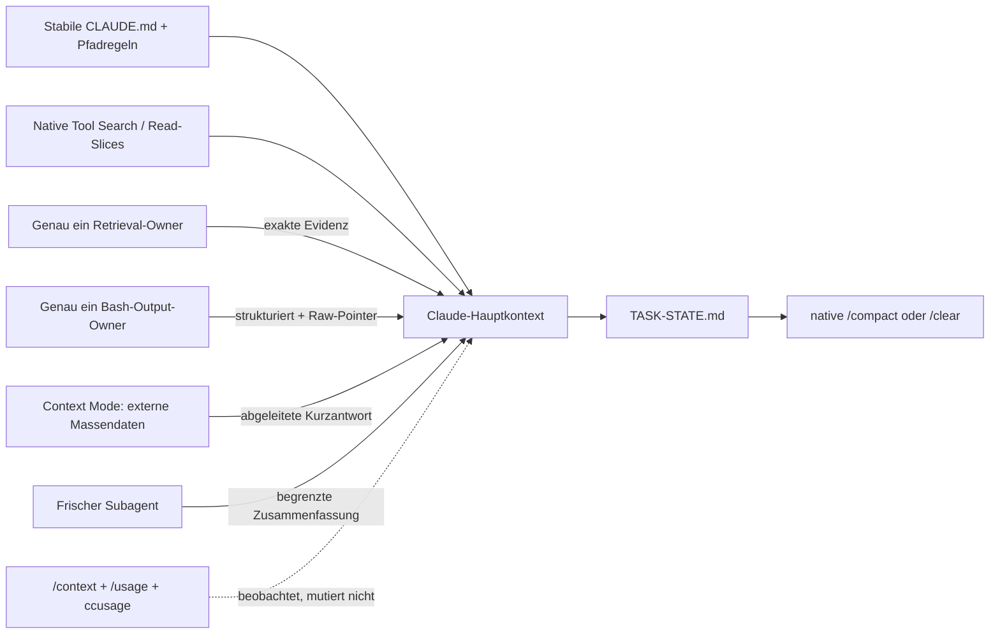

# Claude Code Token Stack — validierte Synthese und Zielentscheidung

**Stand:** 13. August 2026  
**Quellstand:** [`Kirchlive/claudestack@57a852e`](https://github.com/Kirchlive/claudestack/tree/57a852e607dcebe84c84a5c716cfb52315cf7905)  
**Gegenstand:** gleichwertige Prüfung von ABACUS, GPT55, KIMI, MANUS und OPUS; Abgleich mit aktuellen GitHub-Repositories und offizieller Claude-Code-Dokumentation  
**Konfidenz:** hoch für Architektur- und Hook-Entscheidung; mittel für konkrete Einsparungswerte, bis ein eigener A/B-Pilot vorliegt

## 1. Entscheidung in einem Satz

Der beste Stack ist **kein maximaler Tool-Stack**, sondern ein kleiner, messbarer und rückholbarer Kontextpfad:

> Native Claude-Code-Hebel zuerst; genau ein mutierender Owner je Kontextoberfläche; CodeGraph nur für echte Relationsfragen; GPT55-Read-/Bash-Guards nach Packaging-Korrektur und Shadow-Pilot; Context Mode nur für externe Massendaten; `TASK-STATE.md` plus native Sessiongrenze; Proxys, Auto-Memory und weitere Kompressoren nur als getrennte A/B-Arme.

Die stärkste Synthese nutzt:

- **GPT55** für ausführbaren Guard-Code, Tests und Benchmarkplan;
- **OPUS** für die zwei tragenden Gesetze, Surface-Ownership und den breitesten strukturierten Katalog;
- **KIMI** für unabhängige Gegenmessungen, Konflikte und Ausschlussgründe;
- **MANUS** für Security, Portabilität, Pilotdisziplin und Qualitätsmetriken;
- **ABACUS** als schnelle Marktkarte, nicht als technische Produktionsvorgabe.

Kein seriöser Gesamtprozentsatz ist vorab ableitbar. Die behaupteten 60–92 % verschiedener Ausgaben verwenden unterschiedliche Nenner — einzelne Payloads, Bytes, Input-Tokens, Listenpreis oder lange Sondersessions — und sind nicht addierbar.

## 2. Was tatsächlich geprüft wurde

[`TREE.md`](https://github.com/Kirchlive/claudestack/blob/57a852e607dcebe84c84a5c716cfb52315cf7905/TREE.md) inventarisiert 132 Dateien in fünf Agentenpaketen. Alle Markdown-, HTML-, JSON-, YAML-, JavaScript-, Python- und Shell-Artefakte wurden erfasst; finale Berichte, Kataloge, Worker-Ergebnisse, gespeicherte READMEs, Quellcode und Tests wurden getrennt bewertet.

### 2.1 Konsolidiertes Repo-Inventar

Alle GitHub-Links wurden auf `owner/repository` normalisiert und am 13.08.2026 über die GitHub-API geprüft:

| Kennzahl | Ergebnis |
|---|---:|
| Unterschiedliche referenzierte Repo-IDs | 368 |
| Aktuell öffentlich auf GitHub verifiziert | 367 |
| Fehlend/nicht zugänglich | 1 (`cardimvitor/compression`) |
| Archiviert | 2 |
| Von mindestens zwei Agentenfamilien referenziert | 250 |
| ABACUS-Referenzen | 139 |
| GPT55-Referenzen | 228 |
| KIMI-Referenzen | 157 |
| MANUS-Referenzen | 105 |
| OPUS-Referenzen | 251 |

Stärkster vorhandener Evidenzstatus pro Repo:

| Status | Anzahl | Aussagekraft |
|---|---:|---|
| Querverweis ohne Audit | 117 | Existenz/Erwähnung, keine Empfehlung |
| Discovery-only | 75 | GitHub-Metadaten, keine technische Prüfung |
| Catalogued | 86 | grobe Rolle/Einordnung |
| README-reviewed | 64 | Herstellerdokumentation gelesen |
| Deep-audit | 22 | README plus relevante Architektur/Quellen/Issues |
| Audited | 4 | gezielte Quellcodeprüfung |

Damit ist der Datensatz breit, aber **nicht global vollständig**. Private, gelöschte, umbenannte, neue oder von GitHub nicht indexierte Repositories bleiben prinzipiell unsichtbar. „Alle Repos“ ist keine beweisbare Kategorie; das belastbare Ergebnis ist eine datierte, provenance-fähige öffentliche Momentaufnahme.

Die vollständige Union liegt als `claude-token-repo-union.csv` und `claude-token-repo-union.json` bei.

## 3. Gleiches Bewertungsraster für alle Agenten

Bewertet wurde der Nutzen für eine **deploybare Zielentscheidung**, nicht Sprachstil oder Modellname. Das Raster: Abdeckung 20 %, Primärquellen/Reproduzierbarkeit 25 %, technische Aktualität 20 %, ausführbare Artefakte 20 %, Security/Betrieb 15 %. Die Punktwerte sind Entscheidungsheuristik, kein wissenschaftliches Ranking.

| Agent | Abdeckung | Evidenz | Aktualität | Ausführbar | Betrieb | Gesamt | Stärkste Rolle |
|---|---:|---:|---:|---:|---:|---:|---|
| GPT55 | 18/20 | 21/25 | 17/20 | 18/20 | 14/15 | **88/100** | Produktionsbasis |
| OPUS | 20/20 | 19/25 | 16/20 | 10/20 | 15/15 | **80/100** | Architektur/Governance |
| KIMI | 16/20 | 22/25 | 13/20 | 8/20 | 14/15 | **73/100** | Evidenz/Gegenprüfung |
| MANUS | 11/20 | 20/25 | 18/20 | 4/20 | 15/15 | **68/100** | Pilot/Security/Portabilität |
| ABACUS | 14/20 | 10/25 | 6/20 | 2/20 | 8/15 | **40/100** | Schnellübersicht |

### 3.1 GPT55 — stärkste ausführbare Basis

Stärken:

- Der [Revision-3-Bericht](https://github.com/Kirchlive/claudestack/blob/57a852e607dcebe84c84a5c716cfb52315cf7905/GPT55SOL_PRO/claude-code-token-stack-research-2026-08-10.md) korrigiert überlappende Hooks, Proxy-Kaskaden und pauschale Prozentversprechen.
- Das Paket enthält `bash-dump-guard`, kombinierten Read-Dispatcher, Session-Economy, Capability-Canary, Owner-Registry, Installer, Benchmarkplan und Smoke-Tests.
- Alle einzelnen Self-Tests und der Hook-Contract-Smoke-Test bestanden. In einer Wegwerfkopie bestanden nach zwei Packaging-Korrekturen auch kompletter Installer-Smoke-Test, JSONC/YAML-Prüfung und sämtliche SHA-256-Prüfsummen.
- Der [Bash-Guard](https://github.com/Kirchlive/claudestack/blob/57a852e607dcebe84c84a5c716cfb52315cf7905/GPT55SOL_PRO/bash-dump-guard.mjs) liefert als einziger Kandidat im Paket die heute erforderliche strukturtreue `updatedToolOutput`-Ersetzung, private Archive und Sicherheitsbypässe.

Schwächen:

- Das veröffentlichte Paket ist auf Unix **nicht wie dokumentiert installierbar**: `verify-package.sh`, `install-token-stack-hooks.sh` und `install-bash-dump-guard.sh` sind als Git-Modus `100644` statt `100755` gespeichert. Die Prüfung scheitert deshalb in [`verify-package.sh:77`](https://github.com/Kirchlive/claudestack/blob/57a852e607dcebe84c84a5c716cfb52315cf7905/GPT55SOL_PRO/verify-package.sh#L77).
- Zweiter Packagingfehler: vorhanden ist `README_gpt.md`; `SHA256SUMS.txt` und `package-manifest.json` erwarten `README.md`.
- `ENABLE_TOOL_SEARCH=auto` ist nach aktueller Doku nicht tokenminimal: `auto` lädt passende Schemata bis zur 10-%-Schwelle vorab; **unset** deferiert standardmäßig alle MCP-Schemata.
- Prefix- und Token-Schätzungen sind bewusst heuristisch. Sie dürfen `/context` und Provider-Usage nicht ersetzen.

Urteil: **Basis übernehmen, aber nicht unverändert veröffentlichen.** Packaging reparieren, native Defaults aktualisieren, danach Shadow-Pilot.

### 3.2 OPUS — stärkste Architektur, breitester strukturierter Katalog

Stärken:

- Das [Konzept v3](https://github.com/Kirchlive/claudestack/blob/57a852e607dcebe84c84a5c716cfb52315cf7905/OPUS5_MAX/token-stack-konzept-v3.md) formuliert die zwei besten Regeln des gesamten Materials:
  1. genau ein mutierender Owner pro Oberfläche;
  2. append-only/cache-stabil vor Prefix-Rewrite.
- Der [251er-Katalog](https://github.com/Kirchlive/claudestack/blob/57a852e607dcebe84c84a5c716cfb52315cf7905/OPUS5_MAX/repo-catalog-v3.md) ergänzt Cache-Risiko, Prefix-Kosten und Kompatibilitätsrollen.
- `prefix-budget.mjs --self-test` bestand; Migration und Owner-Registry sind sehr brauchbar.

Schwächen:

- 75 Einträge sind Discovery-only; bei 191 von 251 ist das Cache-Risiko nicht geprüft. Kataloggröße ist daher keine Validierungstiefe.
- Außer dem Prefix-Budget fehlen die vorgeschlagenen Dispatcher/Guards als ausführbare OPUS-Artefakte.
- Einige Sekundärannahmen sind inzwischen überholt: Tool Search, Skill-Reinjektion und native Bash-Limits sind präziser dokumentiert als im Bericht.

Urteil: **Governance-Schicht übernehmen**, Runtime aus GPT55.

### 3.3 KIMI — stärkste Evidenzdiskussion, aber keine produktionsreife Guard-Implementierung

Stärken:

- Der [Gesamtbericht](https://github.com/Kirchlive/claudestack/blob/57a852e607dcebe84c84a5c716cfb52315cf7905/KIMI_AGENT/cc-token-stack.agent.final.md) trennt Herstellerclaims, Drittbenchmarks und offene Issues besser als die anderen Ausgaben.
- Besonders stark sind die Gegenbefunde zu RTK, Headroom, Caveman, globalen Memory-MCPs und verlustbehafteter Bildkompression.
- Die Ladder „Vermeiden → Verlagern → reversibel verdichten → verbilligen“ ist eine gute Prioritätenlogik.

Schwächen:

- Die Behauptung von ungefähr 70 vollständigen README-Reads ist nicht vollständig reproduzierbar; 15 READMEs sind im Paket vendort.
- Das eingebettete `bash-dump-guard`-Beispiel gibt für Built-in-Bash einen **String** als `updatedToolOutput` zurück. Aktuelle Claude-Code-Doku verlangt die strukturierte Bash-Form (`stdout`, `stderr`, `interrupted`, `isImage`); eine falsche Form wird ignoriert. Es speichert Rohdaten außerdem ohne explizite 0700/0600-Rechte und ohne die Sicherheitsabdeckung des GPT55-Guards.
- Der vorgeschlagene Kern-Stack besitzt trotz Konfliktmatrix mehrere potenzielle Owner auf Bash-/Read-/Proxyflächen. Besonders `cache-fix` und ein History-Proxy können nicht gleichzeitig denselben `ANTHROPIC_BASE_URL`-Slot besitzen.
- Viele Einsparungszahlen bleiben Hersteller- oder Einzelworkloadwerte.

Urteil: **Evidenz, Watchlist und Ausschlussgründe übernehmen; Code nicht übernehmen.**

### 3.4 MANUS — stärkste konservative Betriebsentscheidung

Stärken:

- Die [Architekturentscheidung](https://github.com/Kirchlive/claudestack/blob/57a852e607dcebe84c84a5c716cfb52315cf7905/MANUS_AGENT/Kontextengineering%20fu%CC%88r%20KI-Coding-Agents%3A%20erweiterte%20Repository-%20und%20Architekturentscheidung.md) priorisiert kleine, reviewbare Regeln, normative ADRs/Runbooks/Tests, Least Privilege und ein Tool je Problemklasse.
- Der Pilotplan misst 10–20 reale Aufgaben, Erfolg, Diagnosezeit, Reviewnacharbeit, Kosten pro akzeptierter Änderung, Security und Betriebslast. Das ist die beste Abnahmelogik im Material.
- „Memory ist nicht Projektwahrheit“ und „Swarms nicht als Default“ sind tragende Sicherheitsentscheidungen.

Schwächen:

- Engeres Inventar; Claude-Code-spezifische Hookdetails und Guard-/Ladder-Ausarbeitung fehlen.
- Vergleichsscores sind nachvollziehbare Expertenurteile, keine Benchmarks.
- Hilfsskripte sind auf `/home/ubuntu/...` fest verdrahtet und lokal nicht reproduzierbar; keine deploybare Runtime.

Urteil: **Rollout, Akzeptanzmetriken und Sicherheitsgrenzen übernehmen.**

### 3.5 ABACUS — gute Marktkarte, schwächste technische Validität

Stärken:

- Der [HTML-Bericht](https://github.com/Kirchlive/claudestack/blob/57a852e607dcebe84c84a5c716cfb52315cf7905/ABACUS_AGENT/document.html) ist die schnellste lesbare Übersicht mit Top-15, Kategorien und konkreten Namen.
- Die parallelen Worker fanden mehrere zusätzliche Kandidaten.

Schwächen:

- Die kumulative 85–92-%-Stackersparnis addiert inkompatible Nenner und überlappende Effekte.
- Empfohlen werden gleichzeitig `sqz + snip`, mehrere Indizes, mehrere Memory-Systeme und eine Proxy-Chain. Das verletzt die später gut belegte Single-Owner-Regel.
- Der Guard-Entwurf will in `PreToolUse` Shell-Ausgabe bearbeiten; dort existiert noch keine Ausgabe.
- Headroom wird trotz offenem Cache-Kostenproblem als Default empfohlen; Monitoring wird fälschlich abgewertet, obwohl es Voraussetzung jedes Net-Win-Gates ist.

Urteil: **Discovery-Eingang behalten, technische Defaults verwerfen.**

## 4. Wichtige Faktenkorrekturen aus offizieller Claude-Code-Dokumentation

| Thema | Aktueller dokumentierter Stand | Konsequenz |
|---|---|---|
| MCP Tool Search | MCP-Schemata werden standardmäßig deferiert; zunächst laden nur Namen und Serverhinweise. `ENABLE_TOOL_SEARCH=auto` ist Schwellenmodus, nicht maximaler Deferred-Modus. [Doku](https://code.claude.com/docs/en/mcp#scale-with-mcp-tool-search) | Auf direktem Anthropic-Pfad **unset lassen**. Hinter kompatiblem Proxy gegebenenfalls `true`; nie pauschal `false`. |
| `CLAUDE.md` | Root-Dateien laden vollständig; Ziel unter 200 Zeilen. `@`-Importe organisieren, sparen aber keine Tokens. Pfadregeln laden bedarfsgesteuert. [Doku](https://code.claude.com/docs/en/memory) | Stabile Invarianten im Root, volatile/fachspezifische Regeln in `.claude/rules` mit `paths:`. |
| Skills | Beschreibungen laden initial, Body bei Nutzung. Manuelle Skills können vollständig bis zum Aufruf verborgen werden. [Doku](https://code.claude.com/docs/en/slash-commands) | Wenige präzise Beschreibungen; Verfahrenswissen on demand; kein großes Always-on-Regelbuch. |
| Bash-Ausgabe | Gültige Ausgaben kommen nur bis ungefähr 30.000 Zeichen inline; größere Ergebnisse werden als Datei plus Vorschau zurückgegeben. [Doku](https://code.claude.com/docs/en/tools-reference#output-limits) | Guard adressiert mittlere Dumps, Dedup, Secrets und strukturierte Reduktion — nicht die Fiktion unbegrenzter Inline-Ausgabe. |
| `PostToolUse` | `updatedToolOutput` ersetzt Modellergebnis nur bei korrekter Tool-Ausgabeform. [Doku](https://code.claude.com/docs/en/hooks#posttooluse-decision-control) | Built-in-Bash immer als Objekt ersetzen; keine String-Ersetzung und kein `additionalContext` neben unverändertem Rohoutput. |
| `PreToolUse allow` | Aktuelle Regeln werten Deny/Ask weiterhin aus; Entscheidungspräzedenz ist `deny > defer > ask > allow`. [Doku](https://code.claude.com/docs/en/hooks#pretooluse-decision-control) | Ältere pauschale Bypass-Aussagen sind veraltet. Ein Output-Guard braucht trotzdem kein `allow`; pass-through ist einfacher. |
| Subagents | Non-fork startet frisch und gibt nur Zusammenfassung zurück; Fork erbt Parent-Kontext. [Doku](https://code.claude.com/docs/en/sub-agents#manage-subagent-context) | Bulk-Reads/Tests in frische Subagents; Fork nur, wenn gemeinsamer Kontext den Cache-/Reorientierungsvorteil rechtfertigt. |
| Compaction | Root-`CLAUDE.md` und unscoped Rules werden reinjiziert; Pfadregeln/nested Files erst beim nächsten passenden Read. [Doku](https://code.claude.com/docs/en/context-window#what-survives-compaction) | TASK-STATE kurz halten; keine Session-State-Injektion in Root-Regeln. |

## 5. Zielarchitektur

### Gesetz 1: Genau ein mutierender Owner pro Oberfläche

Mehrere Observer dürfen koexistieren, solange sie weder Toolinput/-output verändern noch Kontext injizieren. Mehrere Rewriter/Replacer auf demselben Matcher sind keine geordnete Ladder. Wenn mehrere Regeln nötig sind, sequenziert **ein Dispatcher** sie und gibt ein Resultat zurück.

### Gesetz 2: Cache-stabil und rückholbar vor aggressiv komprimiert

Reihenfolge: vermeiden, selektieren, deterministisch reduzieren, rückholbar auslagern, erst dann semantisch komprimieren. Jede Prefix-Mutation, Proxy-Kaskade oder nicht rückholbare Zusammenfassung muss einen größeren End-to-End-Gewinn beweisen als ihr Cache-, Qualitäts- und Betriebsrisiko.

## 6. Empfohlener Stack

### 6.1 Core Safe — Default für fast alle Projekte

1. **Messung:** `/context`, `/usage`, optional [ccusage](https://github.com/ccusage/ccusage). Observer sparen nichts direkt, sind aber Voraussetzung für jede Entscheidung.
2. **Prefix-Hygiene:** Root-`CLAUDE.md` nur für stabile repo-weite Invarianten; Ziel unter 200 Zeilen. Pfadregeln für Fachbereiche, Skills on demand. Plugin-/MCP-Topologie nur zwischen Sessions ändern.
3. **Native Suche zuerst:** bekannte Datei/Symbol → Search → exakter Read-Slice. Kein vollständiger Repo-Dump.
4. **Read-Policy:** GPT55 `read-context-guard` zunächst advisory, später deny-once mit Escape-Valve. State bei Compact/SessionEnd löschen.
5. **Bash-Policy:** GPT55 `bash-dump-guard` zunächst Shadow, später alleiniger `PostToolUse:Bash`-Owner.
6. **Durable State:** kurze `.claude/TASK-STATE.md` mit Ziel, bestätigten Fakten, Entscheidungen, Restarbeit, Verification Contract und genau einem nächsten Schritt. [planning-with-files](https://github.com/OthmanAdi/planning-with-files) ist das Muster, nicht für jede Kleinigkeit eine Pflichtinstallation.
7. **Sessiongrenze:** native `/compact` oder `/clear`; Bulk-Recherche und Testdumps in frischen Subagents.

Nicht im Default: API-Proxy, Auto-Memory, Router, TOON-Konverter, zweiter Index, zweite Bash-Kompression, frühere Auto-Compaction-Schwelle.

### 6.2 Retrieval-Profil — wenn Relationsfragen wiederkehren

Bevorzugter Pilot: [CodeGraph](https://github.com/colbymchenry/codegraph), weil lokal, MIT, kleine Tooloberfläche und auf Call-/Impact-/Architekturfragen spezialisiert.

Die eigenen Benchmarks sind ungewöhnlich ehrlich:

- Ein README-Einfragen-Benchmark berichtet etwa 62 % weniger verarbeitete Tokens und 44 % weniger Kosten.
- Ein härterer Multi-Turn-Lauf berichtet 56 % weniger Tokens und 24 % weniger Kosten, aber einzelne Repos können teurer werden.
- Gleichzeitig bleibt laut [Residual-Context-Messung](https://github.com/colbymchenry/codegraph/blob/main/docs/benchmarks/residual-context-occupancy.md) im Mittel rund 82 % mehr Retrieval-Kontext im Fenster, weil dichte Explore-Ausgaben resident bleiben.
- Auf kurzen 37-Zellen-Flows sanken Reads und Zeit, während Gesamtkosten leicht höher lagen. [A/B-Matrix](https://github.com/colbymchenry/codegraph/blob/main/docs/benchmarks/codegraph-ab-matrix.md)

Entscheidung: CodeGraph für echte Relationsfragen, nicht als Reflex für kleine Repos. Nach Exploration Findings in TASK-STATE persistieren und die Phase beenden/kompaktieren.

Alternative für große polyglotte Cross-Service-Repos: [codebase-memory-mcp](https://github.com/DeusData/codebase-memory-mcp). Es ersetzt CodeGraph; beide nicht parallel. SigMap/Serena sind Spezialalternativen, keine zusätzliche Default-Schicht.

### 6.3 Build-/Log-Profil — genau ein Output-Owner

Default: eigener GPT55-Guard. Integrierte Alternative: [OMNI](https://github.com/fajarhide/omni), wenn Wiederholung statt einzelner Dumps dominiert.

OMNIs reproduzierbarer Eigen-Replay über 6.656 Traces berichtet:

- 2,7 % Payloadreduktion durch Filter allein;
- 14,9 % inklusive Cross-Call-Ledger/Dedup;
- starke Gewinne bei Build/Test, bewusst 0 % bei Datenenumerationen.

[Benchmark](https://github.com/fajarhide/omni/blob/main/docs/website/src/develop/benchmarks.md). Das ist Byte-/Payloadmessung, keine qualitätsgewichtete End-to-End-Kostenmessung. OMNI daher als **Ersatz** für Guard/RTK/Snip/Lowfat, nicht zusätzlich.

Weitere alleinige A/B-Arme:

- [semtrim](https://github.com/jaredboynton/semtrim): konservativer deklarativer Wrapper;
- [Snip](https://github.com/edouard-claude/snip): Filter als testbare YAML-Daten;
- [lowfat](https://github.com/zdk/lowfat): mehrere messbare Reduktionsstufen;
- [Squeez](https://github.com/claudioemmanuel/squeez): breiter Monolith, ersetzt dann Bash-, Read-, Dedup- und Memory-Owner;
- [JFrog Boost](https://github.com/jfrog/boost): stärkste direkte Task-Evidenz — 81 Terminal-Bench-Aufgaben, gleiche 25/81 Erfolgsrate und 11,9 % niedrigere Kosten laut [Herstellerbenchmark](https://boost.jfrog.com/blog/benchmarks-terminal-bench/); proprietäre Preview/Telemetrie machen ihn opt-in.

### 6.4 External-Data-Profil

[Context Mode](https://github.com/mksglu/context-mode) ist stark, wenn große Web-, API-, MCP-, Dokument- oder Logdaten **außerhalb** des Hauptkontexts verarbeitet werden. Sein [21-Fixture-Benchmark](https://github.com/mksglu/context-mode/blob/main/BENCHMARK.md) verarbeitet 376 KB Rohdaten mit 16,5 KB Kontext, also 96 % weniger Payload. Das ist kein 96-%-Taskkostennachweis.

Regel: explizite Sandbox-/Index-Tools für externe Massendaten; lokale Bash-/Read-/Grep-/Glob-Flächen nicht zusätzlich hooken, wenn GPT55-Guards dort Owner sind. Lizenz vor Team-/Produktbetrieb prüfen: ELv2, nicht permissives OSS.

### 6.5 Long-Session-Profil

Reihenfolge:

1. TASK-STATE aktualisieren;
2. native `/compact` oder `/clear`;
3. Bulk-Arbeit in frischen Subagent;
4. [magic-compact](https://github.com/aerovato/magic-compact) als manueller Pilot, falls native Zusammenfassung nachweisbar wichtige Details verliert;
5. erst danach genau **ein** History-Proxy.

[tokdiet](https://github.com/agiwhitelist/tokdiet) und [llmtrim](https://github.com/fkiene/llmtrim) haben interessante recoverable/cache-aware Konzepte, aber überwiegend Eigenbenchmarks und kontrollieren kritischen API-Traffic. Sie gehören in getrennte API-billed A/B-Arme mit Provider-Usage, Cache-Read/Creation, Qualitäts- und Recovery-Messung.

[claude-code-cache-fix](https://github.com/cnighswonger/claude-code-cache-fix) ist nur bei gemessenem Resume-/Cachefehler sinnvoll. Es konkurriert mit jedem History-Proxy um `ANTHROPIC_BASE_URL` und ist kein allgemeiner Default.

### 6.6 Memory-Profil

Normative Wahrheit bleibt in Code, Tests, ADRs, Runbooks und TASK-STATE. [MemSearch](https://github.com/zilliztech/memsearch) oder [claude-mem](https://github.com/thedotmack/claude-mem) erst pilotieren, wenn wiederkehrende Cross-Session-Reorientierung messbar dominiert. Dann genau ein Memory-Owner, projektbezogen; Datenschutz, Retention, Telemetrie und Cloud-Upload vorher prüfen.

## 7. Surface-Ownership

| Oberfläche | Default-Owner | Erlaubte Alternative | Nicht kombinieren |
|---|---|---|---|
| Request-Prefix | Root-`CLAUDE.md` + path-scoped Rules | — | doppelte CLAUDE-/AGENTS-Inhalte, volatile Sessiondaten |
| MCP-Schema | native Tool Search | ein bewusst geprüfter Gateway | mehrere Schema-Kompressoren |
| `PreToolUse:Bash` | keiner | OMNI **oder** semtrim/Snip/lowfat/RTK | mehr als ein Command-Rewriter |
| `PostToolUse:Bash` | GPT55 Bash-Guard | OMNI **oder** Squeez | parallele Output-Replacer |
| Read | GPT55 Read-Dispatcher | Squeez | getrennte Reread-/Slice-/Memory-Rewriter |
| Code-Retrieval | native Search; bedingt CodeGraph | codebase-memory **oder** SigMap/Serena | zwei dauerhafte Indizes |
| Externe Massendaten | Context Mode explizit | — | zusätzlicher Local-Read/Bash-Owner |
| Task-State | TASK-STATE | planning-with-files | Chat/Auto-Memory als einzige Wahrheit |
| Langzeit-Memory | ADRs/Runbooks/Tests | genau ein Memory-System | mehrere Auto-Memories |
| API-Traffic | keiner | genau ein Proxy/cache-fix | Proxy-Chain |
| Beobachtung | `/context`, `/usage`, ccusage | weitere read-only Telemetrie | context-injizierende „Observer“ |

## 8. `bash-dump-guard.mjs`: zu übernehmende Spezifikation

### 8.1 Ausgangspunkt

GPT55 ist die einzige belastbare Codebasis. Nach temporärer Korrektur von Dateimodi und README-Namen bestand die gesamte Paketprüfung. Der Guard selbst bestand Self-Test und Hook-Contract-Smoke-Test unverändert.

### 8.2 Muss-Eigenschaften

- `PostToolUse:Bash`, weil erst dort Output existiert.
- `updatedToolOutput` in der exakten Bash-Objektform; alle nicht geänderten Felder erhalten.
- Fail-open bei Parser-, I/O- oder Statefehlern.
- Shadow-Modus zuerst; Replace erst nach realem Capability-/Payload-Smoke-Test.
- Gültige native Truncation-/Spillmarker erkennen und nicht nochmals komprimieren.
- Fehler, interrupted, non-empty stderr, Patches, Security-Scans, Migrationen, IaC, Krypto und `# token-raw` exakt behandeln.
- Secrets unabhängig von Kompressionsentscheidung redigieren.
- Verlustbehaftete Ersetzung nur mit rückholbarem Raw-Artefakt; Verzeichnis 0700, Datei 0600, begrenzte Größe/Retention, Hash und kurzer Pointer.
- Net-Win-Gate nach Footer: sowohl Mindestbytes als auch Mindestquote müssen positiv sein.
- Metriken trennen: lokale Bytes, modellsichtbare Tokens und End-to-End-Kosten sind drei verschiedene Größen.
- Keine `permissionDecision: allow`; der Guard hat keinen Grund, Berechtigungen zu entscheiden.

### 8.3 Startwerte sind Pilotwerte

Die GPT55-Werte `minInputBytes=4096`, mindestens 512 B und 15 % Ersparnis, Raw-Retention 7 Tage und 20-MB-Artefaktgrenze sind vernünftige Shadow-Startwerte. Sie sind keine Universaloptima.

Claude Code spillt große gültige Bash-Ausgabe bereits nativ. Der Guard sollte deshalb vor allem den Bereich unterhalb der nativen Spillgrenze, Wiederholungen, Fortschrittsrauschen und recoverable Strukturierung adressieren. `BASH_MAX_OUTPUT_LENGTH`, `MAX_MCP_OUTPUT_TOKENS`, `TASK_MAX_OUTPUT_LENGTH`, Antwortlimit und Auto-Compact-Schwelle einzeln gegen unveränderte Defaults testen; nicht als Paket aktivieren.

### 8.4 Vor Veröffentlichung zu reparieren

1. Shellskripte als `100755` committen.
2. `README_gpt.md` in `README.md` umbenennen oder Manifest/Checksummen konsistent anpassen.
3. `ENABLE_TOOL_SEARCH=auto` aus dem Safe-Default entfernen; direktes Anthropic-Default ist bereits vollständig deferred.
4. Verifier früh auf Dateimodi und exakten Manifest-Dateisatz prüfen lassen.
5. Offizielle native Bash-Spillform in den Contract-Tests abbilden.
6. Prefix-Budget als Schätzung kennzeichnen und Tool-Search-Modus berücksichtigen.

## 9. Die vier Ladders

### 9.1 Retrieval-Ladder

1. Ist die Information bereits im Kontext? Wiederverwenden.
2. Bekannter Name/Pfad? Native Text-/Symbolsuche.
3. Implementierung nötig? Exakten Symbol-/Zeilenbereich lesen.
4. Beziehung/Impact/Architektur? Genau einen Graph-/Index-Owner fragen.
5. Externe oder sehr große Daten? Context Mode oder frischer Subagent.
6. Bestätigte Findings persistieren; Exploration beenden.

### 9.2 Compression-Ladder

1. **C0 Prevent:** Query/Command enger formulieren; quiet/JSON/failed-only-Flags nutzen.
2. **C1 Native:** eingebaute Tool Search, Read-Paging und Bash-Spill akzeptieren.
3. **C2 Lossless:** ANSI, Progress-Rewrites, identische Duplikate deterministisch entfernen.
4. **C3 Command-specific:** bekannte Strukturen mit getesteten Reducern kürzen.
5. **C4 Recoverable elision:** Head/Tail/Salienz plus privates Raw-Artefakt und Hash.
6. **C5 Semantic:** Modell-/Proxy-Kompression nur als A/B mit Qualität, Cache und Recovery.
7. **C6 Boundary:** TASK-STATE plus Compact/Clear statt weiteren Verlauf umzuschreiben.

### 9.3 Session-Ladder

Die Prozentbänder sind Telemetrie-Startwerte, keine harten Blocker; tatsächliche Fenster-/Outputreserve variiert:

- **unter ca. 70 %:** normal arbeiten, aber breite Exploration abschließen;
- **ca. 70–80 %:** TASK-STATE aktualisieren, Rohartefakte auslagern, nächste Phase planen;
- **ca. 80–85 %:** native `/compact` mit expliziten Erhaltungsinstruktionen;
- **über ca. 85 % oder bei Phasenwechsel:** `/clear` plus Handoff; Bulk-Teilaufgaben in frischen Subagenten.

Keine frühe Auto-Compact-Umgebungsvariable setzen, bevor die native Baseline gemessen ist.

### 9.4 Implementation-Ladder

1. Muss es existieren?
2. Existiert es bereits im Repository?
3. Reicht Standardbibliothek?
4. Reicht native Plattform-/Frameworkfunktion?
5. Reicht bereits installierte Dependency?
6. Geht es deklarativ oder korrekt einzeilig?
7. Erst dann kleinste korrekte Implementierung.

Diese [Ponytail](https://github.com/DietrichGebert/ponytail)-Logik ist nützlich; besser als kurzer on-demand Skill oder Rule, nicht zusammen mit mehreren Always-on-Stilpaketen. Security, Datenintegrität, Accessibility, Kompatibilität, Migrationen und Tests sind keine Kürzungsziele.

## 10. Was bewusst nicht Default wird

| Kandidat | Entscheidung | Begründung/Re-Evaluierungs-Trigger |
|---|---|---|
| [Headroom](https://github.com/headroomlabs-ai/headroom) | Hold | Offenes [Issue #2438](https://github.com/headroomlabs-ai/headroom/issues/2438) berichtet zerstörten Prompt-Cache, 2–7× Kosten und kaputte Toolblöcke. Erst nach Fix plus eigener Provider-Messung. |
| [RTK](https://github.com/rtk-ai/rtk) | alleiniger A/B-Arm, nicht Default | Kostenissue #582 ist geschlossen, aber Permission-Rewrite-Probleme [#1155](https://github.com/rtk-ai/rtk/issues/1155) und [#3152](https://github.com/rtk-ai/rtk/issues/3152) sind offen. |
| [toonify-mcp](https://github.com/PCIRCLE-AI/toonify-mcp) | aktueller Hook nicht nutzen | Audit zeigt `additionalContext` statt Raw-Ersetzung; Roh- und Kompaktausgabe können gleichzeitig Kontext belegen. |
| Caveman/Terse-Stack | nicht Default | Kürzere Antworten allein beweisen weder Taskqualität noch niedrigere End-to-End-Kosten. |
| pxpipe/OmniGlyph | Nische | Lossy Repräsentation ist für Code, IDs, Hex, Diagnostik und Patches ungeeignet. |
| globale Auto-Memory-MCPs | nicht Default | Tool-/Worker-/Privacy-Overhead vor jedem belegten Retrieval-Nutzen. |
| Routing | außerhalb Kernziels | Kann Geld zwischen Modellen verschieben, reduziert aber nicht zwingend Tokens und birgt Tool-Calling-/Qualitätsrisiko. |
| mehrere Indizes/Proxys/Guards | verboten | Doppelte Owner, unklare Attribution, Cache-/Recovery-Risiko. |

## 11. Rollout und Abnahmekriterien

### Phase 0 — Baseline

10–20 anonymisierte reale Aufgaben: Bugfix, Refactoring, neue Funktion, fehlschlagender Test, Review, Incident und Release. Je Aufgabe festhalten:

- Akzeptanzkriterien und Tests;
- Input-, Cache-Read-, Cache-Creation- und Output-Tokens;
- Kosten pro akzeptierter Änderung;
- Zeit bis richtige Datei/Ursache;
- Retries, Recovery-Reads und Re-Orientierungsrunden;
- Review-/Testnacharbeit;
- p95-Latenz und Security-/Egress-Ereignisse.

### Phase 1 — Prefix-Hygiene

Nur Regeln, Skills und MCP-Scope bereinigen. `/context` vor/nach bei gleichem Startzustand. Keine anderen Variablen ändern.

### Phase 2 — Retrieval

Native Search gegen genau einen CodeGraph-Arm. Verlierer entfernen. Erfolg: gleiche/höhere Taskqualität, weniger Diagnosezeit/Toolcalls, keine unvertretbare Residual-Context-Last.

### Phase 3 — Guards

Read- und Bash-Guard mindestens eine Woche im Shadow-Modus. Für jede vorgeschlagene Reduktion prüfen: Signal erhalten, exakter Recovery-Pfad, keine Secrets, keine Zusatzrunden. Danach einzeln aktivieren.

### Phase 4 — Session und External Data

TASK-STATE/Compact/Clear und Context Mode nur dort aktivieren, wo Baseline ein Problem zeigt. Subagent-Rückgaben begrenzen und inhaltlich prüfen.

### Phase 5 — Proxy/Memory

Nur separater Arm mit Datenschutzreview, Providertelemetrie und sofortigem Rollback. Ein Proxy bzw. ein Memory-Owner zur Zeit.

### Übernahmeregel

Ein Werkzeug wird übernommen, wenn Task-Erfolg und Review-/Testqualität nicht praktisch relevant sinken und Kosten pro akzeptierter Änderung oder ein anderer primärer Engpass materiell besser wird. README-Bytes, einzelne Fixture-Kompressionsraten und geschätzte Tokens reichen nicht.

## 12. Finale Rangfolge der Entscheidungen

1. **Sofort:** native Tool Search, kleine stabile Regeln, `/context`-/ccusage-Baseline, TASK-STATE-Muster.
2. **Nach Packaging-Fix:** GPT55 Read-Dispatcher und Bash-Guard im Shadow-Modus.
3. **Bei Relationsbedarf:** CodeGraph als genau ein Retrieval-Owner.
4. **Bei externen Massendaten:** Context Mode, explizit und surface-getrennt.
5. **Bei Bash-Wiederholungen:** OMNI statt eigener Guards als separater Profilarm.
6. **Bei riesigem Polyglot-Repo:** codebase-memory-mcp statt CodeGraph.
7. **Bei verlorenen Langsessions:** native Grenze, dann magic-compact; Proxy zuletzt.
8. **Nur nach Bedarf:** Memory, cache-fix, Boost, tokdiet oder llmtrim.
9. **Nicht default:** Headroom, RTK-Rewrite, toonify-Hook, Caveman-Proxy, lossy Bildkompression, Swarm-/Proxy-/Memory-Kaskaden.

## 13. Quellenkern

### Agentenartefakte

- [GPT55 Revision 3](https://github.com/Kirchlive/claudestack/blob/57a852e607dcebe84c84a5c716cfb52315cf7905/GPT55SOL_PRO/claude-code-token-stack-research-2026-08-10.md)
- [GPT55 Bash Guard](https://github.com/Kirchlive/claudestack/blob/57a852e607dcebe84c84a5c716cfb52315cf7905/GPT55SOL_PRO/bash-dump-guard.mjs)
- [OPUS Konzept v3](https://github.com/Kirchlive/claudestack/blob/57a852e607dcebe84c84a5c716cfb52315cf7905/OPUS5_MAX/token-stack-konzept-v3.md)
- [OPUS Katalog v3](https://github.com/Kirchlive/claudestack/blob/57a852e607dcebe84c84a5c716cfb52315cf7905/OPUS5_MAX/repo-catalog-v3.md)
- [KIMI Gesamtbericht](https://github.com/Kirchlive/claudestack/blob/57a852e607dcebe84c84a5c716cfb52315cf7905/KIMI_AGENT/cc-token-stack.agent.final.md)
- [MANUS Inventar](https://github.com/Kirchlive/claudestack/blob/57a852e607dcebe84c84a5c716cfb52315cf7905/MANUS_AGENT/Normalisiertes%20Repository-Inventar.md)
- [ABACUS Bericht](https://github.com/Kirchlive/claudestack/blob/57a852e607dcebe84c84a5c716cfb52315cf7905/ABACUS_AGENT/document.html)

### Offizielle Claude-Code-Dokumentation

- [Memory, CLAUDE.md und Rules](https://code.claude.com/docs/en/memory)
- [Hooks](https://code.claude.com/docs/en/hooks)
- [MCP Tool Search](https://code.claude.com/docs/en/mcp#scale-with-mcp-tool-search)
- [Tools und Outputlimits](https://code.claude.com/docs/en/tools-reference#output-limits)
- [Context Window und Compaction](https://code.claude.com/docs/en/context-window)
- [Subagents](https://code.claude.com/docs/en/sub-agents)
- [Sessions](https://code.claude.com/docs/en/sessions)

## Schluss

OPUS hat die richtige Architekturformel, GPT55 den besten ausführbaren Kern, KIMI die wertvollste Skepsis und MANUS die richtige Einführungsdisziplin. Das Destillat ist deshalb bewusst kleiner als jeder vorgeschlagene Mega-Stack. Sein Nutzen entsteht nicht durch möglichst viele Kompressoren, sondern durch vier kontrollierbare Eigenschaften: **stabiler Prefix, selektiver Kontext, rückholbare Reduktion und harte Mess-Gates**.
